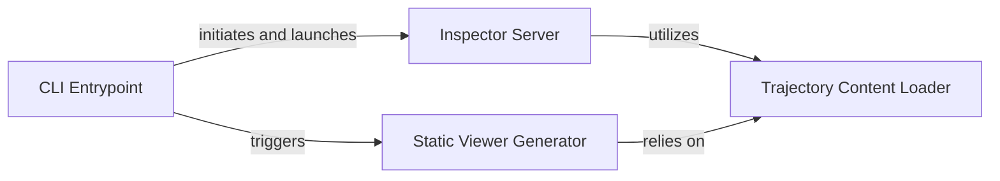

## Component Details

These four components are fundamental to the `Analysis & Inspection` subsystem because they represent distinct, cohesive units of functionality that are essential for its operation.
1.  **CLI Entrypoint**: This is the user's primary interaction point. Without it, users cannot initiate the inspector's functionalities, whether it's launching the server or generating static reports. It acts as the system's gateway.
2.  **Inspector Server**: This component is the heart of the interactive analysis. It provides the web interface that allows users to visualize and explore agent trajectories dynamically. Its absence would remove the primary means of interactive debugging and analysis.
3.  **Trajectory Content Loader**: This component is crucial because it handles the core data processing. Raw trajectory data is not directly usable; it needs to be loaded, parsed, and enriched with additional context (like patches and summaries). Both the Inspector Server and the Static Viewer Generator depend on this component to get the data in a usable format.
4.  **Static Viewer Generator**: This component provides a vital capability for offline analysis and sharing. Not all users will want or need a running server, and the ability to generate self-contained reports is essential for portability and archival purposes.
Together, these components cover the entire lifecycle of analysis and inspection, from user initiation to data processing and presentation, both interactively and statically.

### CLI Entrypoint
This component serves as the dedicated command-line interface for the SWE-agent inspector. It is responsible for parsing command-line arguments, resolving directory paths, and orchestrating the initiation of either the Inspector Server or the generation of static viewer files. It acts as the primary bridge between user command-line input and the inspector's functionalities.

**Related Classes/Methods**:

- <a href="https://github.com/SWE-agent/SWE-agent/blob/master/sweagent/run/inspector_cli.py#L1-L1" target="_blank" rel="noopener noreferrer">`sweagent.run.inspector_cli` (1:1)</a>
- <a href="https://github.com/SWE-agent/SWE-agent/blob/master/sweagent/inspector/server.py#L318-L324" target="_blank" rel="noopener noreferrer">`sweagent.inspector.server.run_from_cli` (318:324)</a>

### Inspector Server
This is the core of the SWE-agent inspector, functioning as an HTTP server. It handles incoming HTTP requests, serves static assets (HTML, CSS, JavaScript, images), provides directory listings, and dynamically delivers content related to agent trajectories. It uses `http.server.SimpleHTTPRequestHandler` to manage client interactions and route requests to appropriate handlers based on the URL path.

**Related Classes/Methods**:

- <a href="https://github.com/SWE-agent/SWE-agent/blob/master/sweagent/inspector/server.py#L195-L266" target="_blank" rel="noopener noreferrer">`sweagent.inspector.server.Handler` (195:266)</a>
- <a href="https://github.com/SWE-agent/SWE-agent/blob/master/sweagent/inspector/server.py#L269-L303" target="_blank" rel="noopener noreferrer">`sweagent.inspector.server.main` (269:303)</a>

### Trajectory Content Loader
This component is responsible for loading, parsing, and enriching raw agent trajectory data. It reads JSON files containing detailed trajectory information, then processes this data by appending additional context such as exit statuses, gold/test patches, and action summaries. The processed data is then prepared for display within the inspector's web interface or for static report generation.

**Related Classes/Methods**:

- <a href="https://github.com/SWE-agent/SWE-agent/blob/master/sweagent/inspector/server.py#L143-L159" target="_blank" rel="noopener noreferrer">`sweagent.inspector.server.load_content` (143:159)</a>

### Static Viewer Generator
This component specializes in creating self-contained, portable static HTML files for individual agent trajectories. It reads the processed trajectory data, integrates necessary styling (CSS) and icons, and embeds all this content into a single HTML template. This allows for offline viewing and easy sharing of agent run results without requiring a running server.

**Related Classes/Methods**:

- <a href="https://github.com/SWE-agent/SWE-agent/blob/master/sweagent/inspector/static.py#L95-L122" target="_blank" rel="noopener noreferrer">`sweagent.inspector.static.save_static_viewer` (95:122)</a>

### [FAQ](https://github.com/CodeBoarding/GeneratedOnBoardings/tree/main?tab=readme-ov-file#faq)