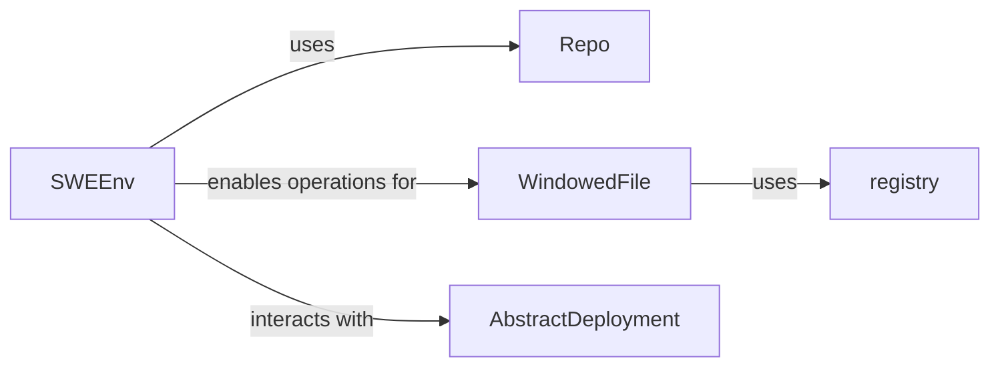

## Component Details

This component provides the interface for the SWE-agent to interact with the external software development environment. It manages repository setup, executes shell commands, provides controlled file system access (including "windowed" views of files), and relays environmental observations back to the agent. It is crucial as it provides the necessary abstraction for the agent to interact with the external world (the code repository, shell, files).

### SWEEnv
The `SWEEnv` class is the central orchestrator of the environment interaction. It manages the entire lifecycle of the development environment, from starting and stopping the underlying deployment to executing shell commands and handling file system operations. It acts as the primary abstraction layer, enabling the SWE-agent to send commands and receive observations from the external world in a structured manner.

**Related Classes/Methods**:

- <a href="https://github.com/SWE-agent/SWE-agent/blob/master/sweagent/environment/swe_env.py#L50-L275" target="_blank" rel="noopener noreferrer">`sweagent.environment.swe_env.SWEEnv` (50:275)</a>

### Repo
The `Repo` component is responsible for managing the code repository within the `SWEEnv`. Its core functionalities include cloning repositories, checking out specific commits or branches, and resetting the repository to a clean state. This component is fundamental as it ensures the agent operates on the correct and consistent version of the codebase, providing a reliable foundation for development tasks.

**Related Classes/Methods**:

- <a href="https://github.com/SWE-agent/SWE-agent/blob/master/sweagent/environment/repo.py#L18-L26" target="_blank" rel="noopener noreferrer">`sweagent.environment.repo.Repo` (18:26)</a>

### WindowedFile
`WindowedFile` provides a specialized and efficient interface for interacting with files. Instead of loading entire files, it allows the agent to view, read, search, replace, and insert text within specific "windows" or sections of a file. This controlled and focused file access is crucial for managing large codebases, reducing computational overhead, and enabling precise modifications without overwhelming the agent with unnecessary context.

**Related Classes/Methods**:

- <a href="https://github.com/SWE-agent/SWE-agent/blob/master/tools/windowed/lib/windowed_file.py#L52-L314" target="_blank" rel="noopener noreferrer">`tools.windowed.lib.windowed_file.WindowedFile` (52:314)</a>

### [FAQ](https://github.com/CodeBoarding/GeneratedOnBoardings/tree/main?tab=readme-ov-file#faq)