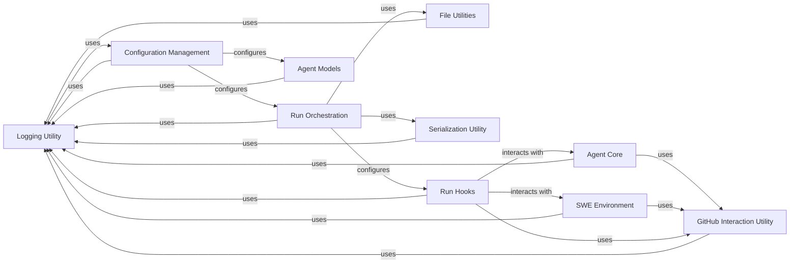

## Component Details

Abstract Components Overview: Infrastructure & Support Services

### Logging Utility
A centralized utility for managing and providing logging capabilities across the entire SWE-agent system. It ensures consistent log formatting and output, crucial for debugging and monitoring.

**Related Classes/Methods**:

- <a href="https://github.com/SWE-agent/SWE-agent/blob/master/sweagent/utils/log.py#L1-L1" target="_blank" rel="noopener noreferrer">`sweagent.utils.log` (1:1)</a>

### Configuration Management
Responsible for loading and managing environment variables and configuration settings, which are vital for initializing and customizing various system components.

**Related Classes/Methods**:

- <a href="https://github.com/SWE-agent/SWE-agent/blob/master/sweagent/utils/config.py#L1-L1" target="_blank" rel="noopener noreferrer">`sweagent.utils.config` (1:1)</a>

### File Utilities
Provides a set of generic functions for reading and loading content from various file types (e.g., JSON, YAML, datasets) based on their extensions.

**Related Classes/Methods**:

- <a href="https://github.com/SWE-agent/SWE-agent/blob/master/sweagent/utils/files.py#L1-L1" target="_blank" rel="noopener noreferrer">`sweagent.utils.files` (1:1)</a>

### GitHub Interaction Utility
Offers a standardized interface for interacting with GitHub, including repository management, fetching problem statements, and opening pull requests.

**Related Classes/Methods**:

- <a href="https://github.com/SWE-agent/SWE-agent/blob/master/sweagent/utils/github.py#L1-L1" target="_blank" rel="noopener noreferrer">`sweagent.utils.github` (1:1)</a>

### Serialization Utility
Handles the serialization and deserialization of data, enabling the system to save and load various states, results, or configurations persistently.

**Related Classes/Methods**:

- <a href="https://github.com/SWE-agent/SWE-agent/blob/master/sweagent/utils/serialization.py#L1-L1" target="_blank" rel="noopener noreferrer">`sweagent.utils.serialization` (1:1)</a>

### Run Hooks
Implements a flexible callback mechanism that allows custom logic to be injected and executed at different stages of an agent's run lifecycle (e.g., on start, on instance completion). This provides a powerful extensibility point.

**Related Classes/Methods**:

- <a href="https://github.com/SWE-agent/SWE-agent/blob/master/sweagent/run/hooks/abstract.py#L1-L1" target="_blank" rel="noopener noreferrer">`sweagent.run.hooks.abstract` (1:1)</a>
- <a href="https://github.com/SWE-agent/SWE-agent/blob/master/sweagent/run/hooks/apply_patch.py#L1-L1" target="_blank" rel="noopener noreferrer">`sweagent.run.hooks.apply_patch` (1:1)</a>
- <a href="https://github.com/SWE-agent/SWE-agent/blob/master/sweagent/run/hooks/swe_bench_evaluate.py#L1-L1" target="_blank" rel="noopener noreferrer">`sweagent.run.hooks.swe_bench_evaluate` (1:1)</a>
- <a href="https://github.com/SWE-agent/SWE-agent/blob/master/sweagent/run/hooks/open_pr.py#L23-L116" target="_blank" rel="noopener noreferrer">`sweagent.run.hooks.open_pr` (23:116)</a>

### Run Orchestration
A component responsible for orchestrating the execution of agent runs.

**Related Classes/Methods**: _None_

### Agent Models
A component representing the models used by the agent.

**Related Classes/Methods**: _None_

### Agent Core
The core component of the agent.

**Related Classes/Methods**: _None_

### SWE Environment
The environment in which the SWE-agent operates.

**Related Classes/Methods**: _None_

### [FAQ](https://github.com/CodeBoarding/GeneratedOnBoardings/tree/main?tab=readme-ov-file#faq)