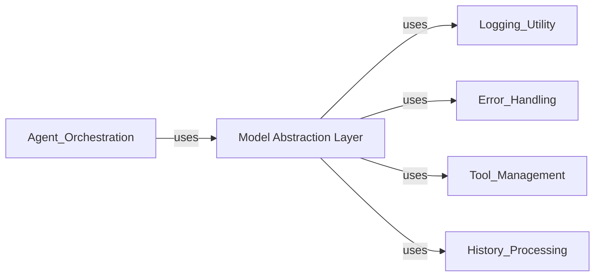

## Component Details

The Model Abstraction Layer is chosen as a fundamental component because it forms the "brain" of the agent. It provides the core mechanism through which the agent generates its thoughts and actions, abstracting away the complexities of different intelligence sources. This abstraction is critical for flexibility, allowing the agent to be powered by an LLM, a human, or a pre-recorded sequence without modifying the agent's core decision-making logic. The AbstractModel class defines the contract, while HumanModel, LiteLLMModel, and ReplayModel provide concrete implementations for diverse operational modes. The get_model function acts as the entry point for obtaining these model instances.

### Model Abstraction Layer
This component provides a unified interface for interacting with various intelligence sources, including large language models (via LiteLLM), human input, or replaying pre-recorded trajectories. It decouples the agent's decision-making logic from the specific implementation of the underlying intelligence source. It is fundamental because it allows the agent to seamlessly switch between different "brains" without altering its core logic.

**Related Classes/Methods**:

- <a href="https://github.com/SWE-agent/SWE-agent/blob/master/sweagent/agent/models.py#L304-L318" target="_blank" rel="noopener noreferrer">`sweagent.agent.models.AbstractModel` (304:318)</a>
- <a href="https://github.com/SWE-agent/SWE-agent/blob/master/sweagent/agent/models.py#L337-L436" target="_blank" rel="noopener noreferrer">`sweagent.agent.models.HumanModel` (337:436)</a>
- <a href="https://github.com/SWE-agent/SWE-agent/blob/master/sweagent/agent/models.py#L571-L837" target="_blank" rel="noopener noreferrer">`sweagent.agent.models.LiteLLMModel` (571:837)</a>
- <a href="https://github.com/SWE-agent/SWE-agent/blob/master/sweagent/agent/models.py#L457-L519" target="_blank" rel="noopener noreferrer">`sweagent.agent.models.ReplayModel` (457:519)</a>
- <a href="https://github.com/SWE-agent/SWE-agent/blob/master/sweagent/agent/models.py#L840-L868" target="_blank" rel="noopener noreferrer">`sweagent.agent.models.get_model` (840:868)</a>

### [FAQ](https://github.com/CodeBoarding/GeneratedOnBoardings/tree/main?tab=readme-ov-file#faq)