```mermaid
graph LR
    sweagent_run_run_main["sweagent.run.run.main"]
    sweagent_run_run_single_RunSingle["sweagent.run.run_single.RunSingle"]
    sweagent_run_run_batch_RunBatch["sweagent.run.run_batch.RunBatch"]
    sweagent_run_run_replay_RunReplay["sweagent.run.run_replay.RunReplay"]
    sweagent_run_run_shell_RunShell["sweagent.run.run_shell.RunShell"]
    sweagent_agent_agents_DefaultAgent["sweagent.agent.agents.DefaultAgent"]
    sweagent_environment_swe_env_SWEEnv["sweagent.environment.swe_env.SWEEnv"]
    sweagent_run_common_ConfigHelper["sweagent.run.common.ConfigHelper"]
    sweagent_run_hooks_abstract_CombinedRunHooks["sweagent.run.hooks.abstract.CombinedRunHooks"]
    sweagent_run__progress_RunBatchProgressManager["sweagent.run._progress.RunBatchProgressManager"]
    sweagent_run_run_main -- "Calls/dispatches to" --> sweagent_run_run_single_RunSingle
    sweagent_run_run_main -- "Calls/dispatches to" --> sweagent_run_run_batch_RunBatch
    sweagent_run_run_main -- "Calls/dispatches to" --> sweagent_run_run_replay_RunReplay
    sweagent_run_run_main -- "Calls/dispatches to" --> sweagent_run_run_shell_RunShell
    sweagent_run_run_main -- "Uses" --> sweagent_run_common_ConfigHelper
    sweagent_run_run_single_RunSingle -- "Initializes and invokes" --> sweagent_agent_agents_DefaultAgent
    sweagent_run_run_single_RunSingle -- "Initializes and interacts with" --> sweagent_environment_swe_env_SWEEnv
    sweagent_run_run_single_RunSingle -- "Registers and triggers hooks via" --> sweagent_run_hooks_abstract_CombinedRunHooks
    sweagent_run_run_single_RunSingle -- "Uses" --> sweagent_run_common_ConfigHelper
    sweagent_run_run_batch_RunBatch -- "Uses" --> sweagent_run_run_single_RunSingle
    sweagent_run_run_batch_RunBatch -- "Uses" --> sweagent_run__progress_RunBatchProgressManager
    sweagent_run_run_batch_RunBatch -- "Initializes and invokes" --> sweagent_agent_agents_DefaultAgent
    sweagent_run_run_batch_RunBatch -- "Initializes and interacts with" --> sweagent_environment_swe_env_SWEEnv
    sweagent_run_run_replay_RunReplay -- "Internally creates and runs" --> sweagent_run_run_single_RunSingle
    sweagent_run_run_replay_RunReplay -- "Uses to configure replay model" --> sweagent_agent_models_get_model
    sweagent_run_run_replay_RunReplay -- "Uses" --> sweagent_run_common_ConfigHelper
    sweagent_run_run_shell_RunShell -- "Initializes and invokes" --> sweagent_agent_agents_DefaultAgent
    sweagent_run_run_shell_RunShell -- "Initializes and interacts with" --> sweagent_environment_swe_env_SWEEnv
    sweagent_run_run_shell_RunShell -- "Registers and triggers hooks via" --> sweagent_run_hooks_abstract_CombinedRunHooks
    sweagent_run_run_shell_RunShell -- "Uses" --> sweagent_run_common_ConfigHelper
    sweagent_agent_agents_DefaultAgent -- "Interacts with to execute commands and manage files" --> sweagent_environment_swe_env_SWEEnv
    sweagent_agent_agents_DefaultAgent -- "Uses to obtain language model" --> sweagent_agent_models_get_model
    sweagent_environment_swe_env_SWEEnv -- "Dispatches environment-specific hooks via" --> sweagent_run_hooks_abstract_CombinedEnvHooks
    sweagent_run_common_ConfigHelper -- "Used by" --> sweagent_run_run_main
    sweagent_run_common_ConfigHelper -- "Used by" --> sweagent_run_run_single_RunSingle
    sweagent_run_common_ConfigHelper -- "Used by" --> sweagent_run_run_batch_RunBatch
    sweagent_run_common_ConfigHelper -- "Used by" --> sweagent_run_run_replay_RunReplay
    sweagent_run_common_ConfigHelper -- "Used by" --> sweagent_run_run_shell_RunShell
    sweagent_run_hooks_abstract_CombinedRunHooks -- "Used by" --> sweagent_run_run_single_RunSingle
    sweagent_run_hooks_abstract_CombinedRunHooks -- "Used by" --> sweagent_run_run_batch_RunBatch
    sweagent_run_hooks_abstract_CombinedRunHooks -- "Used by" --> sweagent_run_run_shell_RunShell
    sweagent_run__progress_RunBatchProgressManager -- "Used by" --> sweagent_run_run_batch_RunBatch
```

## Component Details

The `Run Orchestration & Management` component serves as the central nervous system for SWE-agent, handling the initiation, configuration, and oversight of all agent execution modes. It is fundamental because it provides the command-line interface, dispatches control to specific run handlers, and integrates core functionalities like agent interaction, environment management, and progress tracking.

### sweagent.run.run.main
The primary entry point for the SWE-agent command-line interface. It parses command-line arguments, determines the requested operation (e.g., single run, batch run, replay, shell), and dispatches execution to the appropriate specialized run handler. It acts as the central conductor for all SWE-agent operations.

**Related Classes/Methods**:

- <a href="https://github.com/SWE-agent/SWE-agent/blob/master/sweagent/run/run.py#L1-L1" target="_blank" rel="noopener noreferrer">`sweagent.run.run.main` (1:1)</a>

### sweagent.run.run_single.RunSingle
Manages the execution of a single agent run on a specific problem instance. It initializes the environment and agent, then orchestrates the agent's interaction with the environment, including handling steps, observations, and actions.

**Related Classes/Methods**:

- <a href="https://github.com/SWE-agent/SWE-agent/blob/master/sweagent/run/run_single.py#L1-L1" target="_blank" rel="noopener noreferrer">`sweagent.run.run_single.RunSingle` (1:1)</a>

### sweagent.run.run_batch.RunBatch
Handles the execution of multiple agent runs in a batch, supporting sequential or parallel execution. It manages the overall progress, logging, and result merging for a collection of problem instances. It leverages `RunSingle` for individual instance execution.

**Related Classes/Methods**:

- <a href="https://github.com/SWE-agent/SWE-agent/blob/master/sweagent/run/run_batch.py#L1-L1" target="_blank" rel="noopener noreferrer">`sweagent.run.run_batch.RunBatch` (1:1)</a>

### sweagent.run.run_replay.RunReplay
Allows replaying a previously recorded agent trajectory. It reconstructs the environment and agent state from a saved trajectory file and re-executes the actions, primarily for debugging or analysis.

**Related Classes/Methods**:

- <a href="https://github.com/SWE-agent/SWE-agent/blob/master/sweagent/run/run_replay.py#L1-L1" target="_blank" rel="noopener noreferrer">`sweagent.run.run_replay.RunReplay` (1:1)</a>

### sweagent.run.run_shell.RunShell
Provides a mode for running the agent in an interactive shell environment. This allows direct interaction with the agent and environment, facilitating debugging and manual testing.

**Related Classes/Methods**:

- <a href="https://github.com/SWE-agent/SWE-agent/blob/master/sweagent/run/run_shell.py#L1-L1" target="_blank" rel="noopener noreferrer">`sweagent.run.run_shell.RunShell` (1:1)</a>

### sweagent.agent.agents.DefaultAgent
Implements the core logic for the default agent. This includes managing conversation history, interacting with tools, querying language models, and processing their responses to decide on the next action. It is fundamental as it embodies the "intelligence" of the SWE-agent.

**Related Classes/Methods**:

- <a href="https://github.com/SWE-agent/SWE-agent/blob/master/sweagent/agent/agents.py#L436-L1275" target="_blank" rel="noopener noreferrer">`sweagent.agent.agents.DefaultAgent` (436:1275)</a>

### sweagent.environment.swe_env.SWEEnv
Provides an abstract interface for interacting with the software development environment, typically a Docker container. It handles command execution, file operations, environment setup, and teardown. It is fundamental as it provides the agent's "world" to interact with.

**Related Classes/Methods**:

- <a href="https://github.com/SWE-agent/SWE-agent/blob/master/sweagent/environment/swe_env.py#L50-L275" target="_blank" rel="noopener noreferrer">`sweagent.environment.swe_env.SWEEnv` (50:275)</a>

### sweagent.run.common.ConfigHelper
A utility class for generating human-readable help text from Pydantic configuration objects and assisting in parsing command-line arguments. It is fundamental for providing a consistent and user-friendly configuration experience across different run modes.

**Related Classes/Methods**:

- <a href="https://github.com/SWE-agent/SWE-agent/blob/master/sweagent/run/common.py#L101-L140" target="_blank" rel="noopener noreferrer">`sweagent.run.common.ConfigHelper` (101:140)</a>

### sweagent.run.hooks.abstract.CombinedRunHooks
Manages and dispatches various "hooks" that allow custom functionality to be injected at different stages of an agent's run lifecycle (e.g., on start, on instance completion, on step). It is fundamental for enabling extensibility and custom logging/monitoring of agent runs.

**Related Classes/Methods**:

- <a href="https://github.com/SWE-agent/SWE-agent/blob/master/sweagent/run/hooks/abstract.py#L31-L66" target="_blank" rel="noopener noreferrer">`sweagent.run.hooks.abstract.CombinedRunHooks` (31:66)</a>

### sweagent.run._progress.RunBatchProgressManager
Manages and tracks the progress of batch runs, including updating the exit status table and providing overall progress information. It is fundamental for monitoring and reporting the status of large-scale batch executions.

**Related Classes/Methods**:

- <a href="https://github.com/SWE-agent/SWE-agent/blob/master/sweagent/run/_progress.py#L32-L157" target="_blank" rel="noopener noreferrer">`sweagent.run._progress.RunBatchProgressManager` (32:157)</a>

### [FAQ](https://github.com/CodeBoarding/GeneratedOnBoardings/tree/main?tab=readme-ov-file#faq)