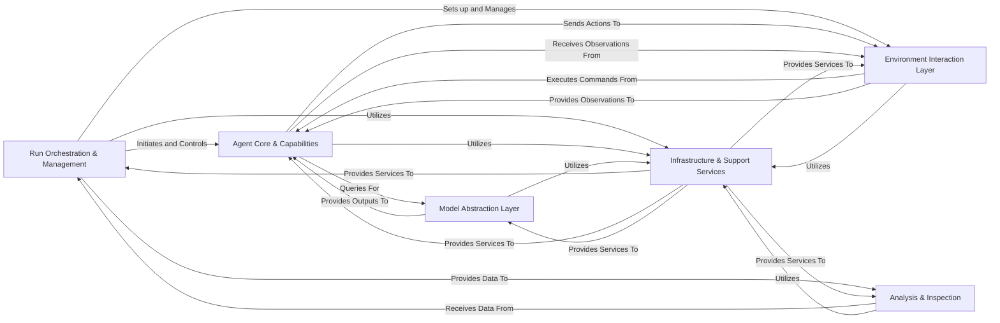

## Component Details

Final architecture analysis for SWE-agent, consolidating components into a high-level overview. The architecture comprises six fundamental components, each with distinct responsibilities and clear interaction pathways, essential for the agent's operation, interaction with its environment, decision-making, and analysis.

### Run Orchestration & Management
This component serves as the primary entry point and orchestrator for all SWE-agent operations. It handles command-line argument parsing, dispatches execution to various run modes (single instance, batch, shell, replay), loads problem instances, and manages the overall progress and lifecycle of a run. It is fundamental as it is the conductor that initiates and oversees the entire agent execution process.

**Related Classes/Methods**:

- <a href="https://github.com/SWE-agent/SWE-agent/blob/master/sweagent/run/run.py#L1-L1" target="_blank" rel="noopener noreferrer">`sweagent.run.run.main` (1:1)</a>
- <a href="https://github.com/SWE-agent/SWE-agent/blob/master/sweagent/run/batch_instances.py#L198-L202" target="_blank" rel="noopener noreferrer">`sweagent.run.batch_instances.InstancesFromFile.get_instance_configs` (198:202)</a>
- <a href="https://github.com/SWE-agent/SWE-agent/blob/master/sweagent/run/_progress.py#L84-L100" target="_blank" rel="noopener noreferrer">`sweagent.run._progress.RunBatchProgressManager.update_exit_status_table` (84:100)</a>

### Agent Core & Capabilities
This is the "brain" of the SWE-agent, embodying its core intelligence, decision-making logic, and the definition and parsing of its executable capabilities (tools). It defines the agent's operational loop, including planning, executing actions, processing observations, handling retry mechanisms, reviewing submissions, and sampling alternative actions. It is fundamental because it contains the core logic for decision-making, planning, and interacting with its environment through defined tools.

**Related Classes/Methods**:

- <a href="https://github.com/SWE-agent/SWE-agent/blob/master/sweagent/agent/agents.py#L1246-L1275" target="_blank" rel="noopener noreferrer">`sweagent.agent.agents.DefaultAgent.run` (1246:1275)</a>
- <a href="https://github.com/SWE-agent/SWE-agent/blob/master/sweagent/agent/agents.py#L1216-L1244" target="_blank" rel="noopener noreferrer">`sweagent.agent.agents.DefaultAgent.step` (1216:1244)</a>
- <a href="https://github.com/SWE-agent/SWE-agent/blob/master/sweagent/agent/reviewer.py#L1-L1" target="_blank" rel="noopener noreferrer">`sweagent.agent.reviewer.Reviewer.review` (1:1)</a>
- <a href="https://github.com/SWE-agent/SWE-agent/blob/master/sweagent/tools/tools.py#L1-L1" target="_blank" rel="noopener noreferrer">`sweagent.tools.tools.ToolHandler` (1:1)</a>
- <a href="https://github.com/SWE-agent/SWE-agent/blob/master/sweagent/tools/parsing.py#L1-L1" target="_blank" rel="noopener noreferrer">`sweagent.tools.parsing.ActionParser` (1:1)</a>

### Environment Interaction Layer
This component provides the interface for the SWE-agent to interact with the external software development environment. It manages repository setup, executes shell commands, provides controlled file system access (including "windowed" views of files), and relays environmental observations back to the agent. It is crucial as it provides the necessary abstraction for the agent to interact with the external world (the code repository, shell, files).

**Related Classes/Methods**:

- <a href="https://github.com/SWE-agent/SWE-agent/blob/master/sweagent/environment/swe_env.py#L108-L113" target="_blank" rel="noopener noreferrer">`sweagent.environment.swe_env.SWEEnv.start` (108:113)</a>
- <a href="https://github.com/SWE-agent/SWE-agent/blob/master/sweagent/environment/swe_env.py#L196-L231" target="_blank" rel="noopener noreferrer">`sweagent.environment.swe_env.SWEEnv.communicate` (196:231)</a>
- `sweagent.tools.windowed.lib.windowed_file.WindowedFile.text` (1:1)

### Model Abstraction Layer
This component abstracts the different sources from which the agent can generate actions or thoughts. It provides a unified interface for interacting with large language models (via LiteLLM), accepting human input, or replaying pre-recorded trajectories. It is fundamental because it decouples the agent's decision-making logic from the specific implementation of the underlying intelligence source (e.g., LLM, human, replay).

**Related Classes/Methods**:

- <a href="https://github.com/SWE-agent/SWE-agent/blob/master/sweagent/agent/models.py#L840-L868" target="_blank" rel="noopener noreferrer">`sweagent.agent.models.get_model` (840:868)</a>
- <a href="https://github.com/SWE-agent/SWE-agent/blob/master/sweagent/agent/models.py#L762-L805" target="_blank" rel="noopener noreferrer">`sweagent.agent.models.LiteLLMModel.query` (762:805)</a>
- <a href="https://github.com/SWE-agent/SWE-agent/blob/master/sweagent/agent/models.py#L417-L436" target="_blank" rel="noopener noreferrer">`sweagent.agent.models.HumanModel.query` (417:436)</a>

### Infrastructure & Support Services
This component provides foundational services and cross-cutting concerns for the entire SWE-agent system. It includes common utilities like logging, configuration management, file operations, and GitHub interactions, as well as a flexible hook system for injecting custom logic and extending behavior at various stages of execution. It is essential for providing common, reusable functionalities and architectural extensibility across the entire system.

**Related Classes/Methods**:

- <a href="https://github.com/SWE-agent/SWE-agent/blob/master/sweagent/utils/log.py#L56-L89" target="_blank" rel="noopener noreferrer">`sweagent.utils.log.get_logger` (56:89)</a>
- <a href="https://github.com/SWE-agent/SWE-agent/blob/master/sweagent/utils/config.py#L59-L79" target="_blank" rel="noopener noreferrer">`sweagent.utils.config.load_environment_variables` (59:79)</a>
- <a href="https://github.com/SWE-agent/SWE-agent/blob/master/sweagent/utils/files.py#L7-L26" target="_blank" rel="noopener noreferrer">`sweagent.utils.files.load_file` (7:26)</a>
- <a href="https://github.com/SWE-agent/SWE-agent/blob/master/sweagent/run/hooks/abstract.py#L31-L66" target="_blank" rel="noopener noreferrer">`sweagent.run.hooks.abstract.CombinedRunHooks` (31:66)</a>
- <a href="https://github.com/SWE-agent/SWE-agent/blob/master/sweagent/run/hooks/apply_patch.py#L31-L44" target="_blank" rel="noopener noreferrer">`sweagent.run.hooks.apply_patch.SaveApplyPatchHook.on_instance_completed` (31:44)</a>

### Analysis & Inspection
This component provides tools for visualizing, analyzing, and debugging agent trajectories and run results. It includes functionalities for generating interactive web-based viewers and static reports, aiding in understanding agent behavior and performance. While not directly part of the core execution loop, this component is fundamental for development, debugging, and evaluation, providing necessary visibility into agent behavior.

**Related Classes/Methods**:

- <a href="https://github.com/SWE-agent/SWE-agent/blob/master/sweagent/inspector/server.py#L269-L303" target="_blank" rel="noopener noreferrer">`sweagent.inspector.server.main` (269:303)</a>
- <a href="https://github.com/SWE-agent/SWE-agent/blob/master/sweagent/inspector/static.py#L95-L122" target="_blank" rel="noopener noreferrer">`sweagent.inspector.static.save_static_viewer` (95:122)</a>

### [FAQ](https://github.com/CodeBoarding/GeneratedOnBoardings/tree/main?tab=readme-ov-file#faq)