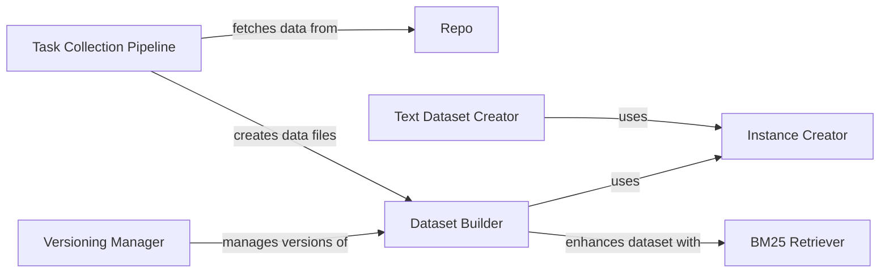

## Component Details

The Data Acquisition and Preparation component is responsible for collecting, processing, and formatting data from software repositories into datasets suitable for training and evaluating language models. It involves fetching data from repositories, extracting relevant information, cleaning and transforming the data, and creating instances for training and evaluation. The component also manages versioning of tasks and instances to ensure reproducibility and comparability of results.

### Repo
The Repo component provides an abstraction for interacting with code repositories. It encapsulates the logic for fetching data such as issues, pull requests, and code changes from a repository. It serves as the primary interface for accessing repository data within the data acquisition pipeline.
- **Related Classes/Methods**: `swebench.collect.utils.Repo`

### Task Collection Pipeline
The Task Collection Pipeline orchestrates the process of collecting software tasks from various repositories. It uses the Repo component to fetch repository data and applies filters and configurations to extract relevant tasks. The pipeline outputs data files containing the collected tasks, which are then used for dataset construction.
- **Related Classes/Methods**: `swebench.collect.get_tasks_pipeline:main`

### Dataset Builder
The Dataset Builder component takes the data files produced by the Task Collection Pipeline and constructs datasets for training and evaluation. It processes the data to create instances, which are individual examples used for training and evaluating language models. The component also handles filtering and sampling of instances based on specified criteria.
- **Related Classes/Methods**: `swebench.collect.build_dataset:main`

### Instance Creator
The Instance Creator component is responsible for generating individual instances for the dataset. It formats the data into a structure suitable for model training, including adding lines, creating code text, and generating prompts in different styles. It supports various prompt styles and data formatting options to accommodate different model architectures and training objectives.
- **Related Classes/Methods**: `swebench.inference.make_datasets.create_instance:add_lines`, `swebench.inference.make_datasets.create_instance:make_code_text`, `swebench.inference.make_datasets.create_instance:make_code_text_edits_only`, `swebench.inference.make_datasets.create_instance:prompt_style_2`, `swebench.inference.make_datasets.create_instance:prompt_style_2_edits_only`, `swebench.inference.make_datasets.create_instance:prompt_style_3`, `swebench.inference.make_datasets.create_instance:full_file_gen`, `swebench.inference.make_datasets.create_instance:add_text_inputs`

### BM25 Retriever
The BM25 Retriever component builds and searches indexes using the BM25 retrieval algorithm. It is used for retrieving relevant code snippets or documents based on similarity scores. This component enhances the dataset with retrieved context, providing additional information that can improve model performance.
- **Related Classes/Methods**: `swebench.inference.make_datasets.bm25_retrieval:main`

### Text Dataset Creator
The Text Dataset Creator component generates text datasets for training and evaluation. It takes instances generated by the Instance Creator and prepares them for use in text-based models. This component formats the data into a text-based structure suitable for model training, ensuring compatibility with various text-based model architectures.
- **Related Classes/Methods**: `swebench.inference.make_datasets.create_text_dataset:main`

### Versioning Manager
The Versioning Manager component handles different versions of the dataset. It retrieves version information from builds or the web and maps versions to task instances. This component ensures that the dataset is versioned and that different versions can be accessed and compared, facilitating reproducibility and comparability of results.
- **Related Classes/Methods**: `swebench.versioning.get_versions:main`
