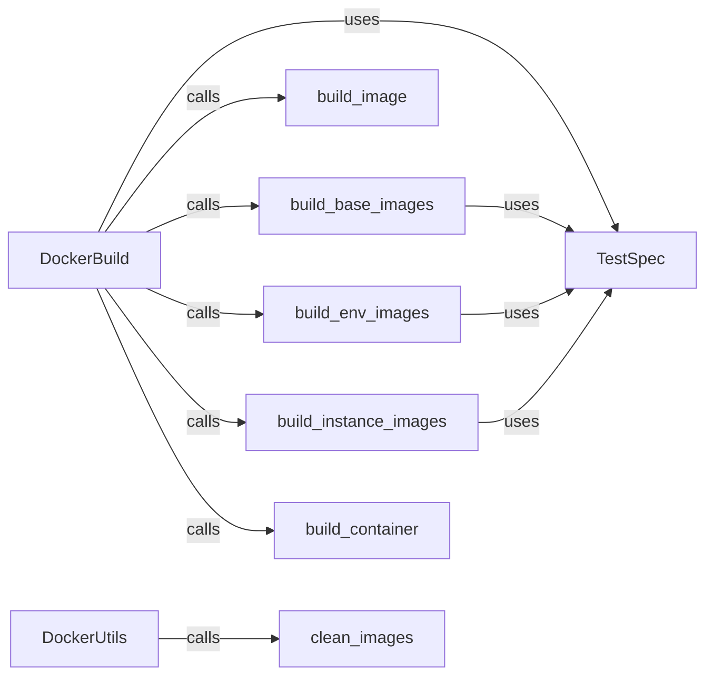

## Component Details

The Docker Environment Management component automates the creation, configuration, and cleanup of Docker images and containers for testing. It streamlines the process of building base, environment-specific, and instance-specific images using Dockerfiles defined in the TestSpec. The component also provides utilities for cleaning up unused images, ensuring a consistent and efficient testing environment.

### TestSpec
Defines the specification for a test, including the Dockerfiles to use for building the base, environment, and instance images. It acts as a central configuration for the Docker build process.
- **Related Classes/Methods**: `SWE-bench.swebench.harness.test_spec.test_spec.TestSpec`, `SWE-bench.swebench.harness.test_spec.test_spec.TestSpec:base_dockerfile`, `SWE-bench.swebench.harness.test_spec.test_spec.TestSpec:env_dockerfile`, `SWE-bench.swebench.harness.test_spec.test_spec.TestSpec:instance_dockerfile`

### DockerBuild
Provides functions for building Docker images for different stages of the testing process (base, environment, and instance). It orchestrates the image building process based on the Dockerfiles provided by the TestSpec.
- **Related Classes/Methods**: `swebench.harness.docker_build`

### build_image
A function responsible for building a Docker image using the Docker SDK. It takes the Dockerfile and other build parameters as input and returns the image ID.
- **Related Classes/Methods**: `swebench.harness.docker_build:build_image`

### build_base_images
A function responsible for building the base Docker images. It uses the base_dockerfile from the TestSpec.
- **Related Classes/Methods**: `swebench.harness.docker_build:build_base_images`

### build_env_images
A function responsible for building the environment-specific Docker images. It uses the env_dockerfile from the TestSpec.
- **Related Classes/Methods**: `swebench.harness.docker_build:build_env_images`

### build_instance_images
A function responsible for building the instance-specific Docker images. It uses the instance_dockerfile from the TestSpec.
- **Related Classes/Methods**: `swebench.harness.docker_build:build_instance_images`

### build_container
A function responsible for building a Docker container from a given image. It configures and starts the container based on the provided parameters.
- **Related Classes/Methods**: `swebench.harness.docker_build:build_container`

### DockerUtils
Provides utility functions for interacting with Docker, such as cleaning up images. It helps in managing the Docker environment and removing unused resources.
- **Related Classes/Methods**: `swebench.harness.docker_utils`

### clean_images
A function responsible for cleaning up Docker images. It removes unused images to free up disk space and maintain a clean environment.
- **Related Classes/Methods**: `swebench.harness.docker_utils:clean_images`
