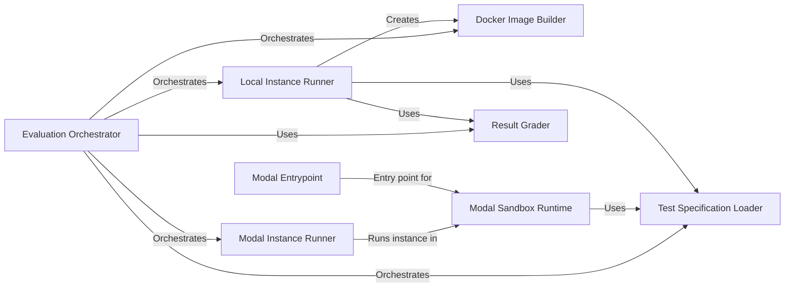

## Component Details

The Evaluation Harness automates the process of evaluating code patches. It retrieves test specifications, builds Docker images or Modal sandboxes, executes tests within isolated environments, grades the results, and generates reports. The harness supports both local Docker-based execution and remote execution using Modal, providing flexibility and scalability for evaluating code changes.

### Evaluation Orchestrator
The Evaluation Orchestrator serves as the central control point for the evaluation process. It determines whether to run evaluations locally using Docker or remotely using Modal. It coordinates the building of necessary images/sandboxes, the execution of test instances, and the aggregation of results.
- **Related Classes/Methods**: `swebench.harness.run_evaluation:main`, `swebench.harness.modal_eval.run_evaluation_modal:run_instances_modal`

### Test Specification Loader
The Test Specification Loader is responsible for extracting test specifications from the dataset. These specifications define the environment, scripts, and grading criteria for each test instance. It transforms the raw data into structured TestSpec objects that are used by other components.
- **Related Classes/Methods**: `swebench.harness.test_spec.test_spec:get_test_specs_from_dataset`, `swebench.harness.test_spec.test_spec:make_test_spec`

### Docker Image Builder
The Docker Image Builder component builds Docker images for the evaluation environments and instances. It builds base images with common dependencies, environment images with language-specific dependencies, and instance images with the generated code. It uses Dockerfiles to define the image configurations.
- **Related Classes/Methods**: `swebench.harness.docker_build:build_image`, `swebench.harness.docker_build:build_base_images`, `swebench.harness.docker_build:build_env_images`, `swebench.harness.docker_build:build_instance_images`

### Local Instance Runner
The Local Instance Runner executes individual test instances within Docker containers. It applies the patch, executes the evaluation script, and collects the results. It interacts with the Docker Image Builder to create the necessary instance images.
- **Related Classes/Methods**: `swebench.harness.run_evaluation:run_instance`

### Modal Instance Runner
The Modal Instance Runner executes individual test instances within Modal sandboxes. It creates a Modal sandbox, applies the patch, executes the evaluation script, and collects the results. It leverages the ModalSandboxRuntime for managing the sandbox environment.
- **Related Classes/Methods**: `swebench.harness.modal_eval.run_evaluation_modal:run_instance_modal`

### Modal Sandbox Runtime
The Modal Sandbox Runtime provides a secure and isolated environment for running test instances within Modal. It handles sandbox creation, file writing, command execution, and stream management. It interacts with the Modal API to manage the sandbox lifecycle.
- **Related Classes/Methods**: `swebench.harness.modal_eval.run_evaluation_modal.ModalSandboxRuntime`, `swebench.harness.modal_eval.run_evaluation_modal.ModalSandboxRuntime:exec`

### Modal Entrypoint
The Modal Entrypoint serves as the entry point for running evaluations within Modal. It receives the command to execute and passes it to the ModalSandboxRuntime. It acts as a bridge between the Modal environment and the evaluation logic.
- **Related Classes/Methods**: `swebench.harness.modal_eval.run_evaluation_modal_entrypoint:main`

### Result Grader
The Result Grader analyzes the test results and determines whether the patch resolved the issue. It parses the test output, applies predefined grading criteria, and generates an evaluation report. It provides a consistent and objective assessment of the patch quality.
- **Related Classes/Methods**: `swebench.harness.grading:get_eval_report`
