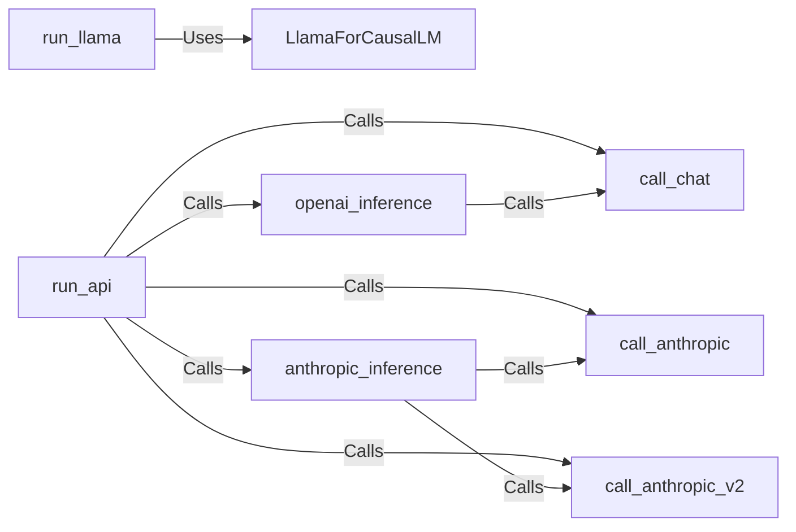

## Component Details

The Inference Engine is the core component responsible for generating code patches using language models. It supports both local Llama models and external APIs like OpenAI and Anthropic, providing flexibility in model selection. The engine orchestrates the process of loading data, generating predictions, and processing responses to extract the generated code patch. It includes modules for running inference using local models (`run_llama`) and external APIs (`run_api`).

### run_llama
This module is responsible for running inference using a local Llama model. It orchestrates the process of loading data, generating predictions using the Llama model, and saving the results. It interacts with the Llama model components to generate code patches.
- **Related Classes/Methods**: `SWE-bench.swebench.inference.run_llama:load_data`, `SWE-bench.swebench.inference.run_llama:generate`, `SWE-bench.swebench.inference.run_llama:main`

### run_api
This module handles inference by calling external APIs such as OpenAI and Anthropic. It includes functions for calling the APIs, processing the responses, and managing the inference process. It supports different API versions and provides a unified interface for interacting with various language models. It interacts with the API call functions and inference functions to generate code patches.
- **Related Classes/Methods**: `SWE-bench.swebench.inference.run_api:call_chat`, `SWE-bench.swebench.inference.run_api:openai_inference`, `SWE-bench.swebench.inference.run_api:call_anthropic`, `SWE-bench.swebench.inference.run_api:call_anthropic_v2`, `SWE-bench.swebench.inference.run_api:anthropic_inference`, `SWE-bench.swebench.inference.run_api:main`

### LlamaForCausalLM
This class represents the Llama model for causal language modeling. It inherits from the LlamaModel and adds a language modeling head for generating text. It uses the LlamaModel's architecture and extends it for text generation tasks. It is used by the `run_llama` module to generate code patches.
- **Related Classes/Methods**: `SWE-bench.swebench.inference.llamao.modeling_flash_llama.LlamaForCausalLM:__init__`, `SWE-bench.swebench.inference.llamao.modeling_flash_llama.LlamaForCausalLM:forward`

### call_chat
This function is responsible for calling the OpenAI chat API. It takes the prompt and other parameters as input and returns the API response. It handles the communication with the OpenAI API. It is called by the `openai_inference` function.
- **Related Classes/Methods**: `SWE-bench.swebench.inference.run_api:call_chat`

### openai_inference
This function performs inference using the OpenAI API. It prepares the input for the API, calls the API using `call_chat`, and processes the API response to extract the generated code patch. It is called by the `run_api` module.
- **Related Classes/Methods**: `SWE-bench.swebench.inference.run_api:openai_inference`

### call_anthropic
This function is responsible for calling the Anthropic API. It takes the prompt and other parameters as input and returns the API response. It handles the communication with the Anthropic API. It is called by the `anthropic_inference` function.
- **Related Classes/Methods**: `SWE-bench.swebench.inference.run_api:call_anthropic`

### call_anthropic_v2
This function is responsible for calling the Anthropic API version 2. It takes the prompt and other parameters as input and returns the API response. It handles the communication with the Anthropic API. It is called by the `anthropic_inference` function.
- **Related Classes/Methods**: `SWE-bench.swebench.inference.run_api:call_anthropic_v2`

### anthropic_inference
This function performs inference using the Anthropic API. It prepares the input for the API, calls the API using `call_anthropic` or `call_anthropic_v2`, and processes the API response to extract the generated code patch. It is called by the `run_api` module.
- **Related Classes/Methods**: `SWE-bench.swebench.inference.run_api:anthropic_inference`
