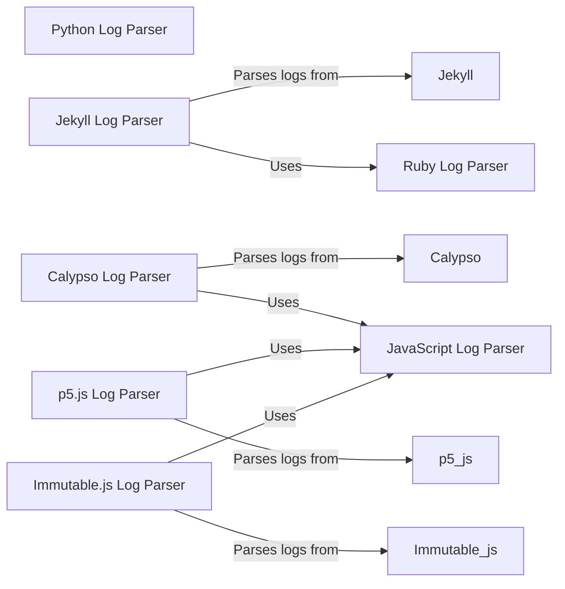

## Component Details

The Log Parsing and Result Extraction component is responsible for analyzing log files generated during test executions in various programming languages. It extracts relevant information such as test results, pass/fail status, error messages, and execution time. This structured approach to interpreting test output enables automated grading and reporting of evaluation results. The component supports multiple languages, including Python, JavaScript, and Ruby, with specialized parsers for specific frameworks and libraries within those languages.

### Python Log Parser
The Python Log Parser component is responsible for parsing log files generated by Python-based tests. It extracts relevant information about test results, such as pass/fail status, error messages, and execution time. This information is then used for automated grading and reporting.
- **Related Classes/Methods**: `swebench.harness.log_parsers.python`

### JavaScript Log Parser
The JavaScript Log Parser component is responsible for parsing log files generated by JavaScript-based tests. It extracts relevant information about test results, such as pass/fail status, error messages, and execution time. This information is then used for automated grading and reporting.
- **Related Classes/Methods**: `swebench.harness.log_parsers.javascript`

### Ruby Log Parser
The Ruby Log Parser component is responsible for parsing log files generated by Ruby-based tests. It extracts relevant information about test results, such as pass/fail status, error messages, and execution time. This information is then used for automated grading and reporting.
- **Related Classes/Methods**: `swebench.harness.log_parsers.ruby`

### Jekyll Log Parser
The Jekyll Log Parser component is a specialized parser that handles log files generated by Jekyll, a Ruby-based static site generator. It extracts relevant information from the log output, leveraging the Ruby Log Parser for core functionality.
- **Related Classes/Methods**: `swebench.harness.log_parsers.ruby:parse_log_jekyll`

### Calypso Log Parser
The Calypso Log Parser component is a specialized parser that handles log files generated by Calypso, a JavaScript-based web application framework. It extracts relevant information from the log output, leveraging the JavaScript Log Parser for core functionality.
- **Related Classes/Methods**: `swebench.harness.log_parsers.javascript:parse_log_calypso`

### p5.js Log Parser
The p5.js Log Parser component is a specialized parser that handles log files generated by p5.js, a JavaScript library for creative coding. It extracts relevant information from the log output, leveraging the JavaScript Log Parser for core functionality.
- **Related Classes/Methods**: `swebench.harness.log_parsers.javascript:parse_log_p5js`

### Immutable.js Log Parser
The Immutable.js Log Parser component is a specialized parser that handles log files generated by Immutable.js, a JavaScript library for immutable data structures. It extracts relevant information from the log output, leveraging the JavaScript Log Parser for core functionality.
- **Related Classes/Methods**: `swebench.harness.log_parsers.javascript:parse_log_immutable_js`
