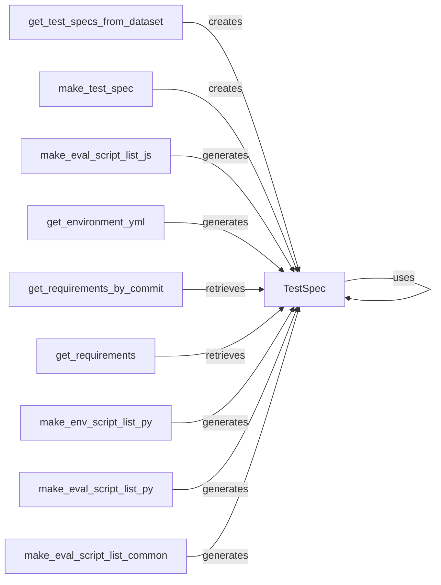

## Component Details

The Test Specification Handling subsystem is responsible for defining and managing test configurations for software tasks. It provides a standardized approach to create testing environments, generate necessary scripts (like Dockerfiles and environment setup scripts), and execute evaluation scripts. This ensures consistent and reproducible evaluation results across different tasks and programming languages. The core of this subsystem revolves around the `TestSpec` object, which encapsulates all the information needed to set up and run tests. The process starts with retrieving test specifications from a dataset, creating `TestSpec` instances, and then generating the necessary environment and evaluation scripts based on the programming language of the task.

### TestSpec
Represents a test specification, encapsulating information needed to create testing environments and execute tests. It includes methods for defining base, environment, and instance-specific Dockerfiles. It serves as a central data structure holding all the necessary information for a test.
- **Related Classes/Methods**: `swebench.harness.test_spec.test_spec.TestSpec`

### get_test_specs_from_dataset
Retrieves test specifications from a dataset. This function serves as the entry point for obtaining the necessary information to create test environments. It parses the dataset and extracts the relevant test configurations.
- **Related Classes/Methods**: `swebench.harness.test_spec.test_spec.get_test_specs_from_dataset`

### make_test_spec
Creates a TestSpec object. This function likely takes raw data and transforms it into a structured TestSpec instance. It populates the TestSpec object with the necessary information extracted from the dataset.
- **Related Classes/Methods**: `swebench.harness.test_spec.test_spec.make_test_spec`

### make_eval_script_list_js
Generates a list of evaluation scripts for JavaScript tests. These scripts are used to execute and assess the performance or correctness of JavaScript code. It creates the specific commands and scripts needed to evaluate JavaScript code.
- **Related Classes/Methods**: `swebench.harness.test_spec.javascript.make_eval_script_list_js`

### get_environment_yml
Creates a YAML file defining the environment for Python tests. This file specifies the dependencies and configurations required to run the Python code. It generates a conda environment file that lists all the necessary Python packages.
- **Related Classes/Methods**: `swebench.harness.test_spec.python.get_environment_yml`

### get_requirements_by_commit
Retrieves the Python requirements for a specific commit. This is useful for ensuring that the test environment matches the exact dependencies of the code being tested. It fetches the requirements.txt file associated with a particular commit.
- **Related Classes/Methods**: `swebench.harness.test_spec.python.get_requirements_by_commit`

### get_requirements
Retrieves the Python requirements. This function is likely used to gather the necessary dependencies for setting up the Python test environment. It extracts the Python package dependencies from a given source.
- **Related Classes/Methods**: `swebench.harness.test_spec.python.get_requirements`

### make_env_script_list_py
Generates a list of environment setup scripts for Python tests. These scripts are responsible for configuring the environment before running the tests. It creates scripts to set up the Python environment, potentially including installing dependencies.
- **Related Classes/Methods**: `swebench.harness.test_spec.python.make_env_script_list_py`

### make_eval_script_list_py
Generates a list of evaluation scripts for Python tests. These scripts are used to execute and assess the performance or correctness of Python code. It creates the specific commands and scripts needed to evaluate Python code.
- **Related Classes/Methods**: `swebench.harness.test_spec.python.make_eval_script_list_py`

### make_eval_script_list_common
Generates a list of common evaluation scripts. These scripts are likely used across multiple languages or test types. It creates evaluation scripts that are language-agnostic or applicable to multiple languages.
- **Related Classes/Methods**: `swebench.harness.test_spec.utils.make_eval_script_list_common`
