```mermaid
graph LR
    Data_Acquisition_and_Preparation["Data Acquisition and Preparation"]
    Inference_Engine["Inference Engine"]
    Evaluation_Harness["Evaluation Harness"]
    Docker_Environment_Management["Docker Environment Management"]
    Test_Specification_Handling["Test Specification Handling"]
    Log_Parsing_and_Result_Extraction["Log Parsing and Result Extraction"]
    Data_Acquisition_and_Preparation -- "provides data to" --> Inference_Engine
    Data_Acquisition_and_Preparation -- "provides data to" --> Evaluation_Harness
    Inference_Engine -- "generates patches using" --> Evaluation_Harness
    Evaluation_Harness -- "builds images using" --> Docker_Environment_Management
    Evaluation_Harness -- "defines tests for" --> Test_Specification_Handling
    Evaluation_Harness -- "parses logs for" --> Log_Parsing_and_Result_Extraction
    Test_Specification_Handling -- "builds images" --> Docker_Environment_Management
    click Data_Acquisition_and_Preparation href "https://github.com/CodeBoarding/GeneratedOnBoardings/blob/main/SWE-bench/Data Acquisition and Preparation.md" "Details"
    click Inference_Engine href "https://github.com/CodeBoarding/GeneratedOnBoardings/blob/main/SWE-bench/Inference Engine.md" "Details"
    click Evaluation_Harness href "https://github.com/CodeBoarding/GeneratedOnBoardings/blob/main/SWE-bench/Evaluation Harness.md" "Details"
    click Docker_Environment_Management href "https://github.com/CodeBoarding/GeneratedOnBoardings/blob/main/SWE-bench/Docker Environment Management.md" "Details"
    click Test_Specification_Handling href "https://github.com/CodeBoarding/GeneratedOnBoardings/blob/main/SWE-bench/Test Specification Handling.md" "Details"
    click Log_Parsing_and_Result_Extraction href "https://github.com/CodeBoarding/GeneratedOnBoardings/blob/main/SWE-bench/Log Parsing and Result Extraction.md" "Details"
```

## Component Details

SWE-bench automates the process of collecting software tasks, generating code patches using language models, and evaluating the generated patches in isolated environments. The main flow involves acquiring tasks from repositories, transforming them into datasets, using language models to infer potential solutions, and then rigorously evaluating these solutions using Docker containers and test specifications. The purpose is to provide a standardized and automated benchmark for evaluating the performance of language models on software development tasks.

### Data Acquisition and Preparation
This component is responsible for collecting software tasks from various sources, such as GitHub repositories, and transforming them into datasets suitable for training and evaluating language models. It handles data extraction, cleaning, and formatting, including tokenization and indexing for efficient retrieval. It also manages the versioning of tasks and instances.
- **Related Classes/Methods**: `swebench.collect.utils.Repo`, `swebench.collect.get_tasks_pipeline`, `swebench.collect.build_dataset`, `swebench.inference.make_datasets.create_text_dataset`, `swebench.inference.make_datasets.create_instance`, `swebench.inference.make_datasets.bm25_retrieval`, `swebench.inference.make_datasets.utils`, `swebench.versioning.get_versions`

### Inference Engine
The Inference Engine leverages language models to generate potential code patches for the identified software tasks. It supports various inference methods, including local Llama models and external APIs like OpenAI and Anthropic, providing flexibility in model selection and deployment. This component is the core of the patch generation process.
- **Related Classes/Methods**: `swebench.inference.run_llama`, `swebench.inference.run_api`, `swebench.inference.run_live`, `swebench.inference.llamao.modeling_flash_llama`

### Evaluation Harness
The Evaluation Harness orchestrates the entire evaluation process. It builds Docker images based on test specifications, executes tests within isolated containers, grades the results based on predefined criteria, and generates comprehensive reports. It ensures a consistent and reliable evaluation environment, providing the framework for assessing the quality of generated patches.
- **Related Classes/Methods**: `swebench.harness.run_evaluation`, `swebench.harness.docker_build`, `swebench.harness.grading`, `swebench.harness.reporting`, `swebench.harness.test_spec.test_spec`, `swebench.harness.modal_eval.run_evaluation_modal`, `swebench.harness.modal_eval.run_evaluation_modal_entrypoint`

### Docker Environment Management
This component manages the creation, configuration, and cleanup of Docker images and containers used for evaluation. It provides utilities for building images from Dockerfiles, removing unused images, and interacting with the Docker daemon, ensuring a clean and efficient evaluation environment for running tests in isolation.
- **Related Classes/Methods**: `swebench.harness.docker_build`, `swebench.harness.docker_utils`

### Test Specification Handling
The Test Specification Handler defines the structure and configuration of tests for each software task. It generates Dockerfiles, creates environment setup scripts, and manages the execution of evaluation scripts, providing a standardized way to define and run tests across different tasks and programming languages. This ensures consistent and reproducible evaluation results.
- **Related Classes/Methods**: `swebench.harness.test_spec.test_spec`, `swebench.harness.test_spec.python`, `swebench.harness.test_spec.javascript`

### Log Parsing and Result Extraction
The Log Parser component analyzes the logs generated during test execution to extract relevant information about test results. It supports different programming languages and provides a structured way to interpret test output, enabling automated grading and reporting of the evaluation results.
- **Related Classes/Methods**: `swebench.harness.log_parsers.python`, `swebench.harness.log_parsers.javascript`, `swebench.harness.log_parsers.ruby`