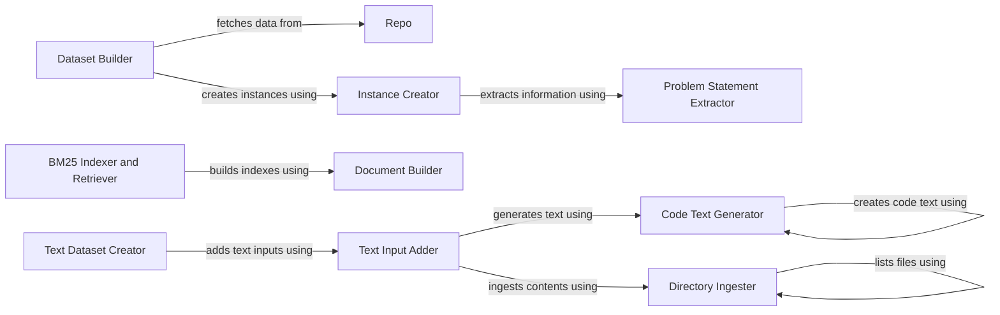

## Component Details

The Data Collection and Preparation component automates the process of gathering and transforming software engineering tasks from repositories into a usable format for downstream inference tasks. It involves fetching data from repositories, extracting relevant information from issues and pull requests, creating data instances, and generating text datasets. The component ensures that the data is properly formatted and tokenized for model consumption, facilitating tasks such as code retrieval and problem solving.

### Repo
The `Repo` component interacts with code repositories (e.g., GitHub) via their APIs to fetch issues, pull requests, and other repository data. It provides methods to extract and process the retrieved information, acting as the primary interface for accessing repository data.
- **Related Classes/Methods**: `swebench.collect.utils.Repo`

### Problem Statement Extractor
The `Problem Statement Extractor` component extracts the problem statement and hints from a given text. It employs different strategies to extract the information, adapting to various text formats and structures.
- **Related Classes/Methods**: `swebench.collect.utils.extract_problem_statement_and_hints`

### Dataset Builder
The `Dataset Builder` component orchestrates the process of building a dataset from a code repository. It fetches data using the `Repo` component, filters pull requests based on defined criteria, and creates instances using the `Instance Creator` component.
- **Related Classes/Methods**: `swebench.collect.build_dataset.main`

### Instance Creator
The `Instance Creator` component creates a single instance of a problem for the dataset. It extracts patches and problem statements/hints using the `Problem Statement Extractor` component, combining them to form a complete instance.
- **Related Classes/Methods**: `swebench.collect.build_dataset.create_instance`

### BM25 Indexer and Retriever
The `BM25 Indexer and Retriever` component builds and searches BM25 indexes for code retrieval. It clones repositories, builds indexes, and searches for relevant code snippets, enabling efficient code search and retrieval.
- **Related Classes/Methods**: `swebench.inference.make_datasets.bm25_retrieval.main`

### Document Builder
The `Document Builder` component builds documents from files in a repository for BM25 indexing. It lists files and manages the context of the repository, preparing the files for indexing.
- **Related Classes/Methods**: `swebench.inference.make_datasets.bm25_retrieval.build_documents`

### Text Dataset Creator
The `Text Dataset Creator` component creates a text dataset from JSONL files. It validates arguments, constructs output filenames, and adds text inputs using the `Text Input Adder` component.
- **Related Classes/Methods**: `swebench.inference.make_datasets.create_text_dataset.main`

### Text Input Adder
The `Text Input Adder` component adds text inputs to a data instance. It uses functions to add retrieval results, ingest files, and create code text, enriching the data instance with relevant text information.
- **Related Classes/Methods**: `swebench.inference.make_datasets.create_instance.add_text_inputs`

### Code Text Generator
The `Code Text Generator` component creates a text representation of code. It adds lines of code to the text, generating a readable text format of the code.
- **Related Classes/Methods**: `swebench.inference.make_datasets.create_instance.make_code_text`

### Directory Ingester
The `Directory Ingester` component ingests the contents of a directory. It lists files and detects the encoding of the files, preparing the directory contents for further processing.
- **Related Classes/Methods**: `swebench.inference.make_datasets.utils.ingest_directory_contents`
