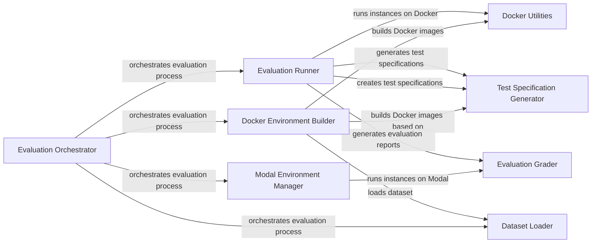

## Component Details

The Evaluation and Reporting component is responsible for executing and assessing the generated code within isolated environments, either using Docker containers or Modal sandboxes. It orchestrates the building of necessary images or sandbox environments, runs the code against predefined test specifications, grades the results based on the test outcomes, and generates comprehensive reports detailing the evaluation process and results. This ensures a standardized and rigorous evaluation of the generated code's correctness and performance.

### Evaluation Orchestrator
The central component that manages the entire evaluation process. It loads the dataset, determines the execution environment (Docker or Modal), and initiates the evaluation of bug instances. It aggregates results and triggers report generation.
- **Related Classes/Methods**: `swebench.harness.run_evaluation:main`

### Docker Environment Builder
This component builds the Docker images required for running the evaluation in a containerized environment. It retrieves test specifications from the dataset and constructs both base images and environment-specific images tailored to each bug instance.
- **Related Classes/Methods**: `swebench.harness.docker_build:build_env_images`, `swebench.harness.docker_build:build_container`

### Docker Utilities
Provides a set of utility functions for interacting with the Docker daemon. These utilities enable listing images, removing containers, copying files to and from containers, and executing commands within the containers.
- **Related Classes/Methods**: `swebench.harness.docker_utils`

### Modal Environment Manager
This component manages the execution of evaluations within the Modal sandbox environment. It handles the setup of the sandbox, execution of scripts, and retrieval of results from the Modal environment.
- **Related Classes/Methods**: `swebench.harness.modal_eval.run_evaluation_modal:run_instances_modal`, `swebench.harness.modal_eval.run_evaluation_modal:run_instance_modal`, `swebench.harness.modal_eval.run_evaluation_modal.ModalSandboxRuntime`

### Test Specification Generator
Creates test specifications for each bug instance. These specifications define the environment, repository, and evaluation scripts necessary for running the tests.
- **Related Classes/Methods**: `swebench.harness.test_spec.test_spec:make_test_spec`

### Evaluation Runner
Executes the evaluation for a set of bug instances, either using Docker containers or Modal sandboxes. It manages the execution of tests, handles potential errors, and collects the results for grading.
- **Related Classes/Methods**: `swebench.harness.run_evaluation:run_instances`

### Evaluation Grader
Generates an evaluation report for each bug instance, including logs, test results, and the final resolution status. This component assesses the outcome of the tests and determines whether the generated code successfully fixed the bug.
- **Related Classes/Methods**: `swebench.harness.grading:get_eval_report`

### Dataset Loader
Loads the SWEBench dataset from a specified file, providing the bug instances and their associated information for the evaluation process.
- **Related Classes/Methods**: `swebench.harness.utils:load_swebench_dataset`
