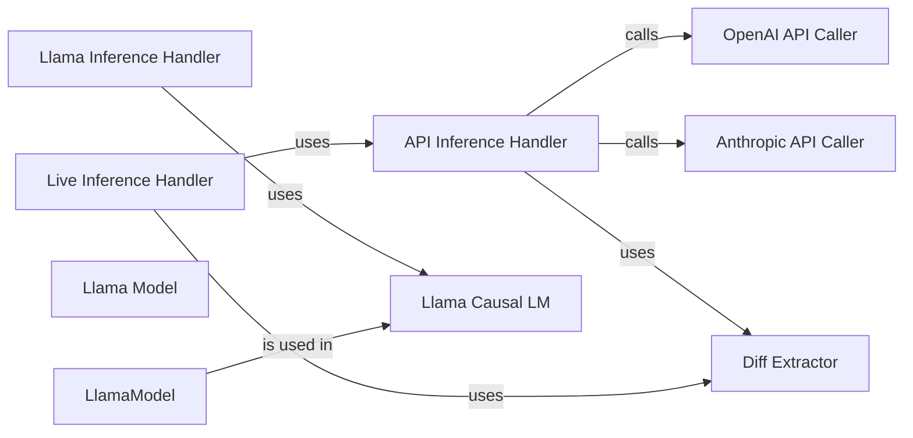

## Component Details

The Inference Orchestration component manages the process of generating code using different models, including OpenAI, Anthropic, and Llama. It provides a unified framework for running inference, handling tokenization, cost calculation, and API calls. The component supports both offline inference using pre-prepared datasets and live inference on real-world issues by retrieving relevant information and generating patches. It adapts to different models and APIs, providing a flexible and adaptable inference framework.

### API Inference Handler
This component handles inference using external APIs like OpenAI and Anthropic. It selects the appropriate API based on configuration, calls the API, and extracts the generated code. It also manages token usage and cost calculation. It interacts with `call_chat` and `call_anthropic` to make the API calls and `extract_diff` to get the code differences.
- **Related Classes/Methods**: `swebench.inference.run_api`, `swebench.inference.run_api.openai_inference`, `swebench.inference.run_api.anthropic_inference`

### Llama Inference Handler
This component manages the inference process using the Llama model. It loads the model, tokenizer, and input data, generates code using the model, and saves the output. It interacts with the Llama model components (`LlamaForCausalLM`, `LlamaModel`, `LlamaDecoderLayer`, `LlamaAttention`, `FlashRotaryEmbedding`) to perform the code generation.
- **Related Classes/Methods**: `swebench.inference.run_llama`, `swebench.inference.run_llama.main`, `swebench.inference.run_llama.load_data`, `swebench.inference.run_llama.generate`

### Live Inference Handler
This component handles inference in a live setting, taking an issue URL as input. It retrieves the problem statement, clones the repository, creates an index of the code, searches for relevant code snippets, and then calls the appropriate API (OpenAI or Anthropic) to generate code. It interacts with `API Inference Handler` to call the external APIs and `extract_diff` to get the code differences.
- **Related Classes/Methods**: `swebench.inference.run_live`, `swebench.inference.run_live.main`, `swebench.inference.run_live.make_instance`

### OpenAI API Caller
This component is responsible for calling the OpenAI chat API. It formats the input prompt and parameters, makes the API request, and returns the API response. It is used by the `API Inference Handler` and `Live Inference Handler`.
- **Related Classes/Methods**: `swebench.inference.run_api.call_chat`

### Anthropic API Caller
This component is responsible for calling the Anthropic API. It formats the input prompt and parameters, makes the API request, and returns the API response. It is used by the `API Inference Handler` and `Live Inference Handler`.
- **Related Classes/Methods**: `swebench.inference.run_api.call_anthropic`

### Diff Extractor
This component extracts the diff between the generated code and the original code. It takes the generated code and the original code as input and returns the diff in a standard format. It is used by the `API Inference Handler` and `Live Inference Handler`.
- **Related Classes/Methods**: `swebench.inference.make_datasets.utils.extract_diff`

### Llama Causal LM
This component represents the Llama model for causal language modeling. It's a wrapper around the core Llama model and is used for generating code. It uses `LlamaModel` as its base.
- **Related Classes/Methods**: `swebench.inference.llamao.modeling_flash_llama.LlamaForCausalLM`

### Llama Model
This component represents the core Llama model architecture. It consists of multiple decoder layers and handles the overall flow of information through the model. It uses `LlamaDecoderLayer`.
- **Related Classes/Methods**: `swebench.inference.llamao.modeling_flash_llama.LlamaModel`
