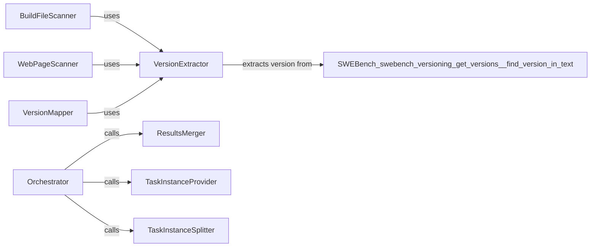

## Component Details

The Versioning Management component is responsible for extracting and managing version information from software projects. It retrieves version details from various sources like build files and web pages, consolidates this information, and maps it to specific task instances within the project. The component aims to provide a comprehensive view of the software versions used in different tasks, aiding in evaluation and analysis.

### VersionExtractor
The VersionExtractor component is responsible for extracting version strings from text using regular expressions. It provides a core functionality for identifying version information within different data sources, such as build files and web pages. It uses regular expressions to find patterns that match version numbers.
- **Related Classes/Methods**: `SWEBench.swebench.versioning.get_versions:get_version`, `SWEBench.swebench.versioning.get_versions:_find_version_in_text`

### BuildFileScanner
The BuildFileScanner component retrieves version information by parsing build files. It utilizes the VersionExtractor to identify version strings within the build file content. This component focuses on extracting version information directly from project build configurations.
- **Related Classes/Methods**: `SWEBench.swebench.versioning.get_versions:get_versions_from_build`

### WebPageScanner
The WebPageScanner component retrieves version information by scraping web pages. It uses the VersionExtractor to extract version strings from the web page content. This component is useful for projects that publish version information on their websites.
- **Related Classes/Methods**: `SWEBench.swebench.versioning.get_versions:get_versions_from_web`

### VersionMapper
The VersionMapper component maps extracted version information to specific task instances. This function associates the identified versions with the tasks they relate to, providing context for the version information.
- **Related Classes/Methods**: `SWEBench.swebench.versioning.get_versions:map_version_to_task_instances`

### ResultsMerger
The ResultsMerger component merges version information obtained from different sources (build files, web pages). It consolidates the extracted versions and their associated task instances into a unified result, providing a single source of truth for version information.
- **Related Classes/Methods**: `SWEBench.swebench.versioning.get_versions:merge_results`

### Orchestrator
The Orchestrator component is the main function that orchestrates the version extraction process. It calls functions to retrieve versions from build files and web pages, then merges the results and maps them to task instances. It manages the overall flow of version extraction.
- **Related Classes/Methods**: `SWEBench.swebench.versioning.get_versions:main`

### TaskInstanceProvider
The TaskInstanceProvider component retrieves task instances. It is used by the Orchestrator to get the instances to map versions to. This component provides the context for associating versions with specific tasks.
- **Related Classes/Methods**: `swebench.versioning.utils:get_instances`

### TaskInstanceSplitter
The TaskInstanceSplitter component splits task instances. It is used by the Orchestrator to split the instances to map versions to. This component helps in managing and processing task instances efficiently.
- **Related Classes/Methods**: `swebench.versioning.utils:split_instances`
