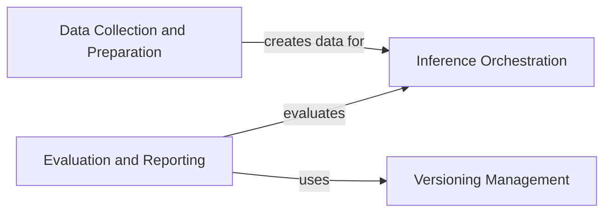

## Component Details

SWEBench is a comprehensive benchmark for evaluating software engineering tasks. The main flow involves collecting and preparing data from software repositories, orchestrating inference using various models, and evaluating the generated code in isolated environments. The purpose is to provide a standardized and rigorous evaluation framework for assessing the performance of different models on software engineering tasks.

### Data Collection and Preparation
This component focuses on gathering software engineering tasks from repositories and transforming them into a usable format. It extracts information from issues and pull requests, creates instances, generates text datasets, and tokenizes the data for model consumption. The component ensures that the data is properly formatted and ready for use in downstream inference tasks.
- **Related Classes/Methods**: `swebench.collect.utils`, `swebench.collect.print_pulls`, `swebench.collect.get_tasks_pipeline`, `swebench.collect.build_dataset`, `swebench.inference.make_datasets.bm25_retrieval`, `swebench.inference.make_datasets.create_instance`, `swebench.inference.make_datasets.create_text_dataset`, `swebench.inference.make_datasets.tokenize_dataset`, `swebench.inference.make_datasets.utils`

### Inference Orchestration
This component manages the inference process using different models, including OpenAI, Anthropic, and Llama. It handles tokenization, cost calculation, and API calls. It also supports running inference on live issues by retrieving relevant information and generating patches, providing a flexible and adaptable inference framework.
- **Related Classes/Methods**: `swebench.inference.run_api`, `swebench.inference.run_live`, `swebench.inference.run_llama`, `swebench.inference.llamao.modeling_flash_llama`, `swebench.inference.llamao.distributed_attention`

### Evaluation and Reporting
This component provides the evaluation harness, which is responsible for building and running the generated code in isolated environments (Docker or Modal) to evaluate its correctness. It includes components for building Docker images, running tests, grading the results, and generating reports, ensuring a rigorous and standardized evaluation process.
- **Related Classes/Methods**: `swebench.harness.run_evaluation`, `swebench.harness.docker_build`, `swebench.harness.docker_utils`, `swebench.harness.grading`, `swebench.harness.test_spec`, `swebench.harness.utils`, `swebench.harness.reporting`, `swebench.harness.modal_eval`

### Versioning Management
This component deals with managing and extracting version information from the software projects being evaluated. It provides utilities for retrieving version information, ensuring that the evaluation process is aware of the specific versions of the software being tested.
- **Related Classes/Methods**: `swebench.versioning.get_versions`, `swebench.versioning.utils`