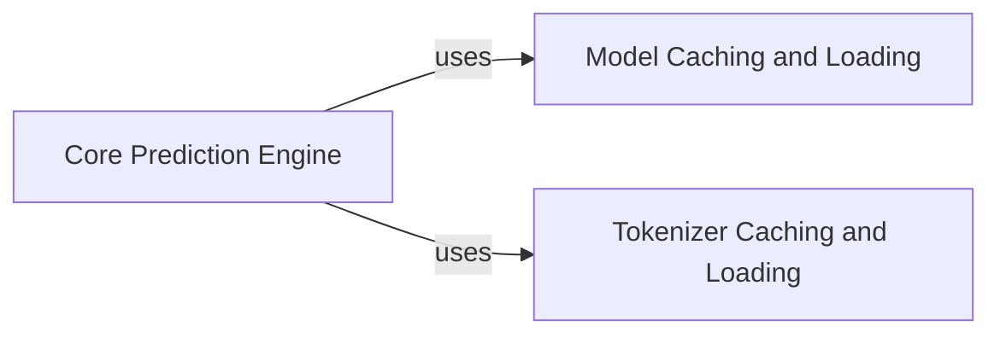

## Component Details

This graph illustrates the core prediction functionality within the Sapiens project. The main flow involves the 'Core Prediction Engine' which orchestrates the prediction process by utilizing cached models and tokenizers to generate various prediction outputs such as residue scores, best scores, masked predictions, and embeddings. The 'Model Caching and Loading' and 'Tokenizer Caching and Loading' components are responsible for efficiently providing the necessary pre-trained models and tokenizers to the prediction engine.

### Core Prediction Engine
This component encapsulates the primary logic for generating Sapiens residue scores. It orchestrates the entire prediction process, from loading necessary models and tokenizers to performing sequence inference and deriving various output formats like probabilities, best scores, masked predictions, and embeddings.

**Related Classes/Methods**:

- <a href="https://github.com/Merck/Sapiens/blob/master/sapiens/predict.py#L23-L59" target="_blank" rel="noopener noreferrer">`sapiens.predict.predict_scores` (23:59)</a>
- <a href="https://github.com/Merck/Sapiens/blob/master/sapiens/predict.py#L62-L64" target="_blank" rel="noopener noreferrer">`sapiens.predict.predict_best_score` (62:64)</a>
- <a href="https://github.com/Merck/Sapiens/blob/master/sapiens/predict.py#L67-L69" target="_blank" rel="noopener noreferrer">`sapiens.predict.predict_masked` (67:69)</a>
- <a href="https://github.com/Merck/Sapiens/blob/master/sapiens/predict.py#L72-L74" target="_blank" rel="noopener noreferrer">`sapiens.predict.predict_residue_embedding` (72:74)</a>
- <a href="https://github.com/Merck/Sapiens/blob/master/sapiens/predict.py#L77-L78" target="_blank" rel="noopener noreferrer">`sapiens.predict.predict_sequence_embedding` (77:78)</a>

### Model Caching and Loading
This component is dedicated to efficiently managing the loading and caching of pre-trained RobertaForMaskedLM models. It ensures that model instances are readily available for prediction tasks, minimizing redundant loading operations.

**Related Classes/Methods**:

- <a href="https://github.com/Merck/Sapiens/blob/master/sapiens/predict.py#L11-L14" target="_blank" rel="noopener noreferrer">`sapiens.predict.load_cached_model` (11:14)</a>

### Tokenizer Caching and Loading
This component handles the loading and caching of RobertaTokenizer instances. These tokenizers are crucial for preprocessing input sequences into a format suitable for the prediction model.

**Related Classes/Methods**:

- <a href="https://github.com/Merck/Sapiens/blob/master/sapiens/predict.py#L17-L20" target="_blank" rel="noopener noreferrer">`sapiens.predict.load_cached_tokenizer` (17:20)</a>

### [FAQ](https://github.com/CodeBoarding/GeneratedOnBoardings/tree/main?tab=readme-ov-file#faq)