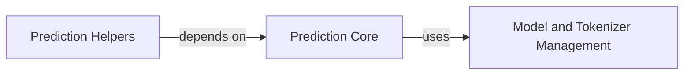

## Component Details

This subsystem is responsible for managing and utilizing pre-trained language models and tokenizers to predict Sapiens residue scores and derive various sequence-based insights. The core flow involves loading models and tokenizers, performing predictions, and then using these predictions to generate specific outputs like best-scoring sequences or embeddings.

### Model and Tokenizer Management
Manages the loading and caching of pre-trained language models (RobertaForMaskedLM) and their corresponding tokenizers (RobertaTokenizer) to optimize performance by avoiding redundant loading. It ensures that the necessary resources are available for the core prediction engine.

**Related Classes/Methods**:

- <a href="https://github.com/Merck/Sapiens/blob/master/sapiens/predict.py#L11-L14" target="_blank" rel="noopener noreferrer">`sapiens.predict.load_cached_model` (11:14)</a>
- <a href="https://github.com/Merck/Sapiens/blob/master/sapiens/predict.py#L17-L20" target="_blank" rel="noopener noreferrer">`sapiens.predict.load_cached_tokenizer` (17:20)</a>

### Prediction Core
This component is responsible for the core logic of predicting Sapiens residue scores. It takes a sequence and chain type, loads the appropriate model and tokenizer, and performs the prediction, returning probabilities or logits, and optionally embeddings.

**Related Classes/Methods**:

- <a href="https://github.com/Merck/Sapiens/blob/master/sapiens/predict.py#L23-L59" target="_blank" rel="noopener noreferrer">`sapiens.predict.predict_scores` (23:59)</a>

### Prediction Helpers
This component provides utility functions that leverage the core prediction functionality to derive specific outputs, such as the best scoring sequence, masked predictions, or various types of embeddings.

**Related Classes/Methods**:

- <a href="https://github.com/Merck/Sapiens/blob/master/sapiens/predict.py#L62-L64" target="_blank" rel="noopener noreferrer">`sapiens.predict.predict_best_score` (62:64)</a>
- <a href="https://github.com/Merck/Sapiens/blob/master/sapiens/predict.py#L67-L69" target="_blank" rel="noopener noreferrer">`sapiens.predict.predict_masked` (67:69)</a>
- <a href="https://github.com/Merck/Sapiens/blob/master/sapiens/predict.py#L72-L74" target="_blank" rel="noopener noreferrer">`sapiens.predict.predict_residue_embedding` (72:74)</a>
- <a href="https://github.com/Merck/Sapiens/blob/master/sapiens/predict.py#L77-L78" target="_blank" rel="noopener noreferrer">`sapiens.predict.predict_sequence_embedding` (77:78)</a>

### [FAQ](https://github.com/CodeBoarding/GeneratedOnBoardings/tree/main?tab=readme-ov-file#faq)