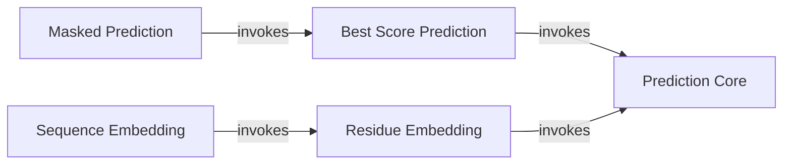

## Component Details

This graph illustrates the architecture of the Sapiens prediction subsystem, focusing on how raw prediction scores and embeddings are processed. The core functionality resides in the 'Prediction Core' component, which handles model loading and basic score/embedding generation. Other components, such as 'Best Score Prediction', 'Masked Prediction', 'Residue Embedding', and 'Sequence Embedding', build upon this core to provide specialized processing and interpretation of the prediction results, ultimately transforming raw outputs into meaningful biological insights.

### Prediction Core
This component is responsible for the fundamental prediction of Sapiens residue scores. It loads pre-trained models and tokenizers, processes input sequences, and generates residue scores or embeddings.

**Related Classes/Methods**:

- <a href="https://github.com/Merck/Sapiens/blob/master/sapiens/predict.py#L23-L59" target="_blank" rel="noopener noreferrer">`sapiens.predict.predict_scores` (23:59)</a>
- <a href="https://github.com/Merck/Sapiens/blob/master/sapiens/predict.py#L11-L14" target="_blank" rel="noopener noreferrer">`sapiens.predict.load_cached_model` (11:14)</a>
- <a href="https://github.com/Merck/Sapiens/blob/master/sapiens/predict.py#L17-L20" target="_blank" rel="noopener noreferrer">`sapiens.predict.load_cached_tokenizer` (17:20)</a>

### Best Score Prediction
This component leverages the Prediction Core to obtain residue scores and then identifies the best scoring residue for each position in the sequence, returning the resulting sequence.

**Related Classes/Methods**:

- <a href="https://github.com/Merck/Sapiens/blob/master/sapiens/predict.py#L62-L64" target="_blank" rel="noopener noreferrer">`sapiens.predict.predict_best_score` (62:64)</a>

### Masked Prediction
This component performs masked prediction by first determining the best score sequence using the Best Score Prediction component and then applying a masking logic based on the original and best score sequences.

**Related Classes/Methods**:

- <a href="https://github.com/Merck/Sapiens/blob/master/sapiens/predict.py#L67-L69" target="_blank" rel="noopener noreferrer">`sapiens.predict.predict_masked` (67:69)</a>

### Residue Embedding
This component is responsible for generating residue-level embeddings for a given sequence. It utilizes the Prediction Core to obtain both scores and embeddings.

**Related Classes/Methods**:

- <a href="https://github.com/Merck/Sapiens/blob/master/sapiens/predict.py#L72-L74" target="_blank" rel="noopener noreferrer">`sapiens.predict.predict_residue_embedding` (72:74)</a>

### Sequence Embedding
This component calculates a single sequence-level embedding by averaging the residue embeddings obtained from the Residue Embedding component.

**Related Classes/Methods**:

- <a href="https://github.com/Merck/Sapiens/blob/master/sapiens/predict.py#L77-L78" target="_blank" rel="noopener noreferrer">`sapiens.predict.predict_sequence_embedding` (77:78)</a>

### [FAQ](https://github.com/CodeBoarding/GeneratedOnBoardings/tree/main?tab=readme-ov-file#faq)