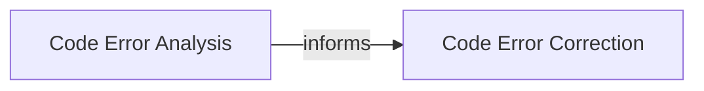

## Details

A specialized subsystem that supports the `LLM Processing Nodes` by providing tools for analyzing and correcting generated code. It addresses different error types, including syntax, execution, validation, and semantic errors, ensuring the reliability and correctness of LLM-generated code.

### Code Error Analysis
This component is responsible for the comprehensive analysis of LLM-generated code to identify and categorize various types of errors (syntax, execution, validation, semantic). It provides detailed diagnostics that inform the subsequent correction process, ensuring the generated code is fit for execution within the web scraping pipeline. This component is crucial for quality assurance in an LLM-driven system.

**Related Classes/Methods**:

- <a href="https://github.com/ScrapeGraphAI/Scrapegraph-ai/blob/main/scrapegraphai/utils/code_error_analysis.py" target="_blank" rel="noopener noreferrer">`scrapegraphai.utils.code_error_analysis`</a>

### Code Error Correction
This component focuses on generating revised or entirely new code snippets based on the error analysis provided by the `Code Error Analysis` component. Its goal is to produce functionally correct and robust code that can be successfully executed by the web fetching and data extraction layers, directly contributing to the reliability of the LLM-orchestrated pipeline. This component embodies the "correction" aspect of the subsystem, directly addressing identified issues.

**Related Classes/Methods**:

- <a href="https://github.com/ScrapeGraphAI/Scrapegraph-ai/blob/main/scrapegraphai/utils/code_error_correction.py" target="_blank" rel="noopener noreferrer">`scrapegraphai.utils.code_error_correction`</a>

### [FAQ](https://github.com/CodeBoarding/GeneratedOnBoardings/tree/main?tab=readme-ov-file#faq)