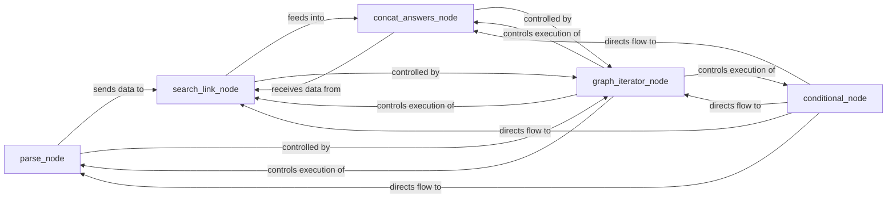

## Details

The `Data Transformation Nodes` subsystem is a core part of the `Scrapegraph-ai` project, responsible for processing raw web content, extracting structured data, and transforming it into a usable format for subsequent steps within the graph pipeline. It encompasses modular components that handle parsing, linking, answer concatenation, graph iteration, and conditional logic.

### parse_node
Responsible for initial data parsing and extraction, specifically identifying and cleaning URLs from raw web content. It acts as the entry point for raw data into the transformation process.

**Related Classes/Methods**:

- <a href="https://github.com/ScrapeGraphAI/Scrapegraph-ai/blob/main/examples/custom_graph/ollama/custom_graph_ollama.py" target="_blank" rel="noopener noreferrer">`parse_node`</a>

### search_link_node
Acts as a data filter and validator, ensuring only relevant and valid links proceed in the scraping process. It refines the output from the `parse_node`.

**Related Classes/Methods**:

- <a href="https://github.com/ScrapeGraphAI/Scrapegraph-ai/blob/main/scrapegraphai/graphs/search_link_graph.py" target="_blank" rel="noopener noreferrer">`search_link_node`</a>

### concat_answers_node
Functions as a data aggregator, combining extracted information into a unified, structured output. This is crucial for consolidating data from various sources or iterative steps.

**Related Classes/Methods**:

- <a href="https://github.com/ScrapeGraphAI/Scrapegraph-ai/blob/main/scrapegraphai/nodes/concat_answers_node.py" target="_blank" rel="noopener noreferrer">`concat_answers_node`</a>

### graph_iterator_node
Manages iterative processing and flow control within complex scraping graphs, enabling multi-page or recursive data extraction. It embodies the orchestration aspect of the pipeline.

**Related Classes/Methods**:

- <a href="https://github.com/ScrapeGraphAI/Scrapegraph-ai/blob/main/scrapegraphai/graphs/document_scraper_multi_graph.py" target="_blank" rel="noopener noreferrer">`graph_iterator_node`</a>

### conditional_node
Implements dynamic decision-making logic, allowing the graph to adapt its execution path based on specified conditions. This provides flexibility and intelligence to the data flow.

**Related Classes/Methods**:

- <a href="https://github.com/ScrapeGraphAI/Scrapegraph-ai/blob/main/scrapegraphai/graphs/smart_scraper_multi_concat_graph.py" target="_blank" rel="noopener noreferrer">`conditional_node`</a>

### [FAQ](https://github.com/CodeBoarding/GeneratedOnBoardings/tree/main?tab=readme-ov-file#faq)