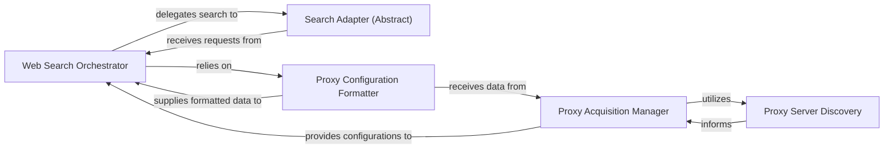

## Details

The Web Search and Proxy Management subsystem is designed to efficiently handle external web search operations, incorporating robust proxy management for enhanced reliability and anonymity. The `Web Search Orchestrator` acts as the central coordinator, preparing search queries and delegating them to various `Search Adapters`. Proxy handling is managed by the `Proxy Acquisition Manager`, which can discover and format proxy configurations through the `Proxy Server Discovery` and `Proxy Configuration Formatter` components, ensuring that all external requests are routed appropriately. This modular design allows for easy integration of new search engines and flexible proxy strategies.

### Web Search Orchestrator
The central control point for all external web search operations. It is responsible for sanitizing search queries, applying proxy configurations, and delegating the actual search execution to specific search engine adapters. It also handles potential configuration and request errors. This component embodies the "Orchestration" pattern by coordinating various search-related tasks.

**Related Classes/Methods**:

- <a href="https://github.com/ScrapeGraphAI/Scrapegraph-ai/blob/main/scrapegraphai/utils/research_web.py" target="_blank" rel="noopener noreferrer">`scrapegraphai/utils/research_web.py`</a>

### Search Adapter (Abstract)
Represents a generalized interface for executing search queries against various search engines. This abstract component is realized by concrete implementations like `Bing Search Adapter`, `Searxng Search Adapter`, and `Serper Search Adapter`, embodying the "Modular/Plugin-based" pattern.

**Related Classes/Methods**:

- <a href="https://github.com/ScrapeGraphAI/Scrapegraph-ai/blob/main/scrapegraphai/utils/research_web.py" target="_blank" rel="noopener noreferrer">`scrapegraphai/utils/research_web.py`</a>

### Proxy Acquisition Manager
Oversees the process of obtaining proxy information, either by parsing a directly provided proxy string or by initiating a search for available proxy servers. This component is crucial for the "Data Flow" and reliability of external data fetching.

**Related Classes/Methods**:

- <a href="https://github.com/ScrapeGraphAI/Scrapegraph-ai/blob/main/scrapegraphai/utils/proxy_rotation.py" target="_blank" rel="noopener noreferrer">`scrapegraphai/utils/proxy_rotation.py`</a>

### Proxy Configuration Formatter
Transforms raw proxy configuration data into a standardized and usable format for HTTP requests, ensuring compatibility across different search mechanisms. This component supports the "Data Flow" by ensuring data consistency.

**Related Classes/Methods**:

- <a href="https://github.com/ScrapeGraphAI/Scrapegraph-ai/blob/main/scrapegraphai/utils/research_web.py" target="_blank" rel="noopener noreferrer">`scrapegraphai/utils/research_web.py`</a>
- <a href="https://github.com/ScrapeGraphAI/Scrapegraph-ai/blob/main/" target="_blank" rel="noopener noreferrer">`scrapegraphai/utils/proxy_config.py`</a>

### Proxy Server Discovery
Initiates and manages the discovery and retrieval of available proxy servers from external sources, contributing to the proxy pool for rotation. This component is a specialized part of the proxy management, essential for robust external interactions.

**Related Classes/Methods**:

- <a href="https://github.com/ScrapeGraphAI/Scrapegraph-ai/blob/main/scrapegraphai/utils/proxy_rotation.py" target="_blank" rel="noopener noreferrer">`scrapegraphai/utils/proxy_rotation.py`</a>

### [FAQ](https://github.com/CodeBoarding/GeneratedOnBoardings/tree/main?tab=readme-ov-file#faq)