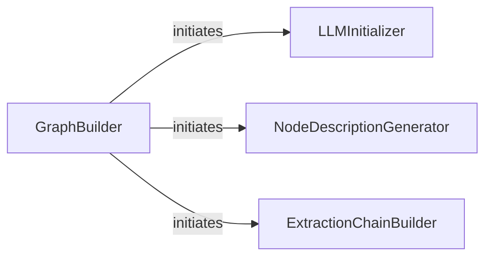

## Details

The Graph Definition & Setup subsystem is primarily encapsulated within the `scrapegraphai.builders.graph_builder` module, specifically the `GraphBuilder` class and its associated methods. This subsystem comprises four central components, each playing a distinct and crucial role in preparing the scraping graph for execution, aligning with the "AI-powered Web Scraping Library/Toolkit" patterns. These components are chosen due to their fundamental architectural importance in establishing the operational blueprint of the scraping process. `GraphBuilder` is the indispensable orchestrator, embodying the pipeline engine. `LLMInitializer` is critical for the "AI-powered" aspect, providing the intelligence. `NodeDescriptionGenerator` bridges the gap between the graph's structure and the LLM's understanding, enabling intelligent orchestration. Finally, `ExtractionChainBuilder` is where the concrete data flow logic is assembled, directly supporting the "data extraction" core functionality. Together, they form a cohesive unit responsible for the initial configuration and readiness of the entire scraping graph.

### GraphBuilder
This is the core orchestrator for defining and setting up the entire scraping graph. It aligns with the "Pipeline/Workflow Engine" and "Orchestration (LLM-driven)" architectural patterns by coordinating the initialization of various sub-components required for the graph's operation. It acts as the central point for assembling the graph's structure.

**Related Classes/Methods**:

- <a href="https://github.com/ScrapeGraphAI/Scrapegraph-ai/blob/main/scrapegraphai/builders/graph_builder.py#L13-L179" target="_blank" rel="noopener noreferrer">`scrapegraphai.builders.graph_builder.GraphBuilder`:13-179</a>

### LLMInitializer
This component specifically handles the setup and configuration of the Large Language Model (LLM) that will be used within the scraping process. It embodies the "LLM Interface/Adapter" pattern by abstracting the details of different LLM providers (e.g., OpenAI, Groq, Azure, Gemini, Ollama), making the system flexible regarding LLM integration.

**Related Classes/Methods**:

- <a href="https://github.com/ScrapeGraphAI/Scrapegraph-ai/blob/main/scrapegraphai/builders/graph_builder.py" target="_blank" rel="noopener noreferrer">`scrapegraphai.builders.graph_builder.GraphBuilder:_create_llm`</a>

### NodeDescriptionGenerator
This component generates or retrieves descriptions for the individual nodes that constitute the scraping graph. These descriptions are crucial for the LLM to understand and interact with the graph's structure, aligning with the "Prompt Engineering/Query Processor" pattern. It ensures the LLM has the necessary context to orchestrate the graph's execution.

**Related Classes/Methods**:

- <a href="https://github.com/ScrapeGraphAI/Scrapegraph-ai/blob/main/scrapegraphai/builders/graph_builder.py" target="_blank" rel="noopener noreferrer">`scrapegraphai.builders.graph_builder.GraphBuilder:_generate_nodes_description`</a>

### ExtractionChainBuilder
This component constructs the actual data extraction pipeline or "chain" based on the defined nodes and LLM configuration. It represents the assembly of "Data Extraction Logic/Nodes" into a coherent workflow, preparing the sequence of operations the graph will perform.

**Related Classes/Methods**:

- <a href="https://github.com/ScrapeGraphAI/Scrapegraph-ai/blob/main/scrapegraphai/builders/graph_builder.py" target="_blank" rel="noopener noreferrer">`scrapegraphai.builders.graph_builder.GraphBuilder:_create_extraction_chain`</a>

### [FAQ](https://github.com/CodeBoarding/GeneratedOnBoardings/tree/main?tab=readme-ov-file#faq)