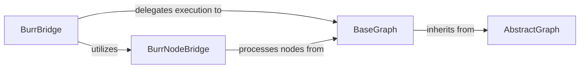

## Details

The Graph Orchestration Core subsystem is primarily defined by the scrapegraphai.graphs package, which establishes the foundational structure and execution logic for scraping graphs, and the scrapegraphai.integrations.burr_bridge module, which provides an external orchestration layer. This subsystem is responsible for the definition, execution, and management of data and control flow within the scraping graphs, acting as the central brain for orchestrating scraping operations.

### AbstractGraph
Serves as the foundational abstract class for all graph definitions. It establishes the common interface and initial setup for any scraping graph, including shared parameters and the initialization of the Language Model (LLM). This component is crucial for defining the common contract for all graph-based scraping pipelines.

**Related Classes/Methods**:

- <a href="https://github.com/ScrapeGraphAI/Scrapegraph-ai/blob/main/scrapegraphai/graphs/abstract_graph.py#L26-L339" target="_blank" rel="noopener noreferrer">`scrapegraphai.graphs.abstract_graph.AbstractGraph`:26-339</a>

### BaseGraph
Implements the core graph execution engine. It is responsible for managing the flow of data and control between nodes, including the creation and management of edges (connections), handling conditional routing, and orchestrating the step-by-step execution of the graph. This is the central "Pipeline/Workflow Engine" of the subsystem, directly executing the scraping logic.

**Related Classes/Methods**:

- <a href="https://github.com/ScrapeGraphAI/Scrapegraph-ai/blob/main/scrapegraphai/graphs/base_graph.py#L18-L398" target="_blank" rel="noopener noreferrer">`scrapegraphai.graphs.base_graph.BaseGraph`:18-398</a>

### BurrBridge
Acts as an integration layer, enabling the orchestration of Scrapegraph-ai graphs using the Burr state machine framework. It translates the graph's execution flow into Burr actions and manages the Burr application lifecycle, providing an external, robust orchestration mechanism. This component extends the system's orchestration capabilities beyond its internal engine.

**Related Classes/Methods**:

- <a href="https://github.com/ScrapeGraphAI/Scrapegraph-ai/blob/main/scrapegraphai/integrations/burr_bridge.py#L89-L227" target="_blank" rel="noopener noreferrer">`scrapegraphai.integrations.burr_bridge.BurrBridge`:89-227</a>

### BurrNodeBridge
Functions as an adapter, translating individual Scrapegraph-ai graph nodes into Burr-compatible actions. This facilitates the seamless execution of granular steps of the scraping process within the Burr framework, ensuring that each node's operation can be managed and tracked by Burr.

**Related Classes/Methods**:

- <a href="https://github.com/ScrapeGraphAI/Scrapegraph-ai/blob/main/scrapegraphai/integrations/burr_bridge.py#L41-L69" target="_blank" rel="noopener noreferrer">`scrapegraphai.integrations.burr_bridge.BurrNodeBridge`:41-69</a>

### [FAQ](https://github.com/CodeBoarding/GeneratedOnBoardings/tree/main?tab=readme-ov-file#faq)