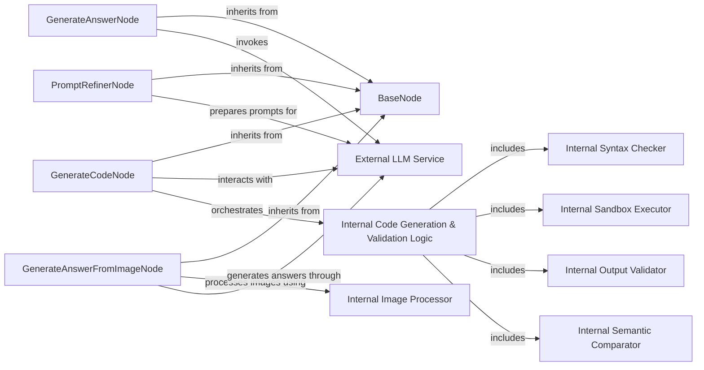

## Details

The scrapegraphai.nodes subsystem is built around a BaseNode abstract class, providing a common interface for various LLM-driven processing nodes. Key components include GenerateAnswerNode for text-based answer generation, GenerateCodeNode for iterative code generation and validation, PromptRefinerNode for optimizing LLM prompts, and GenerateAnswerFromImageNode for multi-modal image analysis. The External LLM Service represents the integration point with various Large Language Models, which are leveraged by GenerateAnswerNode, GenerateCodeNode, and GenerateAnswerFromImageNode for their core functionalities. GenerateCodeNode internally orchestrates a sophisticated Internal Code Generation & Validation Logic which encompasses Internal Syntax Checker, Internal Sandbox Executor, Internal Output Validator, and Internal Semantic Comparator to ensure robust code output. Similarly, GenerateAnswerFromImageNode utilizes an Internal Image Processor for handling image inputs before LLM interaction. This architecture emphasizes modularity and specialized processing capabilities for different data types and tasks within the scraping and AI pipeline.

### BaseNode
The foundational abstract class for all LLM-driven processing nodes. It provides common initialization, input key parsing, and expression evaluation functionalities, ensuring a consistent interface and shared foundational logic across specialized nodes.

**Related Classes/Methods**:

- <a href="https://github.com/ScrapeGraphAI/Scrapegraph-ai/blob/main/scrapegraphai/nodes/base_node.py" target="_blank" rel="noopener noreferrer">`scrapegraphai.nodes.base_node:BaseNode`</a>

### GenerateAnswerNode
Specializes in generating concise and relevant textual answers from input data by querying an external Large Language Model. This is a core AI-powered data extraction capability.

**Related Classes/Methods**:

- <a href="https://github.com/ScrapeGraphAI/Scrapegraph-ai/blob/main/scrapegraphai/nodes/generate_answer_node.py" target="_blank" rel="noopener noreferrer">`scrapegraphai.nodes.generate_answer_node:GenerateAnswerNode`</a>

### GenerateCodeNode
Focuses on generating and iteratively refining executable code, incorporating robust validation mechanisms. It ensures the correctness and functionality of generated code through syntax checking, sandbox execution, output validation, and semantic comparison.

**Related Classes/Methods**:

- <a href="https://github.com/ScrapeGraphAI/Scrapegraph-ai/blob/main/scrapegraphai/nodes/generate_code_node.py" target="_blank" rel="noopener noreferrer">`scrapegraphai.nodes.generate_code_node:GenerateCodeNode`</a>

### PromptRefinerNode
Dedicated to optimizing and refining input prompts before they are sent to an LLM. This process enhances the clarity, specificity, and effectiveness of prompts, leading to more accurate and desirable LLM responses.

**Related Classes/Methods**:

- <a href="https://github.com/ScrapeGraphAI/Scrapegraph-ai/blob/main/scrapegraphai/nodes/prompt_refiner_node.py" target="_blank" rel="noopener noreferrer">`scrapegraphai.nodes.prompt_refiner_node:PromptRefinerNode`</a>

### GenerateAnswerFromImageNode
Handles the processing of image inputs to generate textual answers, leveraging multi-modal capabilities of LLMs or integrated image-to-text functionalities.

**Related Classes/Methods**:

- <a href="https://github.com/ScrapeGraphAI/Scrapegraph-ai/blob/main/scrapegraphai/nodes/generate_answer_from_image_node.py" target="_blank" rel="noopener noreferrer">`scrapegraphai.nodes.generate_answer_from_image_node:GenerateAnswerFromImageNode`</a>

### External LLM Service
An external service providing Large Language Model capabilities (e.g., OpenAI, Groq, Azure, Gemini, Ollama) used by the processing nodes for answer generation, code generation, and multi-modal tasks.

**Related Classes/Methods**:

- <a href="https://github.com/ScrapeGraphAI/Scrapegraph-ai/blob/main/" target="_blank" rel="noopener noreferrer">`scrapegraphai.llms.base.BaseLLM`</a>

### Internal Code Generation & Validation Logic
Internal logic for syntax checking, sandbox execution, output validation, and semantic comparison within GenerateCodeNode.

**Related Classes/Methods**:

- <a href="https://github.com/ScrapeGraphAI/Scrapegraph-ai/blob/main/" target="_blank" rel="noopener noreferrer">`scrapegraphai.nodes.generate_code_node:GenerateCodeNode.overall_reasoning_loop`</a>

### Internal Syntax Checker
Component for syntax checking within GenerateCodeNode's internal logic.

**Related Classes/Methods**:

- <a href="https://github.com/ScrapeGraphAI/Scrapegraph-ai/blob/main/" target="_blank" rel="noopener noreferrer">`scrapegraphai.nodes.generate_code_node:GenerateCodeNode.syntax_check`</a>

### Internal Sandbox Executor
Component for sandbox execution within GenerateCodeNode's internal logic.

**Related Classes/Methods**:

- <a href="https://github.com/ScrapeGraphAI/Scrapegraph-ai/blob/main/" target="_blank" rel="noopener noreferrer">`scrapegraphai.nodes.generate_code_node:GenerateCodeNode.create_sandbox_and_execute`</a>

### Internal Output Validator
Component for output validation within GenerateCodeNode's internal logic.

**Related Classes/Methods**:

- <a href="https://github.com/ScrapeGraphAI/Scrapegraph-ai/blob/main/" target="_blank" rel="noopener noreferrer">`scrapegraphai.nodes.generate_code_node:GenerateCodeNode.validate_dict`</a>

### Internal Semantic Comparator
Component for semantic comparison within GenerateCodeNode's internal logic.

**Related Classes/Methods**:

- <a href="https://github.com/ScrapeGraphAI/Scrapegraph-ai/blob/main/" target="_blank" rel="noopener noreferrer">`scrapegraphai.nodes.generate_code_node:GenerateCodeNode.semantic_comparison`</a>

### Internal Image Processor
Internal component for processing images within GenerateAnswerFromImageNode.

**Related Classes/Methods**:

- <a href="https://github.com/ScrapeGraphAI/Scrapegraph-ai/blob/main/" target="_blank" rel="noopener noreferrer">`scrapegraphai.nodes.generate_answer_from_image_node:GenerateAnswerFromImageNode.process_image`</a>

### [FAQ](https://github.com/CodeBoarding/GeneratedOnBoardings/tree/main?tab=readme-ov-file#faq)