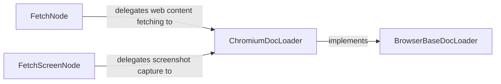

## Details

Analysis of the Web Content Fetching subsystem.

### FetchNode
Acts as the primary dispatcher for general content acquisition within the scraping graph. It handles various input sources and delegates web content fetching to specialized loaders, forming a key entry point for data flow.

**Related Classes/Methods**:

- <a href="https://github.com/ScrapeGraphAI/Scrapegraph-ai/blob/main/scrapegraphai/nodes/fetch_node.py#L19-L365" target="_blank" rel="noopener noreferrer">`scrapegraphai.nodes.fetch_node.FetchNode`:19-365</a>

### FetchScreenNode
Specializes in capturing visual representations (screenshots) of web pages. It initiates and manages the screenshot generation process, providing a distinct content acquisition method.

**Related Classes/Methods**:

- <a href="https://github.com/ScrapeGraphAI/Scrapegraph-ai/blob/main/scrapegraphai/nodes/fetch_screen_node.py#L12-L58" target="_blank" rel="noopener noreferrer">`scrapegraphai.nodes.fetch_screen_node.FetchScreenNode`:12-58</a>

### BrowserBaseDocLoader
Defines the abstract interface and common asynchronous patterns for browser-based content fetching. It establishes the contract for how browser interactions should be performed, ensuring consistency across different browser implementations.

**Related Classes/Methods**:

- <a href="https://github.com/ScrapeGraphAI/Scrapegraph-ai/blob/main/scrapegraphai/docloaders/browser_base.py" target="_blank" rel="noopener noreferrer">`scrapegraphai.docloaders.browser_base.BrowserBaseDocLoader`</a>

### ChromiumDocLoader
Implements the concrete browser automation logic, specifically for Chromium-based browsers (e.g., via Playwright). It handles actual interactions with web browsers to retrieve content from dynamic, JavaScript-rendered pages, fulfilling the contract defined by `BrowserBaseDocLoader`.

**Related Classes/Methods**:

- <a href="https://github.com/ScrapeGraphAI/Scrapegraph-ai/blob/main/scrapegraphai/docloaders/chromium.py" target="_blank" rel="noopener noreferrer">`scrapegraphai.docloaders.chromium.ChromiumDocLoader`</a>

### [FAQ](https://github.com/CodeBoarding/GeneratedOnBoardings/tree/main?tab=readme-ov-file#faq)