```mermaid
graph LR
    Graph_Orchestration_Core["Graph Orchestration Core"]
    Graph_Definition_Setup["Graph Definition & Setup"]
    Web_Content_Fetching["Web Content Fetching"]
    Data_Transformation_Nodes["Data Transformation Nodes"]
    LLM_Processing_Nodes["LLM Processing Nodes"]
    External_Data_Integration["External Data Integration"]
    Code_Correction_Validation["Code Correction & Validation"]
    Graph_Definition_Setup -- "configures and initializes" --> Graph_Orchestration_Core
    Graph_Orchestration_Core -- "orchestrates and activates" --> Web_Content_Fetching
    External_Data_Integration -- "provides initial URLs/search results to" --> Web_Content_Fetching
    Web_Content_Fetching -- "provides raw content to" --> Data_Transformation_Nodes
    Graph_Orchestration_Core -- "orchestrates and activates" --> Data_Transformation_Nodes
    Data_Transformation_Nodes -- "prepares and structures data for" --> LLM_Processing_Nodes
    Graph_Orchestration_Core -- "orchestrates and activates" --> LLM_Processing_Nodes
    External_Data_Integration -- "enriches context for" --> LLM_Processing_Nodes
    LLM_Processing_Nodes -- "submits generated code to" --> Code_Correction_Validation
    Code_Correction_Validation -- "provides feedback/corrected code to" --> LLM_Processing_Nodes
    click Graph_Orchestration_Core href "https://github.com/CodeBoarding/GeneratedOnBoardings/blob/main/Scrapegraph-ai/Graph_Orchestration_Core.md" "Details"
    click Graph_Definition_Setup href "https://github.com/CodeBoarding/GeneratedOnBoardings/blob/main/Scrapegraph-ai/Graph_Definition_Setup.md" "Details"
    click Web_Content_Fetching href "https://github.com/CodeBoarding/GeneratedOnBoardings/blob/main/Scrapegraph-ai/Web_Content_Fetching.md" "Details"
    click Data_Transformation_Nodes href "https://github.com/CodeBoarding/GeneratedOnBoardings/blob/main/Scrapegraph-ai/Data_Transformation_Nodes.md" "Details"
    click LLM_Processing_Nodes href "https://github.com/CodeBoarding/GeneratedOnBoardings/blob/main/Scrapegraph-ai/LLM_Processing_Nodes.md" "Details"
    click External_Data_Integration href "https://github.com/CodeBoarding/GeneratedOnBoardings/blob/main/Scrapegraph-ai/External_Data_Integration.md" "Details"
    click Code_Correction_Validation href "https://github.com/CodeBoarding/GeneratedOnBoardings/blob/main/Scrapegraph-ai/Code_Correction_Validation.md" "Details"
```

## Details

The `Scrapegraph-ai` project implements a sophisticated, LLM-orchestrated data extraction pipeline, centralizing its operations around a **Graph Orchestration Core**. This core dynamically manages a sequence of specialized nodes, beginning with **Graph Definition & Setup** for initial configuration. The data flow initiates with **Web Content Fetching**, optionally guided by **External Data Integration**, to acquire raw web content. This content then undergoes processing by **Data Transformation Nodes** before being fed into **LLM Processing Nodes** for advanced AI-driven analysis, generation, and reasoning. A dedicated **Code Correction & Validation** component ensures the robustness of any LLM-generated code, completing a highly adaptable and intelligent web scraping workflow. This modular design facilitates clear component boundaries, making it ideal for visual representation as a flow graph, highlighting the progression of data and control through its AI-powered stages.

### Graph Orchestration Core [[Expand]](./Graph_Orchestration_Core.md)
The central engine responsible for defining, executing, and managing the flow of data and control through the scraping graphs. It orchestrates the sequence of operations performed by various nodes, handles state management, and manages conditional routing, acting as the brain of the scraping process.

**Related Classes/Methods**:

- <a href="https://github.com/ScrapeGraphAI/Scrapegraph-ai/blob/main/scrapegraphai/graphs/base_graph.py" target="_blank" rel="noopener noreferrer">`scrapegraphai.graphs.base_graph`</a>
- <a href="https://github.com/ScrapeGraphAI/Scrapegraph-ai/blob/main/scrapegraphai/graphs/abstract_graph.py" target="_blank" rel="noopener noreferrer">`scrapegraphai.graphs.abstract_graph`</a>
- <a href="https://github.com/ScrapeGraphAI/Scrapegraph-ai/blob/main/scrapegraphai/integrations/burr_bridge.py" target="_blank" rel="noopener noreferrer">`scrapegraphai.integrations.burr_bridge`</a>

### Graph Definition & Setup [[Expand]](./Graph_Definition_Setup.md)
Manages the creation and initial configuration of scraping graphs. This includes initializing LLM models and generating descriptions for the nodes that will be part of the graph, effectively building the pipeline structure before execution.

**Related Classes/Methods**:

- <a href="https://github.com/ScrapeGraphAI/Scrapegraph-ai/blob/main/scrapegraphai/builders/graph_builder.py" target="_blank" rel="noopener noreferrer">`scrapegraphai.builders.graph_builder`</a>

### Web Content Fetching [[Expand]](./Web_Content_Fetching.md)
Handles the acquisition of raw content from various web sources. This component utilizes browser automation (e.g., Playwright) to interact with web pages, navigate, and retrieve their content, forming the initial input for the scraping pipeline.

**Related Classes/Methods**:

- <a href="https://github.com/ScrapeGraphAI/Scrapegraph-ai/blob/main/scrapegraphai/nodes/fetch_node.py" target="_blank" rel="noopener noreferrer">`scrapegraphai.nodes.fetch_node`</a>
- <a href="https://github.com/ScrapeGraphAI/Scrapegraph-ai/blob/main/scrapegraphai/nodes/fetch_screen_node.py" target="_blank" rel="noopener noreferrer">`scrapegraphai.nodes.fetch_screen_node`</a>
- <a href="https://github.com/ScrapeGraphAI/Scrapegraph-ai/blob/main/scrapegraphai/docloaders/browser_base.py" target="_blank" rel="noopener noreferrer">`scrapegraphai.docloaders.browser_base`</a>
- <a href="https://github.com/ScrapeGraphAI/Scrapegraph-ai/blob/main/scrapegraphai/docloaders/chromium.py" target="_blank" rel="noopener noreferrer">`scrapegraphai.docloaders.chromium`</a>

### Data Transformation Nodes [[Expand]](./Data_Transformation_Nodes.md)
A collection of modular components designed to process raw content, extract structured data, and transform it into a usable format for subsequent steps within the graph pipeline. These nodes perform tasks like parsing, linking, concatenating answers, iterating through graphs, and conditional logic.

**Related Classes/Methods**:

- <a href="https://github.com/ScrapeGraphAI/Scrapegraph-ai/blob/main/scrapegraphai/nodes/parse_node.py" target="_blank" rel="noopener noreferrer">`scrapegraphai.nodes.parse_node`</a>
- <a href="https://github.com/ScrapeGraphAI/Scrapegraph-ai/blob/main/scrapegraphai/nodes/search_link_node.py" target="_blank" rel="noopener noreferrer">`scrapegraphai.nodes.search_link_node`</a>
- <a href="https://github.com/ScrapeGraphAI/Scrapegraph-ai/blob/main/scrapegraphai/nodes/concat_answers_node.py" target="_blank" rel="noopener noreferrer">`scrapegraphai.nodes.concat_answers_node`</a>
- <a href="https://github.com/ScrapeGraphAI/Scrapegraph-ai/blob/main/scrapegraphai/nodes/graph_iterator_node.py" target="_blank" rel="noopener noreferrer">`scrapegraphai.nodes.graph_iterator_node`</a>
- <a href="https://github.com/ScrapeGraphAI/Scrapegraph-ai/blob/main/scrapegraphai/nodes/conditional_node.py" target="_blank" rel="noopener noreferrer">`scrapegraphai.nodes.conditional_node`</a>

### LLM Processing Nodes [[Expand]](./LLM_Processing_Nodes.md)
Nodes that leverage Large Language Models (LLMs) for advanced tasks such as generating answers, creating executable code, refining prompts based on contextual information, and image-to-text generation. These are the AI-powered core of the data extraction and reasoning capabilities.

**Related Classes/Methods**:

- <a href="https://github.com/ScrapeGraphAI/Scrapegraph-ai/blob/main/scrapegraphai/nodes/generate_answer_node.py" target="_blank" rel="noopener noreferrer">`scrapegraphai.nodes.generate_answer_node`</a>
- <a href="https://github.com/ScrapeGraphAI/Scrapegraph-ai/blob/main/scrapegraphai/nodes/generate_code_node.py" target="_blank" rel="noopener noreferrer">`scrapegraphai.nodes.generate_code_node`</a>
- <a href="https://github.com/ScrapeGraphAI/Scrapegraph-ai/blob/main/scrapegraphai/nodes/prompt_refiner_node.py" target="_blank" rel="noopener noreferrer">`scrapegraphai.nodes.prompt_refiner_node`</a>
- <a href="https://github.com/ScrapeGraphAI/Scrapegraph-ai/blob/main/scrapegraphai/nodes/generate_answer_from_image_node.py" target="_blank" rel="noopener noreferrer">`scrapegraphai.nodes.generate_answer_from_image_node`</a>

### External Data Integration [[Expand]](./External_Data_Integration.md)
Provides capabilities to perform external web searches and integrate search results or other external data into the scraping process. This is often used for initial data gathering, enriching existing context, or providing supplementary information to the LLM.

**Related Classes/Methods**:

- <a href="https://github.com/ScrapeGraphAI/Scrapegraph-ai/blob/main/scrapegraphai/utils/research_web.py" target="_blank" rel="noopener noreferrer">`scrapegraphai.utils.research_web`</a>
- <a href="https://github.com/ScrapeGraphAI/Scrapegraph-ai/blob/main/scrapegraphai/utils/proxy_rotation.py" target="_blank" rel="noopener noreferrer">`scrapegraphai.utils.proxy_rotation`</a>

### Code Correction & Validation [[Expand]](./Code_Correction_Validation.md)
A specialized subsystem that supports the `LLM Processing Nodes` by providing tools for analyzing and correcting generated code. It addresses different error types, including syntax, execution, validation, and semantic errors, ensuring the reliability and correctness of LLM-generated code.

**Related Classes/Methods**:

- <a href="https://github.com/ScrapeGraphAI/Scrapegraph-ai/blob/main/scrapegraphai/utils/code_error_analysis.py" target="_blank" rel="noopener noreferrer">`scrapegraphai.utils.code_error_analysis`</a>
- <a href="https://github.com/ScrapeGraphAI/Scrapegraph-ai/blob/main/scrapegraphai/utils/code_error_correction.py" target="_blank" rel="noopener noreferrer">`scrapegraphai.utils.code_error_correction`</a>

### [FAQ](https://github.com/CodeBoarding/GeneratedOnBoardings/tree/main?tab=readme-ov-file#faq)