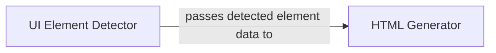

## Details

One paragraph explaining the functionality which is represented by this graph. What the main flow is and what is its purpose.

### UI Element Detector
Processes the input screenshot to identify and classify distinct UI elements. Its core responsibility is to detect components like text, images, and containers, and to output their precise locations (bounding boxes) and classifications. This forms the foundational data for code generation.

**Related Classes/Methods**:

- `UIED.detection.image_box_detection.ImageDetection`

### HTML Generator
Takes the structured data of detected UI elements (including their bounding boxes and classifications) from the UI Element Detector. Its responsibility is to translate this data into a complete HTML file, using the bounding box information to position elements with CSS and the classification to select appropriate HTML tags.

**Related Classes/Methods**:

- `UIED.generation.html_generator.HTMLGenerator`

### [FAQ](https://github.com/CodeBoarding/GeneratedOnBoardings/tree/main?tab=readme-ov-file#faq)