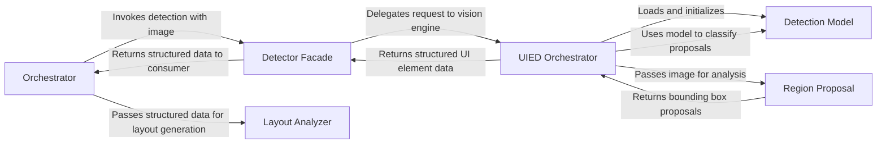

## Details

One paragraph explaining the functionality which is represented by this graph. What the main flow is and what is its purpose.

### Orchestrator
The main application controller that orchestrates the entire UI-to-code generation process. It initiates the workflow by invoking the `Detector Facade` with a UI screenshot and receives the structured data back before passing it to the `Layout Analyzer`.

**Related Classes/Methods**:

- `src/screencoder/main.py`

### Detector Facade
Acts as the single entry point into the vision subsystem. It abstracts the underlying UIED engine, exposing a simplified `detect(image)` method. It is invoked by the main `Orchestrator` and returns the structured data to it.

**Related Classes/Methods**:

- `src/screencoder/vision/detector.py`

### UIED Orchestrator
The internal controller for the vision pipeline, invoked by the `Detector Facade`. It manages the end-to-end detection process, including model loading, image preprocessing, and coordinating the different steps of the UIED engine.

**Related Classes/Methods**:

- `UIED/run_single.py`

### Region Proposal
A specialized computer vision module within the UIED engine that identifies potential UI element locations. It applies image processing techniques to generate bounding box proposals for candidate components.

**Related Classes/Methods**:

- `UIED/detect_compo/ip_region_proposal.py`

### Detection Model
The pre-trained neural network that performs UI element detection and classification. It is loaded and managed by the `UIED Orchestrator` and represents the core intelligence of the vision subsystem.

**Related Classes/Methods**:

- `UIED/cnn/model/cnn-rico-1.h5`

### Layout Analyzer
The downstream component that receives structured data (element types and coordinates) from the `Orchestrator`. It is responsible for analyzing the spatial relationships between detected elements to reconstruct the UI layout.

**Related Classes/Methods**:

- `src/screencoder/compiler/layout.py`

### [FAQ](https://github.com/CodeBoarding/GeneratedOnBoardings/tree/main?tab=readme-ov-file#faq)