```mermaid
graph LR
    User_Interface["User Interface"]
    Orchestrator["Orchestrator"]
    Vision_Analysis["Vision Analysis"]
    Layout_Code_Generation["Layout & Code Generation"]
    Asset_Integration_Mapping["Asset Integration & Mapping"]
    User_Interface -- "Sends Image" --> Orchestrator
    Orchestrator -- "Invokes Pipeline" --> Vision_Analysis
    Vision_Analysis -- "Sends Detected Elements" --> Layout_Code_Generation
    Layout_Code_Generation -- "Sends Generated Code" --> Asset_Integration_Mapping
    Asset_Integration_Mapping -- "Returns Final Code & Assets" --> Orchestrator
    Orchestrator -- "Displays Result" --> User_Interface
    click Vision_Analysis href "https://github.com/CodeBoarding/GeneratedOnBoardings/blob/main/ScreenCoder/Vision_Analysis.md" "Details"
    click Layout_Code_Generation href "https://github.com/CodeBoarding/GeneratedOnBoardings/blob/main/ScreenCoder/Layout_Code_Generation.md" "Details"
```

## Details

One paragraph explaining the functionality which is represented by this graph. What the main flow is and what is its purpose.

### User Interface
Provides the web-based frontend for user interaction, handling image uploads and displaying the final generated code.

**Related Classes/Methods**:

- `src/screencoder/server/app.py`

### Orchestrator
Acts as the central controller, managing the sequential execution of the UI-to-code conversion pipeline from start to finish.

**Related Classes/Methods**:

- `src/screencoder/main.py`

### Vision Analysis [[Expand]](./Vision_Analysis.md)
Performs computer vision tasks on the input image to detect and classify UI elements. It uses a dedicated UI detection model and processing scripts.

**Related Classes/Methods**:

- `src/screencoder/vision/detector.py`
- `UIED/run_single.py`
- `UIED/detect_compo/ip_region_proposal.py`

### Layout & Code Generation [[Expand]](./Layout_Code_Generation.md)
Takes the detected UI elements, organizes them into a structured layout, and then uses a Large Language Model (LLM) to generate the corresponding HTML and CSS code.

**Related Classes/Methods**:

- `src/screencoder/layout/layout_engine.py`
- `src/screencoder/llm/generator.py`

### Asset Integration & Mapping
Finalizes the generated code by mapping the structured data to the final HTML output and managing the extraction and placement of static assets like images.

**Related Classes/Methods**:

- `src/screencoder/mapper/html_mapper.py`
- `src/screencoder/asset_manager.py`

### [FAQ](https://github.com/CodeBoarding/GeneratedOnBoardings/tree/main?tab=readme-ov-file#faq)