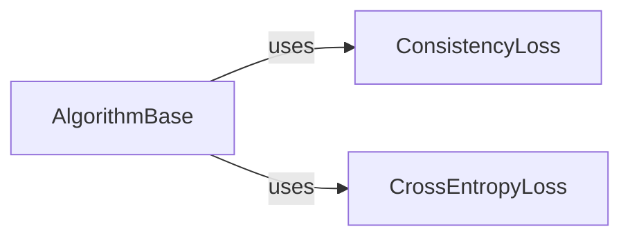

## Details

The `AlgorithmCore` subsystem forms the bedrock for all semi-supervised and imbalanced learning algorithms within the project. It encapsulates the fundamental structure and common functionalities required for algorithm implementation and execution.

### AlgorithmBase
This is the abstract base class that provides the foundational structure and orchestrates the training pipeline for all semi-supervised learning algorithms. It defines the overall flow, including managing the model, optimizer, data loaders, and hooks, and provides abstract methods (e.g., `train_step`) that concrete algorithms must implement. It acts as the central orchestrator for the algorithm's execution.

**Related Classes/Methods**:

- <a href="https://github.com/microsoft/Semi-supervised-learning/blob/main/semilearn/core/algorithmbase.py#L20-L506" target="_blank" rel="noopener noreferrer">`semilearn.core.algorithmbase.AlgorithmBase`:20-506</a>

### ConsistencyLoss
This component computes the consistency regularization loss, a fundamental criterion in many semi-supervised learning algorithms. Its purpose is to ensure that predictions for perturbed versions of the same input remain consistent, thereby enhancing model robustness.

**Related Classes/Methods**:

- <a href="https://github.com/microsoft/Semi-supervised-learning/blob/main/semilearn/core/criterions/consistency.py#L44-L49" target="_blank" rel="noopener noreferrer">`semilearn.core.criterions.consistency.ConsistencyLoss`:44-49</a>

### CrossEntropyLoss
This component provides the standard cross-entropy loss function. It is typically utilized for the supervised learning portion of semi-supervised algorithms or for general classification tasks, serving as a core criterion for measuring prediction error against true labels.

**Related Classes/Methods**:

- <a href="https://github.com/microsoft/Semi-supervised-learning/blob/main/semilearn/core/criterions/cross_entropy.py" target="_blank" rel="noopener noreferrer">`semilearn.core.criterions.cross_entropy.CrossEntropyLoss`</a>

### [FAQ](https://github.com/CodeBoarding/GeneratedOnBoardings/tree/main?tab=readme-ov-file#faq)