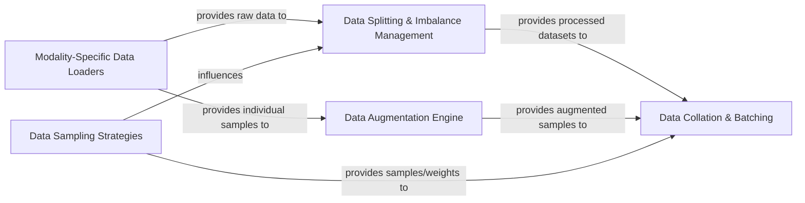

## Details

The semilearn/datasets subsystem provides a robust and flexible framework for managing data within the semi-supervised learning pipeline. It begins with Modality-Specific Data Loaders responsible for ingesting raw data from diverse sources. This raw data then flows into Data Splitting & Imbalance Management for partitioning into labeled and unlabeled sets and handling class imbalances, or to the Data Augmentation Engine for on-the-fly transformations. The Data Sampling Strategies component guides both the splitting process and the final data collation. Ultimately, all prepared data, whether augmented or split, is channeled to Data Collation & Batching, which aggregates individual samples into efficient batches for model training and evaluation. This structured approach ensures data integrity and optimal preparation for semi-supervised learning tasks.

### Modality-Specific Data Loaders
This component is responsible for loading and providing access to raw datasets across different modalities, including Computer Vision, Audio, and Natural Language Processing. It encapsulates the specific logic for handling various dataset formats and provides a unified interface for accessing raw data, often integrating base dataset functionalities.

**Related Classes/Methods**:

- <a href="https://github.com/microsoft/Semi-supervised-learning/blob/main/semilearn/datasets/cv_datasets/" target="_blank" rel="noopener noreferrer">`semilearn/datasets/cv_datasets/`</a>
- <a href="https://github.com/microsoft/Semi-supervised-learning/blob/main/semilearn/datasets/audio_datasets/" target="_blank" rel="noopener noreferrer">`semilearn/datasets/audio_datasets/`</a>
- <a href="https://github.com/microsoft/Semi-supervised-learning/blob/main/semilearn/datasets/nlp_datasets/" target="_blank" rel="noopener noreferrer">`semilearn/datasets/nlp_datasets/`</a>
- <a href="https://github.com/microsoft/Semi-supervised-learning/blob/main/semilearn/datasets/cv_datasets/datasetbase.py" target="_blank" rel="noopener noreferrer">`semilearn/datasets/cv_datasets/datasetbase.py`</a>
- <a href="https://github.com/microsoft/Semi-supervised-learning/blob/main/semilearn/datasets/audio_datasets/datasetbase.py" target="_blank" rel="noopener noreferrer">`semilearn/datasets/audio_datasets/datasetbase.py`</a>
- <a href="https://github.com/microsoft/Semi-supervised-learning/blob/main/semilearn/datasets/nlp_datasets/datasetbase.py" target="_blank" rel="noopener noreferrer">`semilearn/datasets/nlp_datasets/datasetbase.py`</a>

### Data Splitting & Imbalance Management
Manages the core semi-supervised learning data preparation, including splitting raw datasets into labeled and unlabeled subsets and addressing data imbalance through various utility functions. This is crucial for the semi-supervised learning paradigm.

**Related Classes/Methods**:

- <a href="https://github.com/microsoft/Semi-supervised-learning/blob/main/semilearn/datasets/utils.py" target="_blank" rel="noopener noreferrer">`semilearn/datasets/utils.py`</a>

### Data Augmentation Engine
Implements and applies various data augmentation techniques to enhance dataset diversity and model robustness. It operates on individual data samples, transforming them before they are batched for training.

**Related Classes/Methods**:

- <a href="https://github.com/microsoft/Semi-supervised-learning/blob/main/semilearn/datasets/augmentation/" target="_blank" rel="noopener noreferrer">`semilearn/datasets/augmentation/`</a>

### Data Collation & Batching
Handles the batching of individual data samples, including padding and formatting, to prepare data for efficient input into machine learning models during training and evaluation. It ensures data is correctly structured for model consumption.

**Related Classes/Methods**:

- <a href="https://github.com/microsoft/Semi-supervised-learning/blob/main/semilearn/datasets/collactors/" target="_blank" rel="noopener noreferrer">`semilearn/datasets/collactors/`</a>

### Data Sampling Strategies
Manages data sampling strategies, particularly for generating sample weights to address data imbalance or specific sampling requirements during training, ensuring fair representation or focus on certain data points.

**Related Classes/Methods**:

- <a href="https://github.com/microsoft/Semi-supervised-learning/blob/main/semilearn/datasets/samplers/" target="_blank" rel="noopener noreferrer">`semilearn/datasets/samplers/`</a>

### [FAQ](https://github.com/CodeBoarding/GeneratedOnBoardings/tree/main?tab=readme-ov-file#faq)