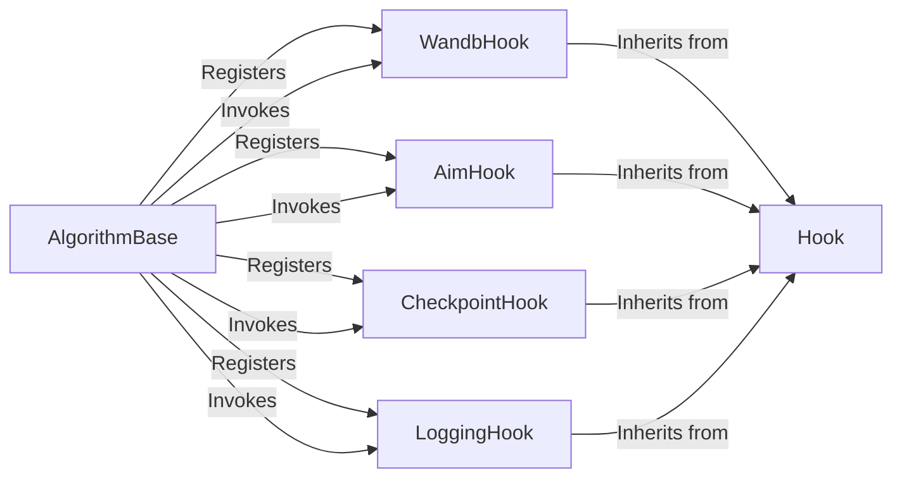

## Details

The core of the `semilearn` training engine is orchestrated by the `AlgorithmBase` component, which manages the lifecycle of various experiment `Hook` implementations. `AlgorithmBase` is responsible for registering and invoking specialized hooks such as `WandbHook`, `AimHook`, `CheckpointHook`, and `LoggingHook` at predefined stages of the training process (e.g., before/after epochs or steps). All concrete hook implementations inherit from the abstract `Hook` base class, ensuring a consistent interface and shared functionalities for managing experiment-related concerns like tracking, checkpointing, and logging. This design promotes modularity and extensibility, allowing new functionalities to be integrated seamlessly as specialized hooks.

### WandbHook
Manages the integration with Weights & Biases (WandB) for comprehensive experiment tracking. This includes initializing WandB runs, logging metrics, parameters, models, and system information, and ensuring proper run termination.

**Related Classes/Methods**:

- <a href="https://github.com/microsoft/Semi-supervised-learning/blob/main/semilearn/core/hooks/wandb.py#L9-L62" target="_blank" rel="noopener noreferrer">`WandbHook`:9-62</a>

### AimHook
Handles the integration with Aim for experiment tracking. It provides capabilities to log training metrics, hyperparameters, and other experiment-related data to the Aim platform.

**Related Classes/Methods**:

- <a href="https://github.com/microsoft/Semi-supervised-learning/blob/main/semilearn/core/hooks/aim.py#L9-L49" target="_blank" rel="noopener noreferrer">`AimHook`:9-49</a>

### CheckpointHook
Responsible for the persistence of experiment state by managing the saving and loading of model checkpoints. This ensures that training can be resumed from a specific point or that trained models can be deployed.

**Related Classes/Methods**:

- <a href="https://github.com/microsoft/Semi-supervised-learning/blob/main/semilearn/core/hooks/checkpoint.py#L9-L23" target="_blank" rel="noopener noreferrer">`CheckpointHook`:9-23</a>

### LoggingHook
Manages the output of training progress, metrics, and other relevant information to the console or specified log files, providing real-time feedback on experiment execution.

**Related Classes/Methods**:

- <a href="https://github.com/microsoft/Semi-supervised-learning/blob/main/semilearn/core/hooks/logging.py#L7-L39" target="_blank" rel="noopener noreferrer">`LoggingHook`:7-39</a>

### Hook
Serves as the abstract base class for all specific hook implementations. It defines a consistent interface and provides common functionalities (e.g., conditional execution) that concrete hooks inherit, promoting modularity and extensibility.

**Related Classes/Methods**:

- <a href="https://github.com/microsoft/Semi-supervised-learning/blob/main/semilearn/core/hooks/hook.py#L6-L42" target="_blank" rel="noopener noreferrer">`semilearn.core.hooks.hook.Hook`:6-42</a>

### AlgorithmBase
Acts as the central orchestrator within the training engine, responsible for registering and invoking various hooks (WandbHook, AimHook, CheckpointHook, LoggingHook) at appropriate stages of the training lifecycle (e.g., before training, after each epoch).

**Related Classes/Methods**:

- <a href="https://github.com/microsoft/Semi-supervised-learning/blob/main/semilearn/core/algorithmbase.py#L20-L506" target="_blank" rel="noopener noreferrer">`semilearn.core.algorithmbase.AlgorithmBase`:20-506</a>

### [FAQ](https://github.com/CodeBoarding/GeneratedOnBoardings/tree/main?tab=readme-ov-file#faq)