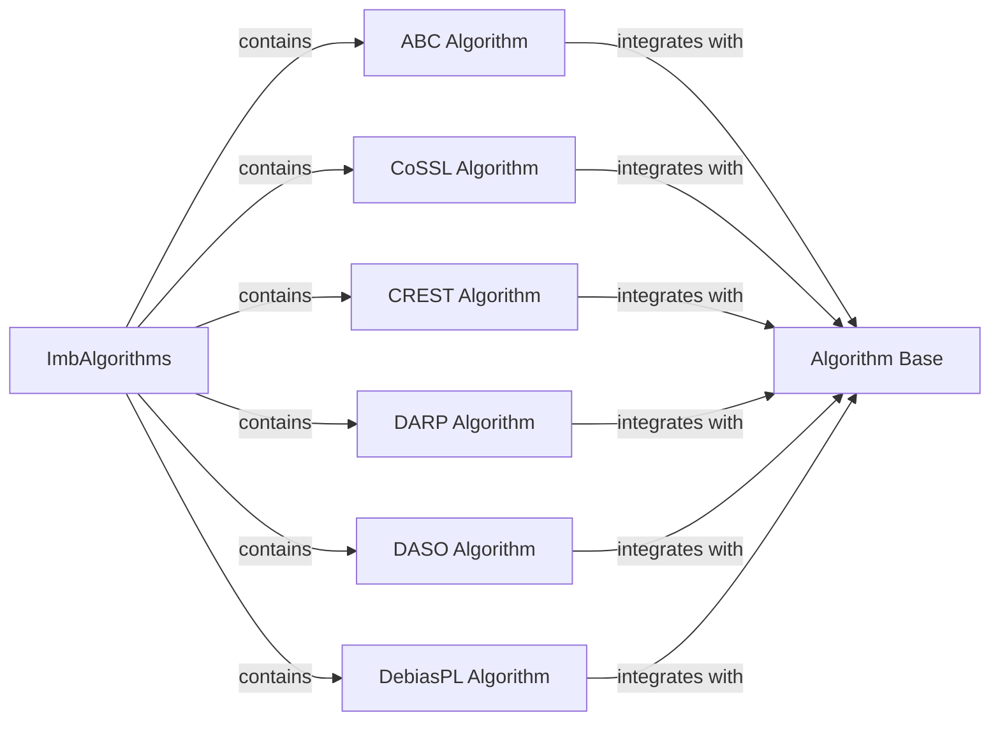

## Details

The `semilearn` project's `ImbAlgorithms` subsystem provides a specialized suite of semi-supervised learning algorithms designed to address data imbalance. At its core, the `Algorithm Base` component establishes a unified interface and foundational structure, ensuring consistency across all algorithms. Each specific algorithm, such as `ABC Algorithm`, `CoSSL Algorithm`, `CREST Algorithm`, `DARP Algorithm`, `DASO Algorithm`, and `DebiasPL Algorithm`, extends this base, implementing unique strategies to handle imbalanced datasets. These algorithms are contained within the `ImbAlgorithms` subsystem, leveraging the common functionalities provided by `Algorithm Base` while introducing their specialized mechanisms for tasks like pseudo-labeling refinement, dynamic parameter updates, and class rebalancing. This modular design allows for easy integration and extension of new imbalance-aware semi-supervised learning techniques within the `semilearn` framework.

**Critical Interaction Pathways:**
- **ImbAlgorithms contains specific algorithms:** The `ImbAlgorithms` package serves as a container for various specialized imbalance-aware algorithms (e.g., `ABC Algorithm`, `CREST Algorithm`). This represents a hierarchical relationship where the package organizes and provides access to its constituent algorithms.
- **Specific algorithms integrate with Algorithm Base:** Each specialized algorithm (e.g., `ABC Algorithm`, `CREST Algorithm`) inherits from or utilizes the `Algorithm Base`. This signifies that the base component provides the fundamental framework and common functionalities that all specific algorithms build upon, ensuring a standardized approach to semi-supervised learning.
- **CREST Algorithm utilizes hooks for training flow:** The `CREST Algorithm` specifically registers `CReSTCheckpointHook` and `CReSTLoggingHook` to manage its training process, demonstrating how individual algorithms can customize their behavior through a hook-based system.
- **CREST Algorithm manages pseudo-labels and dataset splits:** The `CREST Algorithm` includes methods like `get_split` and `set_dataset` to handle the generation and integration of pseudo-labels, which are crucial for its self-training mechanism in imbalanced scenarios.
- **CREST Algorithm re-initializes components for generations:** The `re_init` method in `CREST Algorithm` shows how the algorithm can reset and rebuild its model, optimizer, and data loaders across multiple generations, indicating a multi-stage training process.

### ImbAlgorithms [[Expand]](./ImbAlgorithms.md)
The overarching subsystem that groups various imbalance-aware semi-supervised learning algorithms. It serves as the entry point for accessing and integrating these specialized algorithms into the broader semilearn framework.

**Related Classes/Methods**:

- <a href="https://github.com/microsoft/Semi-supervised-learning/blob/main/" target="_blank" rel="noopener noreferrer">`semilearn.imb_algorithms`</a>

### Algorithm Base
Provides a standardized interface and foundational setup for all semi-supervised learning algorithms, including those within ImbAlgorithms. It defines common methods for training, evaluation, and model management, ensuring consistency and extensibility across different algorithm implementations.

**Related Classes/Methods**:

- <a href="https://github.com/microsoft/Semi-supervised-learning/blob/main/" target="_blank" rel="noopener noreferrer">`semilearn.core.Algorithm`</a>

### ABC Algorithm
Implements the "Adaptive Balanced Consistency" (ABC) semi-supervised learning strategy, specifically tailored for imbalanced datasets. It incorporates a custom network architecture and a specialized loss calculation to handle class distribution disparities.

**Related Classes/Methods**:

- <a href="https://github.com/microsoft/Semi-supervised-learning/blob/main/semilearn/imb_algorithms/abc/abc.py#L15-L35" target="_blank" rel="noopener noreferrer">`ABCNet`:15-35</a>
- <a href="https://github.com/microsoft/Semi-supervised-learning/blob/main/semilearn/imb_algorithms/abc/abc.py#L122-L148" target="_blank" rel="noopener noreferrer">`compute_abc_loss`:122-148</a>

### CoSSL Algorithm
Implements the "Consistency-based Semi-Supervised Learning" (CoSSL) algorithm, adapted for imbalanced scenarios. It utilizes dynamic parameter updates via a dedicated hook to adjust its learning process based on dataset imbalance.

**Related Classes/Methods**:

- <a href="https://github.com/microsoft/Semi-supervised-learning/blob/main/semilearn/imb_algorithms/cossl/cossl.py#L50-L97" target="_blank" rel="noopener noreferrer">`CoSSLParamUpdateHook`:50-97</a>

### CREST Algorithm
Implements the "Class-REbalancing Self-Training" (CREST) algorithm, a semi-supervised learning approach designed to mitigate the effects of imbalanced data by rebalancing class distributions during self-training.

**Related Classes/Methods**:

- <a href="https://github.com/microsoft/Semi-supervised-learning/blob/main/semilearn/imb_algorithms/crest/crest.py#L16-L259" target="_blank" rel="noopener noreferrer">`semilearn.imb_algorithms.crest.crest.CReST`:16-259</a>

### DARP Algorithm
Implements the "Distribution-Aware Pseudo-labeling" (DARP) algorithm, which focuses on refining pseudo-labels in an imbalance-aware manner. It uses a specific hook for pseudo-labeling and a utility for refinement.

**Related Classes/Methods**:

- <a href="https://github.com/microsoft/Semi-supervised-learning/blob/main/semilearn/imb_algorithms/darp/utils.py#L13-L126" target="_blank" rel="noopener noreferrer">`DARPPseudoLabelingHook`:13-126</a>
- <a href="https://github.com/microsoft/Semi-supervised-learning/blob/main/semilearn/imb_algorithms/darp/utils.py#L27-L53" target="_blank" rel="noopener noreferrer">`refine_pseudo_labels`:27-53</a>

### DASO Algorithm
Implements the "Distribution-Aware Self-training with Online feature queue" (DASO) algorithm. This approach manages a feature history queue to guide the self-training process, particularly useful in imbalanced settings.

**Related Classes/Methods**:

- <a href="https://github.com/microsoft/Semi-supervised-learning/blob/main/semilearn/imb_algorithms/daso/utils.py#L12-L48" target="_blank" rel="noopener noreferrer">`DASOFeatureQueue`:12-48</a>

### DebiasPL Algorithm
Implements the "Debiased Pseudo-Labeling" (DebiasPL) algorithm, which aims to reduce bias in pseudo-labels generated for imbalanced datasets. It utilizes a custom consistency loss function to achieve this debiasing.

**Related Classes/Methods**:

- <a href="https://github.com/microsoft/Semi-supervised-learning/blob/main/semilearn/imb_algorithms/debiaspl/utils.py#L14-L23" target="_blank" rel="noopener noreferrer">`DebiasPLConsistencyLoss`:14-23</a>

### [FAQ](https://github.com/CodeBoarding/GeneratedOnBoardings/tree/main?tab=readme-ov-file#faq)