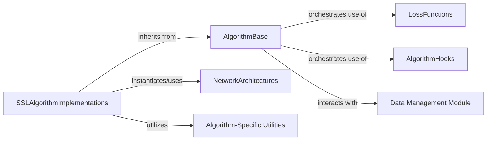

## Details

The `semilearn` project is structured around a core `AlgorithmBase` that defines the fundamental training loop and interaction points for various semi-supervised learning algorithms. Concrete `SSLAlgorithmImplementations` extend this base, each integrating specific `LossFunctions`, leveraging `AlgorithmHooks` for flexible behavior modification, and utilizing diverse `NetworkArchitectures` for model backbones. Data is managed by the `Data Management Module`, which prepares input for the algorithms. `Algorithm-Specific Utilities` provide specialized support for individual algorithm requirements. This modular design promotes extensibility and maintainability, allowing for easy integration of new algorithms and network architectures.

### AlgorithmBase
Serves as the abstract foundation for all semi-supervised learning algorithms. It provides a standardized training loop, handles model and optimizer setup, manages data flow, and integrates a robust hook management system. This class defines the core contract and common functionalities for all specific SSL algorithms.

**Related Classes/Methods**:

- <a href="https://github.com/microsoft/Semi-supervised-learning/blob/main/semilearn/core/algorithmbase.py#L20-L506" target="_blank" rel="noopener noreferrer">`semilearn.core.algorithmbase.AlgorithmBase`:20-506</a>

### SSLAlgorithmImplementations
This component represents the collection of concrete semi-supervised learning algorithms (e.g., FixMatch, Mean Teacher, CoMatch, FlexMatch, FreeMatch, ReMixMatch, SoftMatch, VAT, CRMatch). Each algorithm extends `AlgorithmBase` and implements its unique training logic, loss functions, and regularization methods to effectively leverage unlabeled data.

**Related Classes/Methods**:

- <a href="https://github.com/microsoft/Semi-supervised-learning/blob/main/semilearn/algorithms/fixmatch/fixmatch.py#L11-L114" target="_blank" rel="noopener noreferrer">`semilearn.algorithms.fixmatch.fixmatch.FixMatch`:11-114</a>
- <a href="https://github.com/microsoft/Semi-supervised-learning/blob/main/semilearn/algorithms/meanteacher/meanteacher.py#L11-L83" target="_blank" rel="noopener noreferrer">`semilearn.algorithms.meanteacher.meanteacher.MeanTeacher`:11-83</a>
- <a href="https://github.com/microsoft/Semi-supervised-learning/blob/main/semilearn/algorithms/comatch/comatch.py#L72-L275" target="_blank" rel="noopener noreferrer">`semilearn.algorithms.comatch.comatch.CoMatch`:72-275</a>
- <a href="https://github.com/microsoft/Semi-supervised-learning/blob/main/semilearn/algorithms/crmatch/crmatch.py#L119-L292" target="_blank" rel="noopener noreferrer">`semilearn.algorithms.crmatch.crmatch.CRMatch`:119-292</a>
- <a href="https://github.com/microsoft/Semi-supervised-learning/blob/main/semilearn/algorithms/flexmatch/flexmatch.py#L15-L140" target="_blank" rel="noopener noreferrer">`semilearn.algorithms.flexmatch.flexmatch.FlexMatch`:15-140</a>
- <a href="https://github.com/microsoft/Semi-supervised-learning/blob/main/semilearn/algorithms/freematch/freematch.py#L47-L153" target="_blank" rel="noopener noreferrer">`semilearn.algorithms.freematch.freematch.FreeMatch`:47-153</a>
- <a href="https://github.com/microsoft/Semi-supervised-learning/blob/main/semilearn/algorithms/remixmatch/remixmatch.py#L49-L228" target="_blank" rel="noopener noreferrer">`semilearn.algorithms.remixmatch.remixmatch.ReMixMatch`:49-228</a>
- <a href="https://github.com/microsoft/Semi-supervised-learning/blob/main/semilearn/algorithms/softmatch/softmatch.py#L13-L146" target="_blank" rel="noopener noreferrer">`semilearn.algorithms.softmatch.softmatch.SoftMatch`:13-146</a>
- <a href="https://github.com/microsoft/Semi-supervised-learning/blob/main/semilearn/algorithms/vat/vat.py#L14-L145" target="_blank" rel="noopener noreferrer">`semilearn.algorithms.vat.vat.VAT`:14-145</a>

### LossFunctions
A dedicated module responsible for implementing and providing various loss calculations, including common and algorithm-specific loss functions. These functions are crucial for guiding the optimization process during the training of all semi-supervised learning algorithms.

**Related Classes/Methods**:

- <a href="https://github.com/microsoft/Semi-supervised-learning/blob/main/semilearn/core/criterions/consistency.py#L44-L49" target="_blank" rel="noopener noreferrer">`semilearn.core.criterions.consistency.ConsistencyLoss`:44-49</a>
- <a href="https://github.com/microsoft/Semi-supervised-learning/blob/main/semilearn/core/criterions/cross_entropy.py#L34-L39" target="_blank" rel="noopener noreferrer">`semilearn.core.criterions.cross_entropy.CELoss`:34-39</a>

### AlgorithmHooks
Provides a flexible mechanism for extending and modifying the behavior of algorithms at various stages of the training process. This includes general-purpose hooks and specialized hooks (e.g., for thresholding or weighting) that allow for custom logic insertion without altering the core algorithm implementations.

**Related Classes/Methods**:

- <a href="https://github.com/microsoft/Semi-supervised-learning/blob/main/semilearn/core/hooks/hook.py#L6-L42" target="_blank" rel="noopener noreferrer">`semilearn.core.hooks.hook.Hook`:6-42</a>
- <a href="https://github.com/microsoft/Semi-supervised-learning/blob/main/semilearn/algorithms/flexmatch/flexmatch_hook.py#L1-L100" target="_blank" rel="noopener noreferrer">`semilearn.algorithms.flexmatch.flexmatch_hook.FlexMatchHook`:1-100</a>
- <a href="https://github.com/microsoft/Semi-supervised-learning/blob/main/semilearn/algorithms/softmatch/softmatch_hook.py#L1-L100" target="_blank" rel="noopener noreferrer">`semilearn.algorithms.softmatch.softmatch_hook.SoftMatchHook`:1-100</a>

### NetworkArchitectures
Encompasses various neural network models and backbone architectures that can be instantiated and utilized by the semi-supervised learning algorithms. This includes general-purpose backbones and specific network designs tailored for particular algorithms (e.g., CoMatch_Net, CRMatch_Net). This component also serves as the "Model Zoo" providing pre-trained or configurable models.

**Related Classes/Methods**:

- <a href="https://github.com/microsoft/Semi-supervised-learning/blob/main/semilearn/nets#L1-L100" target="_blank" rel="noopener noreferrer">`semilearn.nets`:1-100</a>
- <a href="https://github.com/microsoft/Semi-supervised-learning/blob/main/semilearn/nets/resnet.py#L1-L100" target="_blank" rel="noopener noreferrer">`semilearn.nets.resnet.ResNet`:1-100</a>
- <a href="https://github.com/microsoft/Semi-supervised-learning/blob/main/semilearn/nets/vit.py#L1-L100" target="_blank" rel="noopener noreferrer">`semilearn.nets.vit.VisionTransformer`:1-100</a>
- <a href="https://github.com/microsoft/Semi-supervised-learning/blob/main/semilearn/algorithms/comatch/comatch_net.py#L1-L100" target="_blank" rel="noopener noreferrer">`semilearn.algorithms.comatch.comatch_net.CoMatch_Net`:1-100</a>
- <a href="https://github.com/microsoft/Semi-supervised-learning/blob/main/semilearn/algorithms/crmatch/crmatch_net.py#L1-L100" target="_blank" rel="noopener noreferrer">`semilearn.algorithms.crmatch.crmatch_net.CRMatch_Net`:1-100</a>

### Data Management Module
Handles the entire lifecycle of data, including dataset loading, preprocessing, augmentation, and the creation of data loaders. It provides the necessary input streams (labeled and unlabeled data) that feed into the semi-supervised learning algorithms for training and evaluation.

**Related Classes/Methods**:

- <a href="https://github.com/microsoft/Semi-supervised-learning/blob/main/semilearn/datasets#L1-L100" target="_blank" rel="noopener noreferrer">`semilearn.datasets`:1-100</a>
- <a href="https://github.com/microsoft/Semi-supervised-learning/blob/main/semilearn/datasets/cv_datasets#L1-L100" target="_blank" rel="noopener noreferrer">`semilearn.datasets.cv_datasets`:1-100</a>

### Algorithm-Specific Utilities
Contains specialized helper functions and modules that provide unique functionalities required by particular semi-supervised learning algorithms. These utilities ensure that the distinct operational requirements and complex calculations of individual algorithms are met.

**Related Classes/Methods**:

- <a href="https://github.com/microsoft/Semi-supervised-learning/blob/main/semilearn/algorithms/comatch/utils.py#L1-L100" target="_blank" rel="noopener noreferrer">`semilearn.algorithms.comatch.utils`:1-100</a>
- <a href="https://github.com/microsoft/Semi-supervised-learning/blob/main/semilearn/algorithms/vat/utils.py#L1-L100" target="_blank" rel="noopener noreferrer">`semilearn.algorithms.vat.utils`:1-100</a>

### [FAQ](https://github.com/CodeBoarding/GeneratedOnBoardings/tree/main?tab=readme-ov-file#faq)