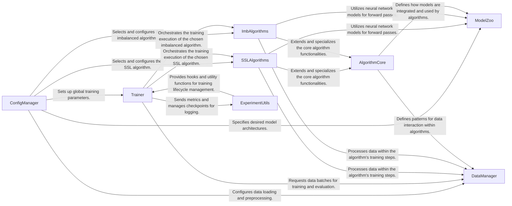

## Details

The `semilearn` project is structured around a modular architecture designed for semi-supervised and imbalanced learning tasks. The `ConfigManager` acts as the central configuration hub, setting up the entire experiment by defining data handling, model architectures, and algorithm specifics. The `DataManager` is responsible for all data-related operations, providing processed data to the `Trainer` and various algorithms. The `ModelZoo` offers a repository of neural network models used by the learning algorithms. The `AlgorithmCore` establishes a foundational framework for all algorithms, which are then specialized into `SSLAlgorithms` for semi-supervised learning and `ImbAlgorithms` for imbalanced datasets. The `Trainer` orchestrates the entire training and evaluation process, interacting with the `DataManager` for data, and delegating execution to the selected `SSLAlgorithms` or `ImbAlgorithms`. Finally, `ExperimentUtils` provides essential services for logging, checkpointing, and experiment tracking, supporting the `Trainer` in monitoring and managing the learning process. This clear separation of concerns facilitates extensibility and maintainability, making it suitable for both documentation and visual diagram generation.

### ConfigManager
Centralizes the definition, parsing, and loading of all experiment configurations, including dataset choices, model architectures, algorithm parameters, and training hyperparameters.

**Related Classes/Methods**:

- <a href="https://github.com/microsoft/Semi-supervised-learning/blob/main/scripts/config_generator_classic_cv.py" target="_blank" rel="noopener noreferrer">`scripts/config_generator_classic_cv.py`</a>
- <a href="https://github.com/microsoft/Semi-supervised-learning/blob/main/semilearn/core/utils/build.py" target="_blank" rel="noopener noreferrer">`semilearn/core/utils/build.py`</a>

### DataManager [[Expand]](./DataManager.md)
Manages all data-related operations, such as loading raw data, splitting into labeled/unlabeled sets, applying augmentations, and preparing batches for training and evaluation across various modalities.

**Related Classes/Methods**:

- <a href="https://github.com/microsoft/Semi-supervised-learning/blob/main/semilearn/datasets/utils.py" target="_blank" rel="noopener noreferrer">`semilearn/datasets/utils.py`</a>
- <a href="https://github.com/microsoft/Semi-supervised-learning/blob/main/semilearn/datasets/cv_datasets/" target="_blank" rel="noopener noreferrer">`semilearn/datasets/cv_datasets/`</a>

### ModelZoo
Provides a collection of pre-defined neural network architectures (backbones) and their corresponding heads, readily available for use by different learning algorithms.

**Related Classes/Methods**:

- <a href="https://github.com/microsoft/Semi-supervised-learning/blob/main/semilearn/nets/resnet/resnet.py" target="_blank" rel="noopener noreferrer">`semilearn/nets/resnet.py`</a>
- <a href="https://github.com/microsoft/Semi-supervised-learning/blob/main/semilearn/nets/vit/vit.py" target="_blank" rel="noopener noreferrer">`semilearn/nets/vit.py`</a>

### AlgorithmCore [[Expand]](./AlgorithmCore.md)
Defines the foundational structure (AlgorithmBase) and common functionalities for all semi-supervised and imbalanced learning algorithms, including abstract training loops and core loss functions (criterions).

**Related Classes/Methods**:

- <a href="https://github.com/microsoft/Semi-supervised-learning/blob/main/semilearn/core/algorithmbase.py" target="_blank" rel="noopener noreferrer">`semilearn/core/algorithmbase.py`</a>
- <a href="https://github.com/microsoft/Semi-supervised-learning/blob/main/semilearn/core/criterions/consistency.py" target="_blank" rel="noopener noreferrer">`semilearn/core/criterions/consistency.py`</a>

### SSLAlgorithms [[Expand]](./SSLAlgorithms.md)
Implements various specific semi-supervised learning techniques, each extending AlgorithmCore with unique training logic, loss functions, and regularization methods to leverage unlabeled data.

**Related Classes/Methods**:

- <a href="https://github.com/microsoft/Semi-supervised-learning/blob/main/semilearn/algorithms/fixmatch/fixmatch.py" target="_blank" rel="noopener noreferrer">`semilearn/algorithms/fixmatch/fixmatch.py`</a>
- <a href="https://github.com/microsoft/Semi-supervised-learning/blob/main/semilearn/algorithms/meanteacher/meanteacher.py" target="_blank" rel="noopener noreferrer">`semilearn/algorithms/meanteacher/meanteacher.py`</a>

### ImbAlgorithms [[Expand]](./ImbAlgorithms.md)
Contains specialized algorithms designed to address challenges posed by imbalanced datasets within a semi-supervised learning context, extending AlgorithmCore with imbalance-specific strategies.

**Related Classes/Methods**:

- <a href="https://github.com/microsoft/Semi-supervised-learning/blob/main/semilearn/imb_algorithms/crest/crest.py" target="_blank" rel="noopener noreferrer">`semilearn/imb_algorithms/crest/crest.py`</a>
- <a href="https://github.com/microsoft/Semi-supervised-learning/blob/main/semilearn/imb_algorithms/darp/darp.py" target="_blank" rel="noopener noreferrer">`semilearn/imb_algorithms/darp/darp.py`</a>

### Trainer
The central orchestrator of the entire training and evaluation lifecycle, managing epochs, distributed training, model saving/loading, and driving the execution of the selected algorithm.

**Related Classes/Methods**:

- <a href="https://github.com/microsoft/Semi-supervised-learning/blob/main/train.py" target="_blank" rel="noopener noreferrer">`train.py`</a>
- <a href="https://github.com/microsoft/Semi-supervised-learning/blob/main/semilearn/lighting/trainer.py" target="_blank" rel="noopener noreferrer">`semilearn/core/trainer.py`</a>

### ExperimentUtils [[Expand]](./ExperimentUtils.md)
Provides essential utilities for experiment tracking (e.g., integration with WandB, Aim, TensorBoard), logging training progress, managing checkpoints, and other general helper functions.

**Related Classes/Methods**:

- <a href="https://github.com/microsoft/Semi-supervised-learning/blob/main/semilearn/core/hooks/wandb.py" target="_blank" rel="noopener noreferrer">`semilearn/core/hooks/wandb.py`</a>
- <a href="https://github.com/microsoft/Semi-supervised-learning/blob/main/semilearn/core/utils/misc.py" target="_blank" rel="noopener noreferrer">`semilearn/core/utils/misc.py`</a>

### [FAQ](https://github.com/CodeBoarding/GeneratedOnBoardings/tree/main?tab=readme-ov-file#faq)