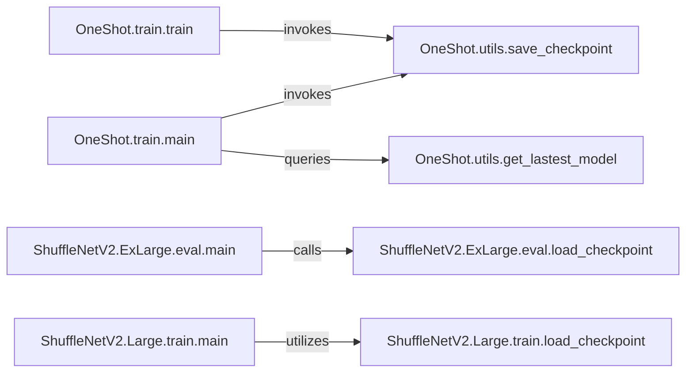

## Details

The `Checkpoint & State Management` subsystem is primarily defined by functions responsible for the persistence and retrieval of model weights, optimizer states, and other training-related information. Its boundaries encompass generic utility functions for saving and retrieving the latest models, as well as model-specific loading functions tailored for different training and evaluation phases. The orchestrating `main` and `train` functions that interact with these utilities also form part of this subsystem, as they dictate when and how checkpoints are managed.

### OneShot.utils.save_checkpoint
The core utility for persisting the current state of a model, its optimizer, and other training-related metadata (e.g., epoch, loss) to disk. This function is generic and can be used across different training processes within the OneShot model.

**Related Classes/Methods**:

- <a href="https://github.com/megvii-model/ShuffleNet-Series/blob/master/OneShot/utils.py#L55-L59" target="_blank" rel="noopener noreferrer">`OneShot.utils.save_checkpoint`:55-59</a>

### OneShot.utils.get_lastest_model
A utility function responsible for identifying and retrieving the file path of the most recently saved model checkpoint. This is crucial for resuming training or loading the latest model for inference.

**Related Classes/Methods**:

- <a href="https://github.com/megvii-model/ShuffleNet-Series/blob/master/OneShot/utils.py#L62-L71" target="_blank" rel="noopener noreferrer">`OneShot.utils.get_lastest_model`:62-71</a>

### ShuffleNetV2.ExLarge.eval.load_checkpoint
A specialized function for loading model checkpoints specifically tailored for the ShuffleNetV2.ExLarge model during its evaluation phase. It ensures the model is correctly initialized with pre-trained weights for performance assessment.

**Related Classes/Methods**:

- <a href="https://github.com/megvii-model/ShuffleNet-Series/blob/master/ShuffleNetV2.ExLarge/eval.py#L273-L283" target="_blank" rel="noopener noreferrer">`ShuffleNetV2.ExLarge.eval.load_checkpoint`:273-283</a>

### ShuffleNetV2.Large.train.load_checkpoint
A specialized function for loading model checkpoints for the ShuffleNetV2.Large model, primarily used for resuming or initializing training runs. This allows for continuation of training from a previously saved state.

**Related Classes/Methods**:

- <a href="https://github.com/megvii-model/ShuffleNet-Series/blob/master/ShuffleNetV2.Large/train.py#L348-L365" target="_blank" rel="noopener noreferrer">`ShuffleNetV2.Large.train.load_checkpoint`:348-365</a>

### OneShot.train.main
An orchestrator component that manages the overall training process for the OneShot model, including the invocation of checkpoint saving and retrieval. It acts as the entry point for OneShot model training.

**Related Classes/Methods**:

- <a href="https://github.com/megvii-model/ShuffleNet-Series/blob/master/OneShot/train.py#L86-L189" target="_blank" rel="noopener noreferrer">`OneShot.train.main`:86-189</a>

### OneShot.train.train
The core training loop for the OneShot model, which periodically invokes the `save_checkpoint` utility to persist model and optimizer states, ensuring training progress is not lost.

**Related Classes/Methods**:

- <a href="https://github.com/megvii-model/ShuffleNet-Series/blob/master/OneShot/train.py#L196-L242" target="_blank" rel="noopener noreferrer">`OneShot.train.train`:196-242</a>

### ShuffleNetV2.ExLarge.eval.main
The orchestrator for the evaluation process of ShuffleNetV2.ExLarge, responsible for calling `load_checkpoint` to prepare the model for evaluation. It sets up the environment for performance assessment.

**Related Classes/Methods**:

- <a href="https://github.com/megvii-model/ShuffleNet-Series/blob/master/ShuffleNetV2.ExLarge/eval.py#L88-L186" target="_blank" rel="noopener noreferrer">`ShuffleNetV2.ExLarge.eval.main`:88-186</a>

### ShuffleNetV2.Large.train.main
The orchestrator for the training process of ShuffleNetV2.Large, responsible for calling `load_checkpoint` to initialize or resume training. It manages the overall training flow for this specific model.

**Related Classes/Methods**:

- <a href="https://github.com/megvii-model/ShuffleNet-Series/blob/master/ShuffleNetV2.Large/train.py#L159-L255" target="_blank" rel="noopener noreferrer">`ShuffleNetV2.Large.train.main`:159-255</a>

### [FAQ](https://github.com/CodeBoarding/GeneratedOnBoardings/tree/main?tab=readme-ov-file#faq)