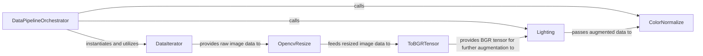

## Details

The Data Pipeline subsystem is responsible for the entire process of loading, augmenting, and preprocessing raw input data, transforming it into a format suitable for consumption by the neural network models.

### DataPipelineOrchestrator
Orchestrates the entire data loading, augmentation, and preprocessing workflow. It is responsible for instantiating and sequencing the various data transformation components.

**Related Classes/Methods**:

- <a href="https://github.com/megvii-model/ShuffleNet-Series/blob/master/DetNAS/train.py" target="_blank" rel="noopener noreferrer">`DetNAS/train.py`</a>
- <a href="https://github.com/megvii-model/ShuffleNet-Series/blob/master/ShuffleNetV2.Large/train.py" target="_blank" rel="noopener noreferrer">`ShuffleNetV2.Large/train.py`</a>

### DataIterator
Loads raw images and corresponding labels from the dataset in batches. It serves as the entry point for raw data into the pipeline.

**Related Classes/Methods**:

- <a href="https://github.com/megvii-model/ShuffleNet-Series/blob/master/DetNAS/train.py" target="_blank" rel="noopener noreferrer">`DetNAS/train.py`</a>
- <a href="https://github.com/megvii-model/ShuffleNet-Series/blob/master/OneShot/train.py" target="_blank" rel="noopener noreferrer">`OneShot/train.py`</a>
- <a href="https://github.com/megvii-model/ShuffleNet-Series/blob/master/ShuffleNetV1/train.py" target="_blank" rel="noopener noreferrer">`ShuffleNetV1/train.py`</a>
- <a href="https://github.com/megvii-model/ShuffleNet-Series/blob/master/ShuffleNetV2/train.py" target="_blank" rel="noopener noreferrer">`ShuffleNetV2/train.py`</a>
- <a href="https://github.com/megvii-model/ShuffleNet-Series/blob/master/ShuffleNetV2.ExLarge/eval.py" target="_blank" rel="noopener noreferrer">`ShuffleNetV2.ExLarge/eval.py`</a>
- <a href="https://github.com/megvii-model/ShuffleNet-Series/blob/master/ShuffleNetV2.Large/train.py" target="_blank" rel="noopener noreferrer">`ShuffleNetV2.Large/train.py`</a>

### OpencvResize
Resizes input images to a consistent, predefined dimension required by the models, typically using OpenCV functionalities.

**Related Classes/Methods**:

- <a href="https://github.com/megvii-model/ShuffleNet-Series/blob/master/DetNAS/train.py" target="_blank" rel="noopener noreferrer">`DetNAS/train.py`</a>
- <a href="https://github.com/megvii-model/ShuffleNet-Series/blob/master/OneShot/train.py" target="_blank" rel="noopener noreferrer">`OneShot/train.py`</a>
- <a href="https://github.com/megvii-model/ShuffleNet-Series/blob/master/ShuffleNetV1/train.py" target="_blank" rel="noopener noreferrer">`ShuffleNetV1/train.py`</a>
- <a href="https://github.com/megvii-model/ShuffleNet-Series/blob/master/ShuffleNetV2/train.py" target="_blank" rel="noopener noreferrer">`ShuffleNetV2/train.py`</a>
- <a href="https://github.com/megvii-model/ShuffleNet-Series/blob/master/ShuffleNetV2.ExLarge/eval.py" target="_blank" rel="noopener noreferrer">`ShuffleNetV2.ExLarge/eval.py`</a>
- <a href="https://github.com/megvii-model/ShuffleNet-Series/blob/master/ShuffleNetV2.Large/train.py" target="_blank" rel="noopener noreferrer">`ShuffleNetV2.Large/train.py`</a>

### ToBGRTensor
Transforms processed image data into a BGR (Blue, Green, Red) tensor, which is the expected input format for the neural network models.

**Related Classes/Methods**:

- <a href="https://github.com/megvii-model/ShuffleNet-Series/blob/master/DetNAS/train.py" target="_blank" rel="noopener noreferrer">`DetNAS/train.py`</a>
- <a href="https://github.com/megvii-model/ShuffleNet-Series/blob/master/OneShot/train.py" target="_blank" rel="noopener noreferrer">`OneShot/train.py`</a>
- <a href="https://github.com/megvii-model/ShuffleNet-Series/blob/master/ShuffleNetV1/train.py" target="_blank" rel="noopener noreferrer">`ShuffleNetV1/train.py`</a>
- <a href="https://github.com/megvii-model/ShuffleNet-Series/blob/master/ShuffleNetV2/train.py" target="_blank" rel="noopener noreferrer">`ShuffleNetV2/train.py`</a>
- <a href="https://github.com/megvii-model/ShuffleNet-Series/blob/master/ShuffleNetV2.ExLarge/eval.py" target="_blank" rel="noopener noreferrer">`ShuffleNetV2.ExLarge/eval.py`</a>
- <a href="https://github.com/megvii-model/ShuffleNet-Series/blob/master/ShuffleNetV2.Large/train.py" target="_blank" rel="noopener noreferrer">`ShuffleNetV2.Large/train.py`</a>

### Lighting
Applies photometric distortions (e.g., brightness, contrast, saturation) to images for data augmentation, enhancing model robustness and generalization.

**Related Classes/Methods**:

- <a href="https://github.com/megvii-model/ShuffleNet-Series/blob/master/ShuffleNetV2.Large/train.py" target="_blank" rel="noopener noreferrer">`ShuffleNetV2.Large/train.py`</a>

### ColorNormalize
Standardizes image color channels by normalizing pixel values (e.g., mean subtraction and standard deviation division), preparing the data for neural network input.

**Related Classes/Methods**:

- <a href="https://github.com/megvii-model/ShuffleNet-Series/blob/master/ShuffleNetV2.Large/train.py" target="_blank" rel="noopener noreferrer">`ShuffleNetV2.Large/train.py`</a>

### [FAQ](https://github.com/CodeBoarding/GeneratedOnBoardings/tree/main?tab=readme-ov-file#faq)