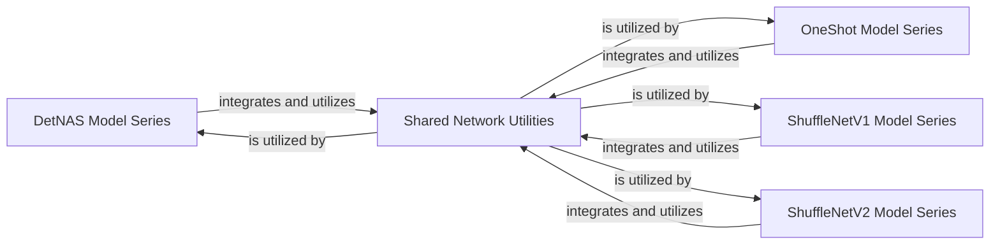

## Details

The ShuffleNet-Series project is structured around distinct neural network model architectures, each encapsulated within its own dedicated component. These include `DetNAS Model Series`, `OneShot Model Series`, `ShuffleNetV1 Model Series`, and `ShuffleNetV2 Model Series` (including its `Large` and `ExLarge` variants). Each model series defines its unique network structure and specialized building blocks. A `Shared Network Utilities` component provides fundamental, reusable operations, such as channel shuffling, that are common across these various ShuffleNet-based architectures, facilitating efficient and consistent implementation of core functionalities.

### DetNAS Model Series
Encapsulates the complete neural network architecture for the DetNAS model, defining its overall structure and specialized building blocks.

**Related Classes/Methods**:

- <a href="https://github.com/megvii-model/ShuffleNet-Series/blob/master/DetNAS/network.py" target="_blank" rel="noopener noreferrer">`DetNAS/network.py`</a>
- <a href="https://github.com/megvii-model/ShuffleNet-Series/blob/master/DetNAS/blocks.py" target="_blank" rel="noopener noreferrer">`DetNAS/blocks.py`</a>

### OneShot Model Series
Encapsulates the complete neural network architecture for the OneShot model, defining its overall structure and specialized building blocks.

**Related Classes/Methods**:

- <a href="https://github.com/megvii-model/ShuffleNet-Series/blob/master/OneShot/network.py" target="_blank" rel="noopener noreferrer">`OneShot/network.py`</a>
- <a href="https://github.com/megvii-model/ShuffleNet-Series/blob/master/OneShot/blocks.py" target="_blank" rel="noopener noreferrer">`OneShot/blocks.py`</a>

### ShuffleNetV1 Model Series
Encapsulates the complete neural network architecture for the ShuffleNetV1 model, defining its overall structure and specialized building blocks.

**Related Classes/Methods**:

- <a href="https://github.com/megvii-model/ShuffleNet-Series/blob/master/ShuffleNetV1/network.py" target="_blank" rel="noopener noreferrer">`ShuffleNetV1/network.py`</a>
- <a href="https://github.com/megvii-model/ShuffleNet-Series/blob/master/ShuffleNetV1/blocks.py" target="_blank" rel="noopener noreferrer">`ShuffleNetV1/blocks.py`</a>

### ShuffleNetV2 Model Series
Defines the comprehensive neural network architecture for the ShuffleNetV2 model, including its base structure and specific variants (Large, ExLarge), along with its core building blocks.

**Related Classes/Methods**:

- <a href="https://github.com/megvii-model/ShuffleNet-Series/blob/master/ShuffleNetV2/network.py" target="_blank" rel="noopener noreferrer">`ShuffleNetV2/network.py`</a>
- <a href="https://github.com/megvii-model/ShuffleNet-Series/blob/master/ShuffleNetV2/blocks.py" target="_blank" rel="noopener noreferrer">`ShuffleNetV2/blocks.py`</a>
- <a href="https://github.com/megvii-model/ShuffleNet-Series/blob/master/ShuffleNetV2.ExLarge/network.py" target="_blank" rel="noopener noreferrer">`ShuffleNetV2.ExLarge/network.py`</a>
- <a href="https://github.com/megvii-model/ShuffleNet-Series/blob/master/ShuffleNetV2.Large/network.py" target="_blank" rel="noopener noreferrer">`ShuffleNetV2.Large/network.py`</a>

### Shared Network Utilities
Provides fundamental, reusable operations, specifically channel shuffling, that are common across various ShuffleNet-based architectures.

**Related Classes/Methods**:

- <a href="https://github.com/megvii-model/ShuffleNet-Series/blob/master/DetNAS/utils.py" target="_blank" rel="noopener noreferrer">`DetNAS/utils.py:channel_shuffle`</a>
- <a href="https://github.com/megvii-model/ShuffleNet-Series/blob/master/DetNAS/utils.py" target="_blank" rel="noopener noreferrer">`DetNAS/utils.py:channel_shuffle2`</a>

### [FAQ](https://github.com/CodeBoarding/GeneratedOnBoardings/tree/main?tab=readme-ov-file#faq)