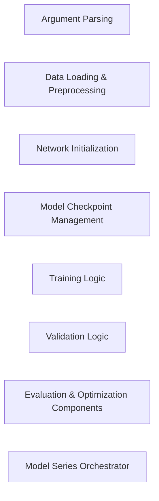

## Details

Analysis of the Model Series Orchestrator and its sub-components, focusing on identifying source code references for accurate documentation and diagram generation.

### Argument Parsing
Handles command-line argument parsing.

**Related Classes/Methods**: _None_

### Data Loading & Preprocessing
Manages loading and preprocessing of data.

**Related Classes/Methods**: _None_

### Network Initialization
Initializes the neural network model.

**Related Classes/Methods**: _None_

### Model Checkpoint Management
Manages saving and loading model checkpoints.

**Related Classes/Methods**: _None_

### Training Logic
Encapsulates the training loop and optimization.

**Related Classes/Methods**: _None_

### Validation Logic
Contains the validation process during training.

**Related Classes/Methods**: _None_

### Evaluation & Optimization Components
Handles model evaluation and optimization post-training.

**Related Classes/Methods**: _None_

### Model Series Orchestrator [[Expand]](./Model_Series_Orchestrator.md)
Orchestrates the entire model series workflow.

**Related Classes/Methods**:

- <a href="https://github.com/megvii-model/ShuffleNet-Series/blob/master/DetNAS/train.py#L95-L191" target="_blank" rel="noopener noreferrer">`DetNAS.train.main`:95-191</a>

### [FAQ](https://github.com/CodeBoarding/GeneratedOnBoardings/tree/main?tab=readme-ov-file#faq)