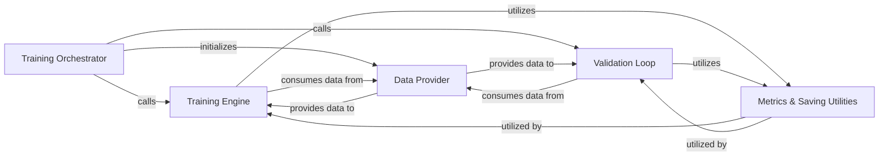

## Details

The training subsystem is orchestrated by the `Training Orchestrator`, which is responsible for setting up the entire training environment, including configuration loading and data pipeline initialization. It iteratively invokes the `Training Engine` for model optimization and the `Validation Loop` for performance evaluation. The `Data Provider` component supplies both training and validation data to the `Training Engine` and `Validation Loop`, abstracting the data access. Throughout the training and validation phases, the `Metrics & Saving Utilities` component is utilized to calculate performance metrics and manage model checkpoints, ensuring continuous monitoring and persistence of the model's state. This structured interaction facilitates a robust and observable machine learning training pipeline.

### Training Orchestrator
Initializes the training environment, loads configurations, sets up data pipelines, and orchestrates the overall training and validation loops. It acts as the high-level controller for the entire training process.

**Related Classes/Methods**: _None_

### Training Engine [[Expand]](./Training_Engine.md)
Encapsulates the iterative process of model optimization, including forward and backward passes, loss calculation, and optimizer steps for a single epoch/iteration. This component is responsible for the actual learning process.

**Related Classes/Methods**: _None_

### Validation Loop
Evaluates the model's performance on a validation dataset, calculating metrics without updating model weights. This component is crucial for monitoring training progress and preventing overfitting.

**Related Classes/Methods**: _None_

### Data Provider
Manages the loading, batching, and provision of training and validation data to the training and validation loops. It abstracts the data access layer.

**Related Classes/Methods**: _None_

### Metrics & Saving Utilities
Provides common functionalities for calculating performance metrics (e.g., accuracy, loss), aggregating results, and persisting model checkpoints. This component supports both training and validation phases.

**Related Classes/Methods**: _None_

### [FAQ](https://github.com/CodeBoarding/GeneratedOnBoardings/tree/main?tab=readme-ov-file#faq)