```mermaid
graph LR
    Model_Series_Orchestrator["Model Series Orchestrator"]
    Configuration_Manager["Configuration Manager"]
    Data_Pipeline["Data Pipeline"]
    Model_Architecture["Model Architecture"]
    Training_Engine["Training Engine"]
    Evaluation_Engine["Evaluation Engine"]
    Checkpoint_State_Management["Checkpoint & State Management"]
    Model_Series_Orchestrator -- "configures" --> Configuration_Manager
    Configuration_Manager -- "provides settings" --> Model_Series_Orchestrator
    Model_Series_Orchestrator -- "initiates training" --> Training_Engine
    Model_Series_Orchestrator -- "initiates evaluation" --> Evaluation_Engine
    Data_Pipeline -- "feeds data to" --> Training_Engine
    Data_Pipeline -- "feeds data to" --> Evaluation_Engine
    Model_Architecture -- "provides model to" --> Training_Engine
    Model_Architecture -- "provides model to" --> Evaluation_Engine
    Training_Engine -- "updates weights of" --> Model_Architecture
    Training_Engine -- "saves state via" --> Checkpoint_State_Management
    Evaluation_Engine -- "loads state via" --> Checkpoint_State_Management
    Checkpoint_State_Management -- "loads/saves model weights" --> Model_Architecture
    click Model_Series_Orchestrator href "https://github.com/CodeBoarding/GeneratedOnBoardings/blob/main/ShuffleNet-Series/Model_Series_Orchestrator.md" "Details"
    click Data_Pipeline href "https://github.com/CodeBoarding/GeneratedOnBoardings/blob/main/ShuffleNet-Series/Data_Pipeline.md" "Details"
    click Model_Architecture href "https://github.com/CodeBoarding/GeneratedOnBoardings/blob/main/ShuffleNet-Series/Model_Architecture.md" "Details"
    click Training_Engine href "https://github.com/CodeBoarding/GeneratedOnBoardings/blob/main/ShuffleNet-Series/Training_Engine.md" "Details"
    click Checkpoint_State_Management href "https://github.com/CodeBoarding/GeneratedOnBoardings/blob/main/ShuffleNet-Series/Checkpoint_State_Management.md" "Details"
```

## Details

The `ShuffleNet-Series` project is architected as a flexible deep learning research repository, structured around distinct model series (e.g., ShuffleNetV1, ShuffleNetV2, DetNAS, OneShot). Each series' workflow is orchestrated by a dedicated `Model Series Orchestrator`, which, after receiving configuration from the `Configuration Manager`, drives the data flow from the `Data Pipeline` to the `Training Engine` and `Evaluation Engine`. The core `Model Architecture` defines the neural network, whose parameters are iteratively refined by the `Training Engine` and persisted through `Checkpoint & State Management`. This modular design facilitates independent development and evaluation of different ShuffleNet variants, making it ideal for a "Model Zoo" paradigm where each model is a self-contained unit interacting with shared infrastructure for data handling, training, and evaluation.

### Model Series Orchestrator [[Expand]](./Model_Series_Orchestrator.md)
The primary entry point for each model series, responsible for initiating and managing the overall training or evaluation workflow. It acts as the orchestrator, coordinating interactions between other components.

**Related Classes/Methods**:

- <a href="https://github.com/megvii-model/ShuffleNet-Series/blob/master/DetNAS/train.py" target="_blank" rel="noopener noreferrer">`DetNAS.train:main`</a>
- <a href="https://github.com/megvii-model/ShuffleNet-Series/blob/master/OneShot/train.py" target="_blank" rel="noopener noreferrer">`OneShot.train:main`</a>
- <a href="https://github.com/megvii-model/ShuffleNet-Series/blob/master/ShuffleNetV1/train.py" target="_blank" rel="noopener noreferrer">`ShuffleNetV1.train:main`</a>
- <a href="https://github.com/megvii-model/ShuffleNet-Series/blob/master/ShuffleNetV2/train.py" target="_blank" rel="noopener noreferrer">`ShuffleNetV2.train:main`</a>
- <a href="https://github.com/megvii-model/ShuffleNet-Series/blob/master/ShuffleNetV2.ExLarge/eval.py" target="_blank" rel="noopener noreferrer">`ShuffleNetV2.ExLarge.eval:main`</a>
- <a href="https://github.com/megvii-model/ShuffleNet-Series/blob/master/ShuffleNetV2.Large/train.py" target="_blank" rel="noopener noreferrer">`ShuffleNetV2.Large.train:main`</a>

### Configuration Manager
Handles the parsing of command-line arguments and the management of runtime configuration parameters, ensuring each model series operates with the correct settings.

**Related Classes/Methods**:

- <a href="https://github.com/megvii-model/ShuffleNet-Series/blob/master/DetNAS/train.py" target="_blank" rel="noopener noreferrer">`DetNAS.train:get_args`</a>
- <a href="https://github.com/megvii-model/ShuffleNet-Series/blob/master/OneShot/train.py" target="_blank" rel="noopener noreferrer">`OneShot.train:get_args`</a>
- <a href="https://github.com/megvii-model/ShuffleNet-Series/blob/master/ShuffleNetV1/train.py" target="_blank" rel="noopener noreferrer">`ShuffleNetV1.train:get_args`</a>
- <a href="https://github.com/megvii-model/ShuffleNet-Series/blob/master/ShuffleNetV2/train.py" target="_blank" rel="noopener noreferrer">`ShuffleNetV2.train:get_args`</a>
- <a href="https://github.com/megvii-model/ShuffleNet-Series/blob/master/ShuffleNetV2.ExLarge/eval.py" target="_blank" rel="noopener noreferrer">`ShuffleNetV2.ExLarge.eval:get_args`</a>
- <a href="https://github.com/megvii-model/ShuffleNet-Series/blob/master/ShuffleNetV2.Large/train.py" target="_blank" rel="noopener noreferrer">`ShuffleNetV2.Large.train:get_args`</a>

### Data Pipeline [[Expand]](./Data_Pipeline.md)
Responsible for loading, augmenting, and preprocessing raw input data, transforming it into a format suitable for consumption by the neural network models.

**Related Classes/Methods**:

- <a href="https://github.com/megvii-model/ShuffleNet-Series/blob/master/DetNAS/train.py" target="_blank" rel="noopener noreferrer">`DetNAS.train:DataIterator`</a>
- <a href="https://github.com/megvii-model/ShuffleNet-Series/blob/master/DetNAS/train.py" target="_blank" rel="noopener noreferrer">`DetNAS.train:OpencvResize`</a>
- <a href="https://github.com/megvii-model/ShuffleNet-Series/blob/master/DetNAS/train.py" target="_blank" rel="noopener noreferrer">`DetNAS.train:ToBGRTensor`</a>
- <a href="https://github.com/megvii-model/ShuffleNet-Series/blob/master/OneShot/train.py" target="_blank" rel="noopener noreferrer">`OneShot.train:DataIterator`</a>
- <a href="https://github.com/megvii-model/ShuffleNet-Series/blob/master/OneShot/train.py" target="_blank" rel="noopener noreferrer">`OneShot.train:OpencvResize`</a>
- <a href="https://github.com/megvii-model/ShuffleNet-Series/blob/master/OneShot/train.py" target="_blank" rel="noopener noreferrer">`OneShot.train:ToBGRTensor`</a>
- <a href="https://github.com/megvii-model/ShuffleNet-Series/blob/master/ShuffleNetV1/train.py" target="_blank" rel="noopener noreferrer">`ShuffleNetV1.train:DataIterator`</a>
- <a href="https://github.com/megvii-model/ShuffleNet-Series/blob/master/ShuffleNetV1/train.py" target="_blank" rel="noopener noreferrer">`ShuffleNetV1.train:OpencvResize`</a>
- <a href="https://github.com/megvii-model/ShuffleNet-Series/blob/master/ShuffleNetV1/train.py" target="_blank" rel="noopener noreferrer">`ShuffleNetV1.train:ToBGRTensor`</a>
- <a href="https://github.com/megvii-model/ShuffleNet-Series/blob/master/ShuffleNetV2/train.py" target="_blank" rel="noopener noreferrer">`ShuffleNetV2.train:DataIterator`</a>
- <a href="https://github.com/megvii-model/ShuffleNet-Series/blob/master/ShuffleNetV2/train.py" target="_blank" rel="noopener noreferrer">`ShuffleNetV2.train:OpencvResize`</a>
- <a href="https://github.com/megvii-model/ShuffleNet-Series/blob/master/ShuffleNetV2/train.py" target="_blank" rel="noopener noreferrer">`ShuffleNetV2.train:ToBGRTensor`</a>
- <a href="https://github.com/megvii-model/ShuffleNet-Series/blob/master/ShuffleNetV2.ExLarge/eval.py" target="_blank" rel="noopener noreferrer">`ShuffleNetV2.ExLarge.eval:DataIterator`</a>
- <a href="https://github.com/megvii-model/ShuffleNet-Series/blob/master/ShuffleNetV2.ExLarge/eval.py" target="_blank" rel="noopener noreferrer">`ShuffleNetV2.ExLarge.eval:OpencvResize`</a>
- <a href="https://github.com/megvii-model/ShuffleNet-Series/blob/master/ShuffleNetV2.ExLarge/eval.py" target="_blank" rel="noopener noreferrer">`ShuffleNetV2.ExLarge.eval:ToBGRTensor`</a>
- <a href="https://github.com/megvii-model/ShuffleNet-Series/blob/master/ShuffleNetV2.Large/train.py" target="_blank" rel="noopener noreferrer">`ShuffleNetV2.Large.train:DataIterator`</a>
- <a href="https://github.com/megvii-model/ShuffleNet-Series/blob/master/ShuffleNetV2.Large/train.py" target="_blank" rel="noopener noreferrer">`ShuffleNetV2.Large.train:OpencvResize`</a>
- <a href="https://github.com/megvii-model/ShuffleNet-Series/blob/master/ShuffleNetV2.Large/train.py" target="_blank" rel="noopener noreferrer">`ShuffleNetV2.Large.train:ToBGRTensor`</a>
- <a href="https://github.com/megvii-model/ShuffleNet-Series/blob/master/ShuffleNetV2.Large/train.py" target="_blank" rel="noopener noreferrer">`ShuffleNetV2.Large.train:Lighting`</a>
- <a href="https://github.com/megvii-model/ShuffleNet-Series/blob/master/ShuffleNetV2.Large/train.py" target="_blank" rel="noopener noreferrer">`ShuffleNetV2.Large.train:ColorNormalize`</a>

### Model Architecture [[Expand]](./Model_Architecture.md)
Defines the specific neural network structure for each model series, including its layers, blocks, and the forward pass logic.

**Related Classes/Methods**:

- <a href="https://github.com/megvii-model/ShuffleNet-Series/blob/master/DetNAS/network.py" target="_blank" rel="noopener noreferrer">`DetNAS.network`</a>
- <a href="https://github.com/megvii-model/ShuffleNet-Series/blob/master/DetNAS/blocks.py" target="_blank" rel="noopener noreferrer">`DetNAS.blocks`</a>
- <a href="https://github.com/megvii-model/ShuffleNet-Series/blob/master/OneShot/network.py" target="_blank" rel="noopener noreferrer">`OneShot.network`</a>
- <a href="https://github.com/megvii-model/ShuffleNet-Series/blob/master/OneShot/blocks.py" target="_blank" rel="noopener noreferrer">`OneShot.blocks`</a>
- <a href="https://github.com/megvii-model/ShuffleNet-Series/blob/master/ShuffleNetV1/network.py" target="_blank" rel="noopener noreferrer">`ShuffleNetV1.network`</a>
- <a href="https://github.com/megvii-model/ShuffleNet-Series/blob/master/ShuffleNetV1/blocks.py" target="_blank" rel="noopener noreferrer">`ShuffleNetV1.blocks`</a>
- <a href="https://github.com/megvii-model/ShuffleNet-Series/blob/master/ShuffleNetV2/network.py" target="_blank" rel="noopener noreferrer">`ShuffleNetV2.network`</a>
- <a href="https://github.com/megvii-model/ShuffleNet-Series/blob/master/ShuffleNetV2/blocks.py" target="_blank" rel="noopener noreferrer">`ShuffleNetV2.blocks`</a>
- <a href="https://github.com/megvii-model/ShuffleNet-Series/blob/master/ShuffleNetV2.ExLarge/network.py" target="_blank" rel="noopener noreferrer">`ShuffleNetV2.ExLarge.network`</a>
- <a href="https://github.com/megvii-model/ShuffleNet-Series/blob/master/ShuffleNetV2.Large/network.py" target="_blank" rel="noopener noreferrer">`ShuffleNetV2.Large.network`</a>

### Training Engine [[Expand]](./Training_Engine.md)
Encapsulates the core training loop, managing the iterative process of model optimization, including forward and backward passes, loss calculation, and optimizer steps. It also utilizes utility functions for metrics.

**Related Classes/Methods**:

- <a href="https://github.com/megvii-model/ShuffleNet-Series/blob/master/DetNAS/train.py" target="_blank" rel="noopener noreferrer">`DetNAS.train:train`</a>
- <a href="https://github.com/megvii-model/ShuffleNet-Series/blob/master/OneShot/train.py" target="_blank" rel="noopener noreferrer">`OneShot.train:train`</a>
- <a href="https://github.com/megvii-model/ShuffleNet-Series/blob/master/ShuffleNetV1/train.py" target="_blank" rel="noopener noreferrer">`ShuffleNetV1.train:train`</a>
- <a href="https://github.com/megvii-model/ShuffleNet-Series/blob/master/ShuffleNetV2/train.py" target="_blank" rel="noopener noreferrer">`ShuffleNetV2.train:train`</a>
- <a href="https://github.com/megvii-model/ShuffleNet-Series/blob/master/ShuffleNetV2.Large/train.py" target="_blank" rel="noopener noreferrer">`ShuffleNetV2.Large.train:train`</a>

### Evaluation Engine
Responsible for assessing the model's performance on unseen data, typically a validation or test set, to gauge its generalization capabilities. It also utilizes utility functions for metrics.

**Related Classes/Methods**:

- <a href="https://github.com/megvii-model/ShuffleNet-Series/blob/master/DetNAS/train.py" target="_blank" rel="noopener noreferrer">`DetNAS.train:validate`</a>
- <a href="https://github.com/megvii-model/ShuffleNet-Series/blob/master/OneShot/train.py" target="_blank" rel="noopener noreferrer">`OneShot.train:validate`</a>
- <a href="https://github.com/megvii-model/ShuffleNet-Series/blob/master/ShuffleNetV1/train.py" target="_blank" rel="noopener noreferrer">`ShuffleNetV1.train:validate`</a>
- <a href="https://github.com/megvii-model/ShuffleNet-Series/blob/master/ShuffleNetV2/train.py" target="_blank" rel="noopener noreferrer">`ShuffleNetV2.train:validate`</a>
- <a href="https://github.com/megvii-model/ShuffleNet-Series/blob/master/ShuffleNetV2.ExLarge/eval.py" target="_blank" rel="noopener noreferrer">`ShuffleNetV2.ExLarge.eval:validate`</a>
- <a href="https://github.com/megvii-model/ShuffleNet-Series/blob/master/ShuffleNetV2.Large/train.py" target="_blank" rel="noopener noreferrer">`ShuffleNetV2.Large.train:validate`</a>

### Checkpoint & State Management [[Expand]](./Checkpoint_State_Management.md)
Manages the persistence and retrieval of model weights, optimizer states, and other training-related information, enabling training resumption and model deployment.

**Related Classes/Methods**:

- <a href="https://github.com/megvii-model/ShuffleNet-Series/blob/master/OneShot/utils.py" target="_blank" rel="noopener noreferrer">`OneShot.utils:save_checkpoint`</a>
- <a href="https://github.com/megvii-model/ShuffleNet-Series/blob/master/OneShot/utils.py" target="_blank" rel="noopener noreferrer">`OneShot.utils:get_lastest_model`</a>
- <a href="https://github.com/megvii-model/ShuffleNet-Series/blob/master/ShuffleNetV2.ExLarge/eval.py" target="_blank" rel="noopener noreferrer">`ShuffleNetV2.ExLarge.eval:load_checkpoint`</a>
- <a href="https://github.com/megvii-model/ShuffleNet-Series/blob/master/ShuffleNetV2.Large/train.py" target="_blank" rel="noopener noreferrer">`ShuffleNetV2.Large.train:load_checkpoint`</a>

### [FAQ](https://github.com/CodeBoarding/GeneratedOnBoardings/tree/main?tab=readme-ov-file#faq)