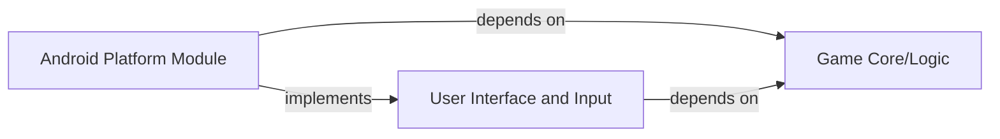

## Details

This section details the architecture of the Android Platform Module within the multiplatform game, outlining its responsibilities, interactions, and key relationships with other core components.

### Android Platform Module [[Expand]](./Android_Platform_Module.md)
This module serves as the concrete application layer for Android devices. It is responsible for the Android-specific application entry point, rendering the user interface using Compose Multiplatform, handling Android-specific input events (e.g., touch, gestures), and integrating with any necessary native Android APIs. It acts as the bridge between the platform-agnostic game logic and the Android operating system.

**Related Classes/Methods**:

- `MainActivity.kt` (1:1)

### Game Core/Logic [[Expand]](./Game_Core_Logic.md)
This is the central, platform-agnostic module that encapsulates all fundamental game mechanics. It manages the game board state, handles game turns, applies game rules, manages scoring, and provides utility functions related to game elements like cards. This module is critical for ensuring consistent game behavior across all target platforms.

**Related Classes/Methods**:

- `GameState.kt` (1:1)
- `Board.kt` (1:1)
- `CardUtils.kt` (1:1)

### User Interface and Input
This component defines the abstract interface for user interaction and UI presentation across all platforms. It specifies the structure of UI elements and how user input is processed, leveraging Compose Multiplatform for shared UI components where possible. Platform-specific modules (like the Android Platform Module) provide the concrete rendering and input handling implementations.

**Related Classes/Methods**:

- `GameScreen.kt` (1:1)
- `InputEvent.kt` (1:1)

### [FAQ](https://github.com/CodeBoarding/GeneratedOnBoardings/tree/main?tab=readme-ov-file#faq)