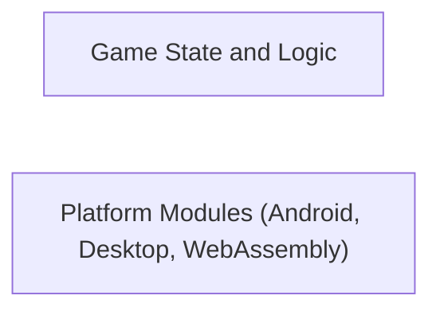

## Details

One paragraph explaining the functionality which is represented by this graph. What the main flow is and what is its purpose.

### Game State and Logic
Manages the current state of the game and enforces game rules.

**Related Classes/Methods**: _None_

### Platform Modules (Android, Desktop, WebAssembly)
Handles platform-specific functionalities for Android, Desktop, and WebAssembly.

**Related Classes/Methods**: _None_

### [FAQ](https://github.com/CodeBoarding/GeneratedOnBoardings/tree/main?tab=readme-ov-file#faq)