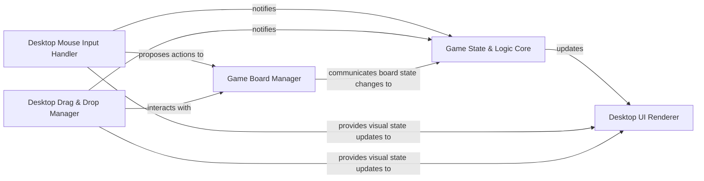

## Details

Component overview for the Desktop Platform Module subsystem, based on the provided analysis and adhering to Multiplatform Application (Game) architectural patterns.

### Desktop UI Renderer
Manages the application's visual output and UI rendering specifically for Desktop JVM environments using Compose Multiplatform. It is responsible for displaying all game elements, handling UI composition, and providing the interactive surface for the game.

**Related Classes/Methods**:

- `org.example.solitaire.ui.GameWindow` (1:1)

### Desktop Mouse Input Handler
Processes desktop-specific mouse click events, translating raw input coordinates and click types into actionable game commands or UI interactions. It detects user intent for single clicks, double clicks, and initial press events.

**Related Classes/Methods**:

- `org.example.solitaire.input.MouseClickHandler` (1:1)

### Desktop Drag & Drop Manager
Manages complex drag-and-drop interactions for game elements (e.g., cards) on the desktop. It handles the visual feedback during drag operations, tracks cursor movement, and coordinates with game logic to validate and execute drop actions.

**Related Classes/Methods**:

- `org.example.solitaire.input.DragAndDropManager` (1:1)

### Game Board Manager
Manages the logical state and rules governing the game board, including the positions of all cards, valid movements, and the application of game-specific rules for actions like stacking or dealing. This component resides in the shared 'common' module.

**Related Classes/Methods**:

- `org.example.solitaire.game.BoardManagement` (1:1)

### Game State & Logic Core
Encapsulates the overall game state, core rules, and progression logic. It acts as the central orchestrator for game events, updates the game state based on player actions, and determines win/loss conditions. This component resides in the shared 'common' module.

**Related Classes/Methods**:

- `org.example.solitaire.game.GameStateAndLogic` (1:1)

### [FAQ](https://github.com/CodeBoarding/GeneratedOnBoardings/tree/main?tab=readme-ov-file#faq)