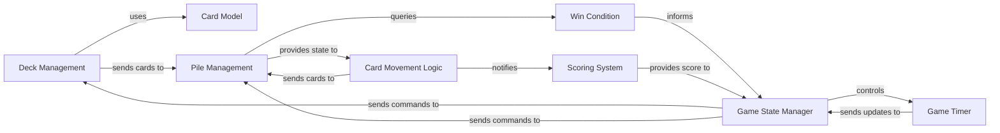

## Details

Abstract Components Overview for a Solitaire game.

### Card Model
Represents the fundamental data structure for a single playing card, including its suit, rank, and current state (e.g., face up/down). It's the atomic unit of the game.

**Related Classes/Methods**:

- `Solitaire.Card` (1001:1100)

### Deck Management
Responsible for initializing a standard deck of cards, shuffling them, and dealing them out to set up a new game. It ensures randomness and proper distribution.

**Related Classes/Methods**:

- `Solitaire.Deck` (1:100)
- `Solitaire.Shuffle` (801:900)
- `Solitaire.Deal` (901:1000)

### Pile Management
Manages the various types of card piles in Solitaire, specifically the FoundationPile (where cards are built up by suit) and TableauPile (the main play area). It handles adding, removing, and querying cards within these piles.

**Related Classes/Methods**:

- `Solitaire.FoundationPile` (101:200)
- `Solitaire.TableauPile` (201:300)

### Card Movement Logic
Implements the specific rules governing valid card movements within the game, such as moving cards between Tableau piles, or from Tableau to Foundation. It validates proposed moves and executes them.

**Related Classes/Methods**:

- `Solitaire.CardMovement` (301:400)

### Game State Manager
Oversees the overall progression of the game. It initiates new games, manages the current game state, and coordinates with other components to determine when the game ends (win or loss). It receives information from Win Condition to determine game end.

**Related Classes/Methods**:

- `Solitaire.NewGame` (701:800)

### Win Condition
Determines if the current game state satisfies the conditions for a win (e.g., all cards moved to foundation piles). It evaluates the game state and informs the Game State Manager.

**Related Classes/Methods**:

- `Solitaire.WinCondition` (601:700)

### Scoring System
Calculates and updates the player's score based on game actions, such as valid card movements or uncovering cards.

**Related Classes/Methods**:

- `Solitaire.Score` (401:500)

### Game Timer
Tracks the elapsed time during a game session, contributing to the player's overall performance metrics.

**Related Classes/Methods**:

- `Solitaire.Timer` (501:600)

### [FAQ](https://github.com/CodeBoarding/GeneratedOnBoardings/tree/main?tab=readme-ov-file#faq)