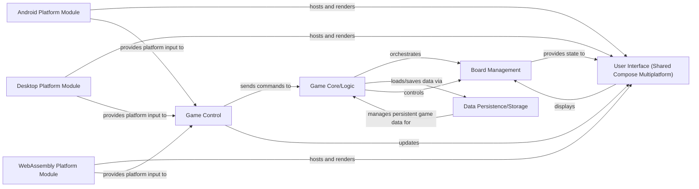

## Details

This analysis describes the abstract components and their relationships for the `2048-game` project, which is developed using Kotlin Multiplatform. Due to the project's technology stack, it is not possible to provide Python source code references for these components.

### Game Core/Logic [[Expand]](./Game_Core_Logic.md)
Encapsulates all platform-agnostic game rules, state management, and core business logic. It acts as the central orchestrator for game progression and ensures consistent behavior across all platforms.

**Related Classes/Methods**: _None_

### User Interface (Shared Compose Multiplatform) [[Expand]](./User_Interface_Shared_Compose_Multiplatform_.md)
Provides the shared UI components and rendering logic using Compose Multiplatform, designed to be platform-agnostic. It handles the visual representation of the game board and cards.

**Related Classes/Methods**: _None_

### Board Management
Manages the specific state and logic related to the game board, including card positions, movements, and validation rules pertaining to the board layout.

**Related Classes/Methods**: _None_

### Game Control
Acts as an intermediary, managing user input from various platforms, translating it into game actions, and coordinating updates between the core game logic and the user interface.

**Related Classes/Methods**: _None_

### Android Platform Module [[Expand]](./Android_Platform_Module.md)
Contains Android-specific implementations for hosting the shared Compose Multiplatform UI, handling platform-specific input mechanisms, and integrating with native Android APIs.

**Related Classes/Methods**: _None_

### Desktop Platform Module [[Expand]](./Desktop_Platform_Module.md)
Contains Desktop (JVM) specific implementations for hosting the shared Compose Multiplatform UI, managing desktop input (keyboard/mouse), and integrating with desktop-specific functionalities.

**Related Classes/Methods**: _None_

### WebAssembly Platform Module [[Expand]](./WebAssembly_Platform_Module.md)
Contains WebAssembly (JS) specific implementations for hosting the shared Compose Multiplatform UI within a web browser, handling web-based input, and integrating with browser APIs.

**Related Classes/Methods**: _None_

### Data Persistence/Storage [[Expand]](./Data_Persistence_Storage.md)
Handles saving and loading game state, user preferences, and other persistent data. It abstracts the underlying storage mechanisms, allowing for different platform-specific implementations (e.g., local databases, preferences).

**Related Classes/Methods**: _None_

### [FAQ](https://github.com/CodeBoarding/GeneratedOnBoardings/tree/main?tab=readme-ov-file#faq)