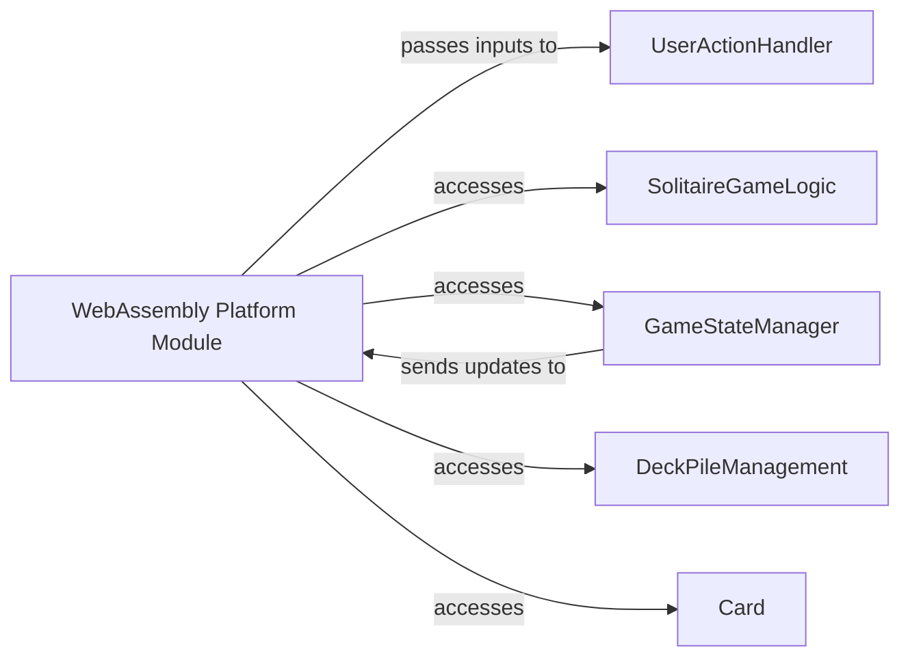

## Details

Analysis of the WebAssembly Platform Module subsystem.

### WebAssembly Platform Module [[Expand]](./WebAssembly_Platform_Module.md)
The primary component responsible for initializing the application, rendering the user interface, and managing web-specific interactions within the WebAssembly environment. It acts as the bridge between the platform's capabilities and the shared game logic.

**Related Classes/Methods**:

- `wasmJsMain`

### UserActionHandler
Processes user inputs originating from the WebAssembly UI, translating them into actionable game commands that can be executed by the core game logic.

**Related Classes/Methods**:

- `UserActionHandler`

### SolitaireGameLogic
Encapsulates the core rules and mechanics of the Solitaire game, including card movements, win conditions, and game state transitions. The WebAssembly module accesses this to perform game operations.

**Related Classes/Methods**:

- `SolitaireGameLogic`

### GameStateManager
Manages and provides a consistent view of the current state of the Solitaire game, including the positions of all cards, scores, and game status. The WebAssembly module accesses this to render the UI and receives updates for real-time display.

**Related Classes/Methods**:

- `GameStateManager`

### DeckPileManagement
Handles the operations related to the deck and various card piles (e.g., tableau, foundation, stock, waste) within the game. The WebAssembly module accesses this to retrieve card data for rendering.

**Related Classes/Methods**:

- `DeckPileManagement`

### Card
Represents a single playing card, including its suit, rank, and face-up/face-down status. The WebAssembly module accesses `Card` objects to render individual cards on the UI.

**Related Classes/Methods**:

- `Card`

### [FAQ](https://github.com/CodeBoarding/GeneratedOnBoardings/tree/main?tab=readme-ov-file#faq)